> 这篇文章面向只学过基础 Python 编程、对 AI 和机器学习完全零基础的同学。我会先从「什么是智慧」「人工智能是什么」「AI 是怎么走到今天的」讲起，再用大白话把那些高大上的概念拆开揉碎来讲，配合完整的 PyTorch 手写数字识别代码，带你走一遍"训练一个能认数字的神经网络"的全流程。
>
> 如果你有一些编程基础但一直被各种公式和术语劝退，这篇文章就是写给你的。

# 一、什么是智慧

在聊 AI 之前，我们先搞清楚一个更基础的问题：**什么是智慧？**

智慧是一种综合运用知识与经验，做出良好判断与决策的能力。你不需要背下整本字典才能判断「今天要不要带伞」——你会综合看天气预报、窗外的云、以及上次被淋湿的经验，然后做出决定。这就是智慧在日常生活中的样子。

## 生物智慧

人类和动物的智慧，来自成长过程中的学习与反馈：

- 学骑车时摔过几次，你就知道怎么保持平衡
- 背英语单词时，错得多的词你会多记几遍
- 被热水烫过一次，下次端杯子会先试探温度

生物智慧的核心是：**通过经验不断调整自身，从而具备判断和决策的能力。**

## 人工智慧

人工智慧则是另一条路：**由人类编写程序，让机器在特定任务上具备判断与决策的能力。**

注意这里的措辞——「特定任务」。AI 不是要复制人类的一切（不会饿、不会做梦、也不会因为失恋写情诗），而是在某个明确的目标上，模拟「输入 → 判断 → 输出」这一智慧特征。

| 类型 | 谁在学习 | 典型方式 |
|------|---------|---------|
| **生物智慧** | 人/动物 | 成长、试错、反馈 |
| **人工智慧** | 机器 | 人类设计算法，机器执行或从数据中学习 |


搞懂这个区别，后面就不会把 AI 神化成「全知全能」，也不会把它贬低成「不过是 if-else 而已」——它是在特定问题上，用计算的方式逼近「做出好判断」这件事。

---

# 二、人工智能是什么

## 顾名思义

**人工智能（Artificial Intelligence，AI）** 指的是由人类创造出来的、具备「智慧」的机器或程序。它有别于生物智慧——不是自然演化出来的，而是工程师一行行代码、一次次实验堆出来的。

## AI 的本质：为问题寻找函数

如果把各种华丽包装拆掉，现代 AI 有一个非常好用的理解角度：

**AI ≈ 为各类问题寻找合适的函数（Function）。**

你给系统一些输入 $x$，它给出你需要的输出 $y$：

$$f(x) = y$$

这个 $x$ 可以是任何类型的数据，$y$ 可能是确定的答案，也可能是一组概率（「有多像猫」「下一个词是什么」）。

### 图像识别

如果 $x$ 是一张图片，在计算机里它就是一个二维矩阵——每个像素有 RGB（红、绿、蓝）或灰度值：

$$f(\text{像素矩阵}) = \text{「这是猫 / 狗 / 数字 5」的概率}$$

### 语音识别

如果 $x$ 是一段音频，可以表示为每个时间采样点上的频率和响度：

$$f(\text{音频采样序列}) = \text{转写文本、说话人性别等}$$

### 文本生成（大语言模型的雏形）

如果 $x$ 是一句没写完的话，比如「最高的山峰是____」：

$$f(\text{「最高的山峰是」}) = \text{下一个词（token）的概率}$$

可能的接龙是「玉」（玉山）、「珠」（珠穆朗玛峰）——模型要学的，就是「在这种上下文里，下一个词最可能是什么」。

## 典型 AI 任务一览

| 任务 | 输入 $x$ | 输出 $y$ |
|------|---------|---------|
| **语音识别** | 声波采样 | 文字（如 "How are you"） |
| **图像识别** | 像素矩阵 | 类别（如 "Cat"）或标签 |
| **围棋对弈** | 棋盘状态 | 下一步落子（如 "5-5"） |

Speech Recognition、Image Recognition、Playing Go——看起来风马牛不相及，但底层思路一致：**找到从输入到输出的映射函数。**


本节只建立 AI 层面的函数视角。下一节我们看 AI 这条路上发生过什么；第四节起，我们会聚焦**机器学习**这条当今最主流的实现路线。

---

# 三、人工智能的发展历史——从图灵测试到第一次 AI 寒冬

> 从 AI 的历史演进过程理解 AI 的基本原理。

## 1950 · 图灵与「机器能思考吗？」

英国数学家、逻辑学家**艾伦·图灵（Alan Turing）** 被誉为计算机科学与人工智能之父。1950 年，他发表论文《计算机器与智能》（*Computing Machinery and Intelligence*），探讨了一个至今仍在争论的问题：**机器能不能思考？**

文中提出了著名的**图灵测试（Turing Test）**，也叫「模仿游戏」：

1. 一位询问者通过纯文字与两个对象对话——一个是人，一个是机器
2. 询问者看不到对方是谁
3. 如果询问者**无法可靠地区分**哪一个是人、哪一个是机器，就认为机器通过了测试


图灵测试的目的在于提供了一个**可操作的检验标准**：从外部行为看，机器是否已经足够聪明得像人一样。

2023 年前后，ChatGPT 等大语言模型的出现，再次把「是否已通过图灵测试」推上风口浪尖，因为目前的主流大语言模型已经足够聪明，其回复内容已经难以让人类判断出到底是由AI写出的还是人类写出的，因此，传统的图灵测试方法来判断AI已经失效。《自然》等期刊也讨论过：也许我们需要设计一个全新的 AI 评估方式。

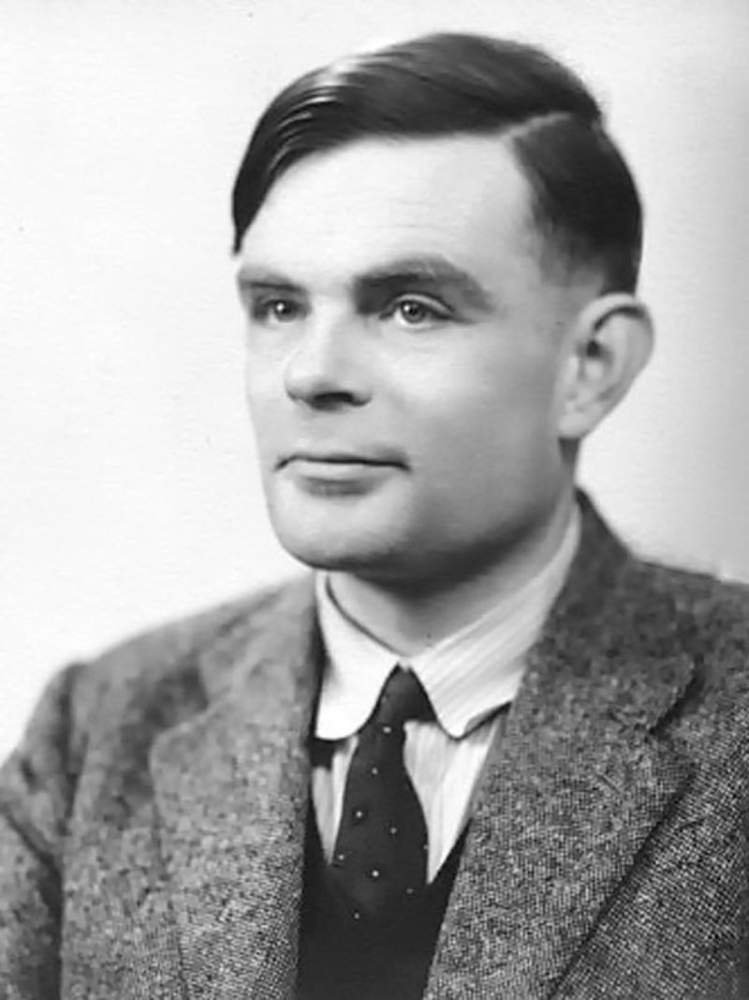

图灵本人于 1954 年英年早逝。有兴趣的朋友可以去网上查询其死因和经历过的历史事件。科学探索往往与时代局限交织，但思想的长寿远超个人命运。

## 1955–1956 · 「人工智能」这个词诞生了

1955 年，计算机科学家**约翰·麦卡锡（John McCarthy）** 在一场研讨会上首次提出 **「人工智能」（artificial intelligence）** 这一术语。

1956 年的**达特茅斯会议（Dartmouth Workshop）** 被普遍视为 AI 学科的开端。麦卡锡、马文·明斯基（Marvin Minsky）、克劳德·香农（Claude Shannon）、赫伯特·西蒙（Herbert Simon）等科学家齐聚一堂，试图回答：「能否让机器像人一样使用语言、形成概念、解决人类专属的问题？」

麦卡锡后来因 AI 领域贡献获得图灵奖，其还发明了 LISP 语言（如果有读过《黑客与画家》这本书的同学应该会听过这门编程语言）。

## 1950s–60s · 两大路线：符号主义 vs 感知机

面对「如何让机器拥有智慧」，早期研究者分裂成两派，逻辑几乎相反，却共同奠定了现代 AI 的基础。

### 符号主义（Symbolism）

符号可以是文字、数字、几何图形或任何概念。符号主义认为：**人类思考，本质上就是符号按逻辑规则运算。**

教机器「有礼貌」，符号主义的做法是写一本规则手册：

- 规则 1：如果遇到长辈，就必须说「您好」
- 规则 2：如果别人送你礼物，就必须说「谢谢」
- 规则 3：如果在图书馆，就必须保持安静

代表技术包括**专家系统（Expert Systems）**、**知识图谱**、**一阶谓词逻辑**，以及从数据中自动归纳规则的**决策树**（ID3、C4.5 等）。

### 感知机（Perceptron）——联结主义的代表

1958 年，弗兰克·罗森布拉特（Frank Rosenblatt）提出**感知机**——模仿人脑单个神经元的数学模型。

想象你要决定「今晚要不要吃火锅」：

- 输入：外面下不下雨？是不是节假日？钱包里有没有钱？
- 每个输入有**权重**（重要程度）：超级吃货可能觉得「下不下雨」权重很低（0.1），「有没有钱」权重极高（0.9）
- 加权求和超过**阈值**，就输出「去！」；否则「不去」

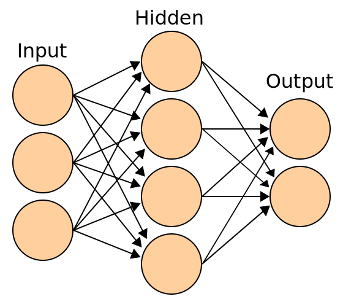

更关键的是：猜错了可以**调整权重**——这就是现代机器学习「训练」的雏形。相对符号主义「规则写死」，感知机可以从错误中学习。

## 1969–1980s · XOR 问题与第一次 AI 寒冬

单层感知机有一个致命弱点：**无法解决 XOR（异或）问题。**

XOR 的规则是：两个输入**不同**时输出 1，**相同**时输出 0：

| 输入 A | 输入 B | XOR 输出 |
|--------|--------|----------|
| 0 | 0 | 0 |
| 0 | 1 | 1 |
| 1 | 0 | 1 |
| 1 | 1 | 0 |

生活案例：公司规定「只有**刚好一个**条件成立才加班」——

- A：今天是周末（是=1，否=0）
- B：你是值班人员（是=1，否=0）
- 只有 A、B 一真一假才加班 → 这就是 XOR

如果把四种情况画在平面上，你会发现：**不存在一条直线能把输出 0 和输出 1 分开**——这叫「线性不可分」。单层感知机只能画直线分类，因此搞不定 XOR。

1969 年，明斯基等人指出感知机的局限，研究经费骤减，AI 进入**第一次寒冬（First AI Winter）**。

### 转折：隐藏层

1980 年代，研究者发现：只要增加**隐藏层（Hidden Layer）**，多层神经网络就能学会 XOR——

- 第一层：学简单特征
- 隐藏层：组合特征
- 输出层：做最终判断

多层网络不再被直线限制，能形成复杂的决策边界。XOR 成为证明「深度结构很重要」的第一个经典案例；今天的图像识别、语音助手、ChatGPT，都建立在这个观念之上。

## AI、机器学习与深度学习：谁包含谁？

AI 的实现方式远不止机器学习一种：

```
人工智能（AI）
├── 专家系统、知识图谱
├── 决策树、概率模型（贝叶斯网络、隐马尔可夫模型等）
├── 机器学习（Machine Learning）
│   ├── 支持向量机（SVM）等传统方法
│   └── 深度学习（Deep Learning）—— 神经网络及其变体
└── ……
```

**机器学习是 AI 的一种实现方式；深度学习是机器学习的一种实现方式。**


本文 remainder 以**监督学习 + 神经网络**为主线——从下一节「机器学习到底是什么」开始，我们会看到：它正是联结主义路线在数据时代的最大胜利。

---

# 四、机器学习到底是什么——从"写规则"到"找规律"

上一节我们介绍了符号主义（写规则）与感知机（从数据学权重）两条早期路线。本节从更现代的视角切入：**机器学习**如何在不手写全部规则的情况下，让计算机自己从数据里找规律——这也是今天大多数 AI 应用背后的核心思路。

## 传统的编程方式

先回想一下我们平时写程序是什么样子的：你制定规则，计算机严格执行。

```
输入数据 → 你写的规则（if-else / 公式） → 输出结果
```

举个例子，你想写一个程序判断"这个水果是不是苹果"，传统的写法大概是这样：

```python
def is_apple(color, shape, size):
    if color == "red" and shape == "round" and size == "medium":
        return True
    else:
        return False
```

这叫**显式编程**——你把判断规则一条一条写清楚，计算机照着做。这在处理明确定义的问题时非常好用。但如果问题变得复杂，比如"这张图片里写的是数字几"？你要怎么用 if-else 来写？

```python
# 你试试看怎么写？
def recognize_digit(image):
    # 如果像素第3行第5列是黑色...如果...如果...
    # 写到天荒地老也写不完
    pass
```

你发现了吗？人类根本不可能写出一个覆盖所有手写情况的 if-else 规则。每个人的书写习惯不同，同一个数字写法千变万化，传统的编程方式在这里彻底失效了。


## 机器学习的不同思路

机器学习换了一个思路——**不给你写规则，而是给计算机大量"例子"，让它自己从例子中总结规则**。

机器学习不是"你告诉计算机怎么做"，而是**计算机从数据中自己学出该怎么做**。

```
输入数据 + 对应的答案 → 计算机自己学习 → 学出一套规则 → 用这套规则预测新数据
```

听起来很玄乎，但其实和你背英语单词的过程差不多：

- 你看了大量"苹果"的图片，老师告诉你"这是苹果"
- 看得多了，你脑中形成了"苹果"的概念
- 下次看到一个新的水果，你能判断它是不是苹果

机器学习做的也是类似的事——只不过"学习"的主体从人变成了计算机。

## 机器学习本质上是在寻找一个函数

第二节我们从 AI 整体视角建立了 $f(x)=y$ 的框架；这里我们把镜头拉近到**机器学习**——它正是当今实现 AI 最主流的一条路线。把各种华丽包装拆掉，机器学习的本质其实非常简单：**它是在寻找一个函数（Function）**。

你给计算机一堆输入 $X$ 和对应的输出 $Y$，机器学习要做的事情就是找到一个函数 $f$，使得：

$$Y \approx f(X)$$

或者说，找到一个映射关系，把输入变成正确的输出。

**手写数字识别本质上就是找一个函数：**

$$f(\text{图片像素矩阵}) = \text{数字标签}$$

**房价预测就是找一个函数：**

$$f(\text{面积, 位置, 房龄, ...}) = \text{房价}$$

所有看似高深的深度学习模型，最终都可以看作是一个**超级复杂的函数**，它接受输入，经过层层计算，给出输出。

## 三种主要的学习方式

### 监督学习（Supervised Learning）

这就像学生做题，**既有题目也有标准答案**。计算机看着"正确答案"来调整自己。

- 数据：特征 + 标签（例如：一张图片 + 这张图片写的是"5"）
- 任务：学到从特征到标签的映射
- 常见应用：图像分类、语音识别、机器翻译

我们这篇博客要写的手写数字识别，就是监督学习——每张图片都对应了一个数字标签（0~9）。

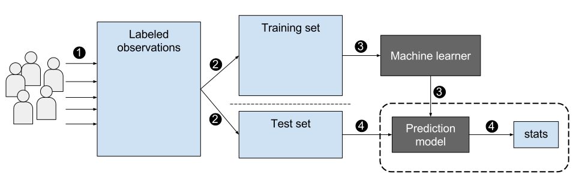

### 无监督学习（Unsupervised Learning）

这就像你第一次去逛一个陌生的商场，**没有地图、没有人引导**，你走一圈下来，自然地发现"哦，这边是卖衣服的，那边是吃饭的"。

无监督学习就是给计算机一堆**没有标签**的数据，让它自己发现数据中的结构。

- 常见应用：用户分群、异常检测、数据降维

### 强化学习（Reinforcement Learning）

这就像训练一只狗——**做对了给奖励，做错了不奖励**。没有标准答案，只有"好"和"不好"的反馈信号。

强化学习就是让一个"智能体"在环境中做决策，通过试错来学习最佳策略。

- 常见应用：围棋（AlphaGo）、自动驾驶、游戏AI

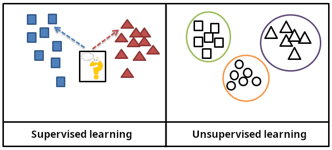

## 三类核心问题

在实际场景中，机器学习解决的问题大致可以分为三类：

### 回归（Regression）

**预测一个连续的数值。** 比如预测明天的气温、股票价格、房价。

- 输入：历史天气数据、时间
- 输出：明天多少度（一个实数）

### 分类（Classification）

**判断输入属于哪个类别。** 比如判断一封邮件是不是垃圾邮件、一张图片里是猫还是狗。

- 输入：邮件内容
- 输出：是垃圾邮件 / 不是垃圾邮件（离散类别）

### 聚类（Clustering）

**把数据自动分成几堆，每一堆内部的样本相似度最高。** 比如电商网站把用户按购物习惯分成几个群体。

聚类和分类最大的区别在于：**分类是你事先知道有哪几类，聚类是你完全不知道——让计算机自己去发现分类**。

**生活中的例子：** 图书馆管理员把一堆书按主题整理到不同的书架上，但他事先并不知道有哪些主题——这就是聚类。


---

# 五、你每天都在用的人工智能——身边的应用案例

聊完了概念，我们来看看生活中已经无处不在的"机器学习"。这些技术你可能每天都在用，只是没意识到背后的原理。

## 手写数字识别

手写数字识别可以说是"机器学习界的 Hello World"——就像学编程第一节课要打印 `Hello, World!` 一样，学机器学习基本都会从手写数字识别入手。

邮政系统每天要处理上百万个信封上的邮政编码，如果全靠人工识别，成本高、效率低。而手写数字识别系统可以自动读取信封上的邮政编码，然后分拣信件。

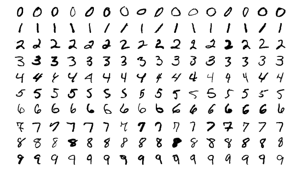

## 车牌识别

每次你开车经过收费站或者进入小区停车场，"嘀"的一声闸门就抬起来了。这就是车牌识别系统在背后工作：

1. 摄像头拍到车牌区域的图像
2. 系统定位车牌的位置
3. 对车牌上的字符逐个进行识别
4. 输出完整的车牌号

这和手写数字识别本质上是一样的——都是在做"图像 → 文字"的转换。

## OCR 文字识别

你可能用过扫描全能王、手机备忘录里"拍照转文字"的功能，或者大学时扫描过老师的课件PDF转成可搜索的文字。这些都是 OCR（光学字符识别）技术。

OCR 把一个文档图片转化为可编辑的文本，背后的核心技术也是图像分类——识别每一个字符是什么。

## 快递单识别

双十一买的东西，快递是怎么自动分拣到各个城市的？
快递单上的寄件地址、收件地址、电话号码等信息，都是通过 OCR 技术自动识别并录入系统的。每分钟可以处理成百上千张快递单。

## 条形码与二维码

这个你可能更熟悉了——超市收银时"嘀"的一下，或者在餐馆扫码点餐。

虽然条形码和二维码的识别方式和图像识别不太一样（它们用的是特定的编码规则），但现在很多系统也会结合机器学习来提升识别的准确率，尤其是在二维码被遮挡、折皱、光线不足的情况下。

## 这些技术的共同点

你发现了吗？上面这些看似不同的应用，本质都在做同一件事：

**把图像中的某些"模式"提取出来，然后和已知的"类别"进行匹配。**

车牌识别的"8"和手写数字识别的"8"用到的是同一个原理——识别图像中的字符形状。

接下来我们就用手写数字识别这个最经典的案例，深入一点看看它背后的机制到底是什么。

---

# 六、手写数字识别的本质——图像不过是数字

正如第二节和第四节所说，机器学习的本质是找一个函数。那对于手写数字识别，输入到底是什么？

是**图片**。

但计算机看不懂"图片"，计算机只认识**数字**。

## 图像在计算机中的表示

你在电脑屏幕上看到的任何一张图片，在计算机看来，就是一个**巨大的数字矩阵**（后面我们会详细讲"矩阵"这个概念）。

### 像素（Pixel）

如果你把一张图片无限放大，会发现它是由一个个小格子组成的。每个小格子就是一个**像素**（Pixel）——这是"图像元素"的缩写。


上图左边是一张手写数字"3"的图片，右边是把左上角 14×14 区域放大后看到的**像素数值**。每个格子里面的数字代表了这个像素的灰度值——数字越大越白（接近于255），数字越小越黑（接近于0）。

### 灰度图

如果是**灰度图**（黑白照片），每个像素只需要一个数值来表示亮度：
- **0** 代表纯黑色
- **255** 代表纯白色
- 中间值代表不同程度的灰色

这样，一张 28×28 像素的灰度图片，就是**一个 28 行 28 列的数字表格**，其中每个数字在 0~255 之间。

### 彩色图

如果是彩色图，每个像素需要三个数值来表示**红（R）、绿（G）、蓝（B）**三种颜色的强度。所以一张彩色图片在计算机中就是**三个叠在一起的矩阵**（或者叫一个"张量"，Tensor）。

对于 MNIST 数据集，每张图片是 **28×28 像素的灰度图**，所以在计算机眼中，它就是一个 **28×28 的数字矩阵**——总共有 784 个数字。

## 手写数字识别到底在做什么

现在我们可以说清楚了：

**手写数字识别 = 给定一个 28×28 的数字矩阵，输出一个 0~9 之间的数字标签。**

```text
输入：[0, 0, 0, ..., 180, 200, 255, ...]  # 784个数字
                   ↓
         一个复杂的函数 f
                   ↓
输出：5  # 模型认为这张图画的是"5"
```

问题就变成了：这个"复杂的函数 $f$"长什么样？怎么找到它？

这就是深度学习要解决的核心问题。在进入具体实现之前，我们先补充一点必要的数学知识。

---

# 七、必要的数学基础

说到数学，很多同学可能已经想关网页了。先别急 —— 我不需要你去解复杂的微积分题，只需要理解几个核心的概念，知道它们"大概是什么"、为什么在神经网络里会用它们就可以了。


## 向量（Vector）

**向量就是一组有序排列的数字。**

举个例子，一个学生的期末成绩可以用一个向量来表示：

$$\text{成绩} = [92, 85, 78, 90, 88]$$

这个向量代表了这个学生在语文、数学、英语、物理、化学五门课上的成绩。

在机器学习的语境里，一个向量的每个分量通常代表一个**特征**。比如描述一个房子，向量可能是：

$$[120\text{平米}, 3\text{室}, 2\text{厅}, 200\text{万}, 2015\text{年}]$$

在图像识别中，一张 28×28 的图片可以"拉直"成一个 784 维的向量——每个分量就是对应位置的像素值。

## 矩阵（Matrix）

**矩阵就是按行和列排列的数字表格。**

$$
\begin{bmatrix}
1 & 2 & 3 \\
4 & 5 & 6 \\
7 & 8 & 9
\end{bmatrix}
$$

前面说的 28×28 的图片，就是一个 28 行 28 列的矩阵。一张灰度图在计算机里就是矩阵，没有任何玄学成分。

矩阵的运算（加法、乘法）在神经网络中无处不在。神经网络的每一层本质上就是在做**矩阵乘法**（以及之后的加法，也就是线性变换）。

## 线性变换（Linear Transformation）

线性变换这个概念听起来很高端，但说白了就是两件事：

$$y = wx + b$$

- 把输入 $x$ **乘以**一个权重 $w$（缩放）
- 然后**加上**一个偏置 $b$（平移）

这就是神经网络每一层在做的事。只不过神经网络里的 $x$ 和 $w$ 不是单个数字，而是向量和矩阵。

人类的神经元接收信号、加权、输出；人工神经元做的事异曲同工——接收输入、乘以权重、加偏置、通过激活函数输出。

## 为什么神经网络离不开矩阵运算

如果你有一张 28×28 的图片（784 个像素），把它输入到神经网络的第一层（假设有 128 个神经元），会发生什么？

**每个神经元都会接收全部 784 个像素的"加权求和"。** 也就是要做：

$$784 \times 128 = 100,352 \text{次乘法}$$

如果写 for 循环来算，慢到你怀疑人生。但用矩阵乘法：

$$\text{输出} = \text{输入矩阵} \times \text{权重矩阵} + \text{偏置}$$

现代计算机的 GPU（图形处理器）天生擅长做大规模的并行矩阵运算，所以深度学习才能跑得这么快。

> **用生活例子来理解：**
> 假设你是班长，要把全班 50 个人（输入）的成绩分别按 5 种不同的公式（权重）各算一遍。你一个一个算，这叫 for 循环。你找 5 个同学一人负责一种公式同时算，这就是矩阵并行运算。

## 特征（Feature）是什么

特征就是**你用来做判断的依据**。

判断一个水果是不是苹果，你会看它的颜色、形状、大小。这里的"颜色""形状""大小"就是**特征**。

在图像识别中，特征可以是：
- 像素值（最原始的特征）
- 边缘（有没有横线、竖线、斜线）
- 纹理（光滑还是粗糙）
- 形状（圆形、方形、细长）

**特征提取（Feature Extraction）**就是从原始数据中提取出对决策有用的信息。

传统机器学习需要人类专家来设计特征（这叫"特征工程"），但深度学习的一大突破就是**让网络自己学习提取特征**——你不需要告诉它"注意看边缘"，它自己会学会去看边缘。

---

# 八、卷积神经网络（CNN）——让计算机学会"看"东西

前面我们一直在说"神经网络"，现在我们来聊一种特殊的网络结构——**卷积神经网络（Convolutional Neural Network, CNN）**。

CNN 是目前做图像识别最主流的网络结构（之一），MNIST 手写数字识别用 CNN 来做效果非常好。

## 为什么不用普通的"全连接"网络？

前面我们提到的全连接网络，就是把每个像素都连接到每个神经元。这样做有两个大问题：

1. **参数太多**：28×28=784 个输入，如果第一层有 512 个神经元，光是这一层就有 784×512 ≈ 40 万个参数，容易过拟合且训练慢。
2. **丢失空间信息**：把 28×28 拉直成 1×784，像素之间的位置关系就丢失了。"这个像素在第 3 行第 5 列"这个信息没了。

CNN 就是来解决这两个问题的。

## 卷积（Convolution）到底是什么

### 从数学公式说起

数学上的卷积是两个函数之间的运算。离散卷积的公式是：

$$(f * g)[n] = \sum_{m=-\infty}^{\infty} f[m] \cdot g[n-m]$$

先别怕，我用人话解释。如果是二维图像卷积：

$$S(i, j) = (I * K)(i, j) = \sum_m \sum_n I(i+m, j+n) \cdot K(m, n)$$

用人话说：**把一个小窗口（卷积核）滑过整张图片，每个位置做一次"对应位置相乘再求和"的操作。**

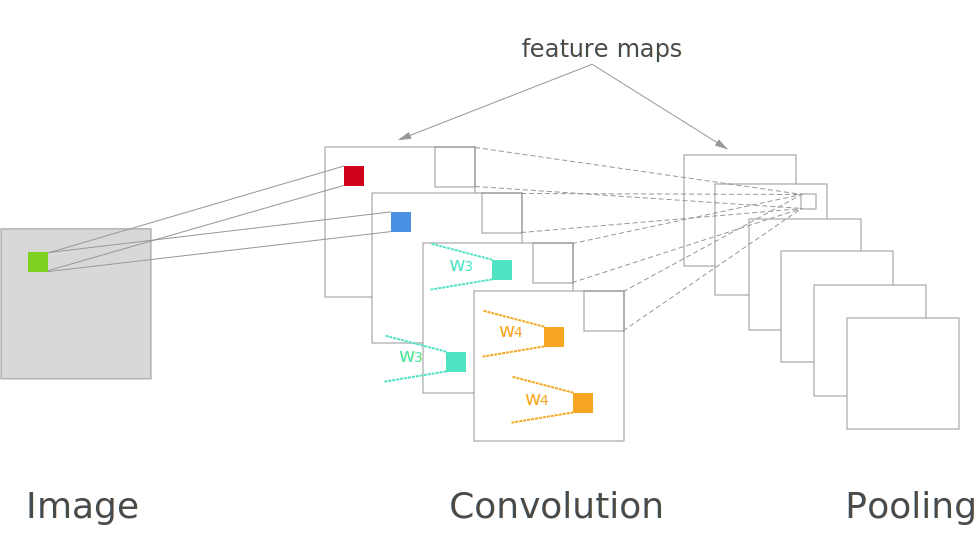

上图从左到右分别是：
1. **输入图像**（一个 7×7 的简单图形）
2. **卷积核（Kernel）**：一个 3×3 的矩阵（这里是 Sobel 垂直边缘检测核）
3. **卷积后的输出**：5×5 的结果

### 打个比方

把卷积想象成用手电筒照一张画。手电筒的光圈就是"卷积核"。你把光圈放在画的左上角，看看照到了什么；然后往右移一格，再看看；一行扫完后移到下一行继续扫。每次移动后记录下你看到的内容。

**卷积核就是"你注意看什么"**——不同的卷积核关注不同的特征。

## 卷积核（Kernel / Filter）

卷积核是一个小矩阵，它的大小通常是 3×3、5×5 或 7×7。不同的卷积核可以检测出图像中不同的特征。

### 经典例子：Sobel 算子

Sobel 算子是一种经典的边缘检测方法（不是神经网络，是传统图像处理，但原理相同）：

**垂直边缘检测核：**

```
[ 1,  0, -1]
[ 2,  0, -2]
[ 1,  0, -1]
```

这个核对"垂直方向上的颜色变化"特别敏感。当它滑过图像中一条垂直的边界时，输出值会很大。

**水平边缘检测核：**

```
[ 1,  2,  1]
[ 0,  0,  0]
[-1, -2, -1]
```

这个核对"水平方向上的颜色变化"敏感。

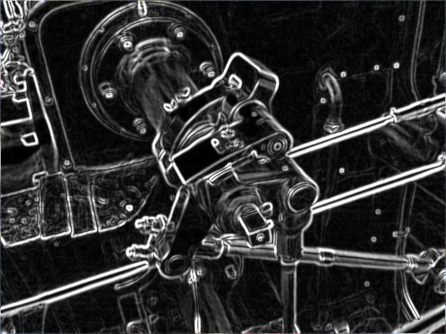

上图展示了对 MNIST 数字"8"进行 Sobel 边缘检测的效果。可以看到，原始图像经过 Sobel 卷积核处理后，数字的轮廓被清晰地提取了出来。

这就是**特征提取**——把图像中重要的结构信息提取出来，丢掉不重要的部分。

## CNN 如何逐层学习特征

CNN 的美妙之处在于：**它不需要人为设计卷积核，而是通过训练自动学出各种有用的卷积核。**

而且 CNN 学习特征是**分层的、由低级到高级的**：

| 层级 | 学到什么 | 可视化理解 |
|------|---------|-----------|
| 第一层（浅层） | 边缘、颜色块、线条方向 | 检测"这里有一条横线""这里是红色" |
| 第二层（中层） | 纹理、局部形状 | 检测"这里有一块格子花纹""这里有个半圆" |
| 第三层（深层） | 物体部件 | 检测"这是一个轮子""这是一个眼睛" |
| 第四层（更深层） | 完整的物体 | 检测"这是一个人脸""这是一辆车" |

对于 MNIST 手写数字识别：
- 浅层网络学会检测数字的笔画方向（横、竖、斜）
- 中层网络学会组合笔画成数字的部件（圆圈、竖线）
- 深层网络学会把部件组合成完整的数字

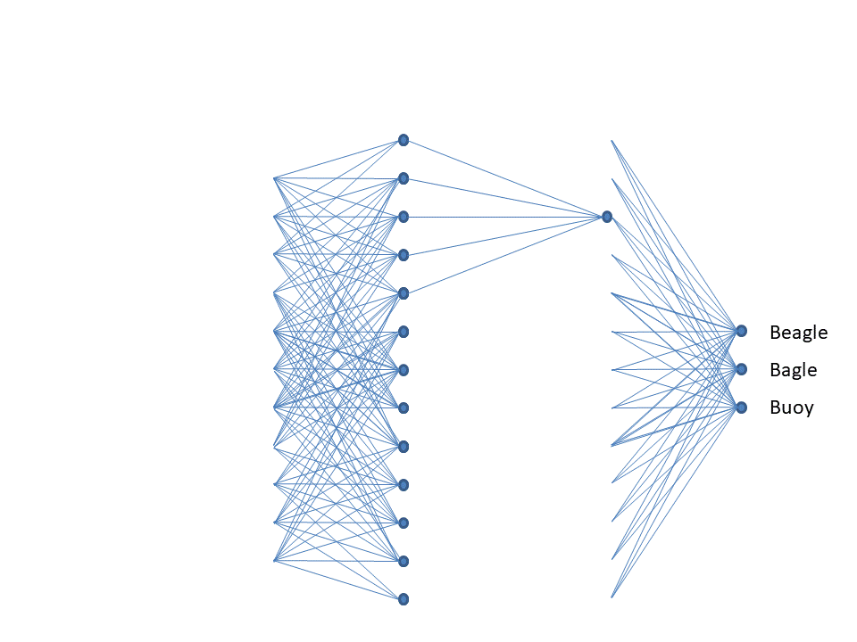

> **生活类比：**
> 你看一个朋友的脸，不会去数每个像素的 RGB 值。你会先看轮廓（脸型）、然后看五官（眼睛、鼻子、嘴巴）、最后组合起来认出"这是张三"。CNN 的工作原理和这个认知过程非常相似。

## 池化（Pooling）

CNN 里另一个重要的操作是**池化**，一般是**最大池化（Max Pooling）**。

池化的作用很简单：**把图片缩小但保留最重要的信息。**

比如 2×2 的最大池化，就是把一个 2×2 区域里的最大值保留下来，其他的丢掉：

```
[1, 3]     [4]
[4, 2]  →  保留最大值 4
```

这样做的好处：
1. **减少参数数量**（图片缩小了，后面的计算量就减少了）
2. **提高鲁棒性**（即使像素位置有一点偏移，池化后的结果差不多）
3. **防止过拟合**（参数少了，就不容易过度拟合训练数据）

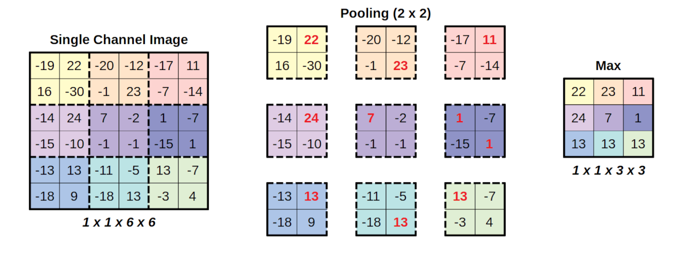

### CNN 的完整流程

```
输入图片(28×28×1)
    ↕ 卷积 + ReLU
特征图(28×28×32)
    ↕ 池化(2×2)
特征图(14×14×32)
    ↕ 卷积 + ReLU
特征图(14×14×64)
    ↕ 池化(2×2)
特征图(7×7×64)
    ↕ 展平(Flatten)
一维向量(7×7×64 = 3136)
    ↕ 全连接层
128维向量
    ↕ 全连接层
10维向量(对应0~9)
    ↕ Softmax
概率分布
```

---

# 九、计算机是如何自动学习的

上面我们了解了 CNN 的结构——但有一个关键问题还没回答：**卷积核里的数字是怎么学出来的？**

这一节我们来看神经网络训练的完整流程。

## 神经网络的基本结构

一个最简单的神经网络包含三种"层"：

```
输入层 → 隐藏层 → 输出层
```

- **输入层**：接收原始数据（MNIST 是 784 个像素值）
- **隐藏层**：中间的计算层（可以有一层或多层）
- **输出层**：输出结果（MNIST 是 10 个数字的概率）

每层之间通过"权重"（Weight）连接，每个神经元还有一个"偏置"（Bias）。


## 前向传播（Forward Propagation）

前向传播就是**数据从输入层流到输出层的过程**。

具体来说：

```
输入 → 加权求和 → 加偏置 → 激活函数 → 传给下一层 → ... → 输出
```

数学表达就是：

$$z^{(l)} = W^{(l)} \cdot a^{(l-1)} + b^{(l)}$$
$$a^{(l)} = \sigma(z^{(l)})$$

其中 $W$ 是权重矩阵，$b$ 是偏置向量，$\sigma$ 是激活函数，$a^{(l)}$ 是第 $l$ 层的输出。

前向传播的"前"是指——数据从前往后走。一开始神经网络的参数（权重和偏置）都是随机初始化的，所以第一次前向传播的输出肯定是乱七八糟的。比如你输入一个"5"的图片，它可能输出"认为这是8的概率99%"——错得离谱。

## 损失函数（Loss Function）

既然模型输出错了，我们需要**量化"错得有多离谱"**。这就是损失函数做的事。

损失函数（也叫代价函数、目标函数）衡量模型的预测值和真实值之间的差距。

对于分类问题，最常用的是**交叉熵损失（Cross-Entropy Loss）**：

$$L = -\sum_{i=1}^{n} y_i \log(\hat{y}_i)$$

其中 $y_i$ 是真实标签（比如 0 或 1），$\hat{y}_i$ 是模型预测的概率。

用人话说：**如果模型对正确答案预测的概率很低，损失就很大；对正确答案预测的概率很高，损失就很小。**

我们的目标就是：**最小化损失函数。**

## 梯度（Gradient）

有了损失函数之后，我们要回答一个问题："怎么调整参数才能让损失变小？"

这就需要用到**梯度**。

"梯度"这个词听起来很数学，但它的实际含义很简单：**梯度告诉你，在哪个方向调整参数，损失下降得最快。**

从数学上说，梯度是损失函数对每个参数的偏导数组成的向量。

- 梯度为正：参数增大，损失增大 → 你应该减小这个参数
- 梯度为负：参数增大，损失减小 → 你应该增大这个参数

> **用「蒙眼下山」来理解梯度下降：**
>
> 想象你被蒙住眼睛，站在一座山上（山代表损失函数的值——山顶高、山谷低）。你要走到山谷（最小损失），但你看不见路。
>
> 你只能用手里的拐杖探探脚下的地面——往哪边倾斜，就往哪边走一步。每迈出一步，再探一次，再走一步。一步一步地，你就能走到山谷。
>
> 这个"用拐杖探路的方向"就是梯度，"每步迈多大"就是学习率。

## 反向传播（Backpropagation）

有了损失值，也知道了梯度的大致概念，现在的问题是：**如何计算网络中每个参数对应的梯度？**

这就是反向传播算法做的事。

反向传播的工作原理是**链式法则（Chain Rule）**——从输出层开始，一层一层往回计算梯度。

```

前向传播：   输入 → 第一层 → 第二层 → ... → 输出层 → 损失
                                                    ↓
反向传播：   输入 ← 第一层 ← 第二层 ← ... ← 输出层 ← 损失
             ↑                              ↑
         计算第一层参数的梯度            计算输出层参数的梯度
```

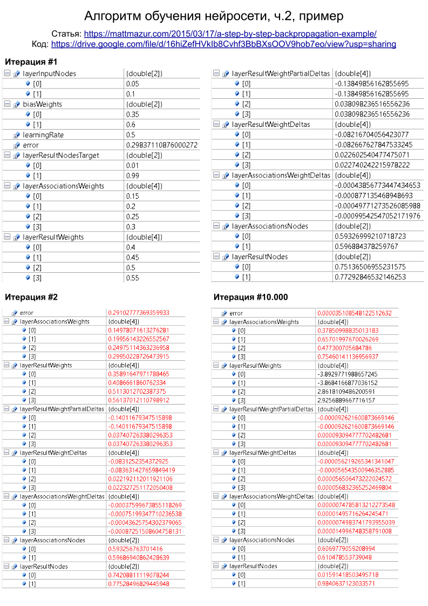

- **前向传播**（绿色箭头）：数据从前往后走，计算出预测结果和损失
- **反向传播**（红色箭头）：梯度从后往前走，每个参数都算出自己对损失的贡献

## 梯度下降（Gradient Descent）

有了梯度（每个参数的"调整方向"）之后，就可以更新参数了：

$$W_{\text{new}} = W_{\text{old}} - \eta \cdot \frac{\partial L}{\partial W}$$

其中 $\eta$（学习率，Learning Rate）控制了每次更新的步长：
- 学习率太大：可能跳过最优点，甚至发散
- 学习率太小：训练速度慢，且可能陷入局部最优

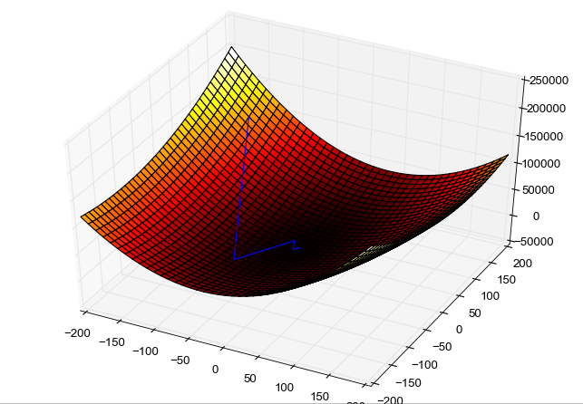

从图中可以看到，优化过程就像在山坡上一步一步往下走，最终到达山谷（损失最小的位置）。

## 优化器（Optimizer）

梯度下降有很多变体，统称为**优化器**。

- **SGD（随机梯度下降）**：每次用一个样本计算梯度，更新参数
- **Mini-batch SGD**：每次用一小批样本（batch）计算梯度，最常用
- **Adam**：自适应学习率，会自动调整每个参数的学习步长（是目前最常用的优化器之一）

在后面的代码中，我们会使用 Adam 优化器。

### 训练过程小结

把上面所有概念串起来，完整的训练过程就是：

```
1. 初始化网络参数（随机）
2. 重复执行以下步骤，直到损失不再下降：
   a. 取一批训练数据
   b. 前向传播：计算预测结果
   c. 计算损失（预测 vs 真实）
   d. 反向传播：计算每个参数的梯度
   e. 用优化器更新参数
3. 训练完成，参数固定下来
```

## 计算图（Computation Graph）的概念

深度学习框架（PyTorch、TensorFlow 等）背后都依赖一个核心技术：**计算图**。

计算图就是把神经网络的计算过程画成一张**有向无环图（DAG）**：
- **节点**：变量（数据、参数）和运算（加法、乘法、激活函数等）
- **边**：数据流向

```text
输入 x → [乘以 W] → [加 b] → [ReLU] → 输出 a
         ↑           ↑
       参数 W      参数 b
```

计算图的好处：
1. **自动求导**：你只需要定义前向传播的计算图，框架自动管理反向传播的梯度计算
2. **模块化**：可以自由组合各种运算
3. **GPU 加速**：计算图的运算可以被高效地并行化

在 PyTorch 中，当你调用 `loss.backward()` 时，PyTorch 会自动沿着计算图反向传播梯度。这就像有个助手自动帮你完成了反向传播的数学推导和计算。

---

# 十、激活函数——为什么神经网络需要"非线性"

## 如果没有激活函数

先考虑一个"极端"情况：如果神经网络没有激活函数（或者说使用恒等映射 $f(x) = x$），会发生什么？

一个两层的网络：

$$\text{输出} = (x \cdot W_1 + b_1) \cdot W_2 + b_2$$

展开一下：

$$\text{输出} = x \cdot (W_1 \cdot W_2) + (b_1 \cdot W_2 + b_2)$$

发现了吗？**两个线性层叠加，本质上还是一个线性层。** 不管你叠加多少层，这个网络的表达能力都和一个单层网络一样。

> 线性函数的组合还是线性函数。就像无论你怎么堆叠弹簧，它拉伸时的受力还是线性的——你永远无法用它来模拟一个钟摆的运动（那需要非线性）。

所以，神经网络必须引入**非线性**，才能真正地表达复杂函数。

## 激活函数的作用

激活函数就是那个引入非线性的东西。它作用于每层的输出：

$$a^{(l)} = \sigma(z^{(l)})$$

常用的激活函数有几种，各有各的用处：

### Sigmoid

$$\sigma(x) = \frac{1}{1 + e^{-x}}$$

- 输出范围：(0, 1)
- 适合：二分类的输出层
- 缺点：两端的梯度几乎为 0，会导致梯度消失（深层网络几乎学不动）
- 形象理解：就像"饱和"的开关——输入很大或很小时，输出差不多不变；只有在中间区域才敏感。

### Tanh

$$\tanh(x) = \frac{e^x - e^{-x}}{e^x + e^{-x}}$$

- 输出范围：(-1, 1)
- 可以看作是 Sigmoid 的"平移版本"
- 优点：零中心（输出有正有负），在某些情况下比 Sigmoid 好
- 缺点：同样有梯度消失问题

### ReLU（Rectified Linear Unit）

$$\text{ReLU}(x) = \max(0, x)$$

- 输出范围：[0, +∞)
- 优点：
  - 计算极其简单（一个 max 运算）
  - 正半轴梯度恒为 1，不会梯度消失
  - 稀疏性：很多神经元的输出为 0（"不激活"）
- 缺点：负半轴输出恒为 0，可能导致一些神经元"死亡"（永远不更新）

### Leaky ReLU

$$\text{Leaky ReLU}(x) = \max(0.01x, x)$$

- 对 ReLU 的改进：负半轴不再是一个平坦的 0，而是有一个很小的斜率
- 解决了"神经元死亡"问题
- 少数情况下效果好于 ReLU

### Softmax

$$\text{Softmax}(x_i) = \frac{e^{x_i}}{\sum_{j=1}^{n} e^{x_j}}$$

- 这是一个**特殊的激活函数，一般只用在输出层**
- 作用：把一个向量转换成**概率分布**
- 输出：所有元素 > 0 且和为 1

> **生活中的 Softmax：**
> 你考试后，老师把原始分数（可能是负数、可能超过100）通过某种规则转换成"标准分"——这就是 Softmax 在做的事。不管原始值是什么范围，最终输出都是"这个情况占多少百分比"，让人能直接理解。

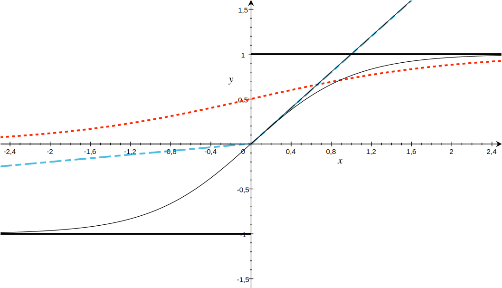

### 为什么需要这么多不同的激活函数

一句话总结：**ReLU 简单好用适合隐藏层，Sigmoid/Tanh 在 RNN 等特殊场景有用，Softmax 专门用来输出概率。**

在现代的 CNN 中，**隐藏层基本都用 ReLU（或其变体），输出层根据任务选择**——分类问题用 Softmax，回归问题不用激活函数（或者用恒等映射）。

---

# 十一、完整的 PyTorch + MNIST 实战项目


理论终于说得差不多了，现在我们来写点真正能跑起来的代码。

## 环境准备

你需要安装以下 Python 包：

```bash
pip install torch torchvision matplotlib numpy
```

## Step 1: 导入必要的库

```python
import torch                     # PyTorch 主库
import torch.nn as nn            # 神经网络模块（层、损失函数等）
import torch.nn.functional as F  # 函数式 API（激活函数等）
import torch.optim as optim      # 优化器
import torchvision               # 视觉工具（数据集、图像处理）
import torchvision.transforms as transforms  # 图像预处理
from torch.utils.data import DataLoader      # 批量数据加载器
import matplotlib.pyplot as plt  # 画图工具
import numpy as np               # 数值计算
```

## Step 2: 下载和加载 MNIST 数据集

```python
# 定义数据预处理流程
# Compose 把多个预处理操作组合在一起
transform = transforms.Compose([
    transforms.ToTensor(),  # 把PIL图像或NumPy数组转换成PyTorch张量(Tensor)
                            # 同时把像素值从[0,255]缩放到[0.0, 1.0]
    transforms.Normalize(   # 标准化：让数据符合标准正态分布
        (0.1307,),          # MNIST数据集的平均灰度值
        (0.3081,)           # MNIST数据集的标准差
    )
])

# 下载训练集
trainset = torchvision.datasets.MNIST(
    root='./mnist_data',    # 下载路径
    train=True,             # 加载训练集（共60000张图片）
    download=True,          # 如果本地没有则自动下载
    transform=transform     # 应用上面定义的预处理
)

# 下载测试集
testset = torchvision.datasets.MNIST(
    root='./mnist_data',
    train=False,            # 加载测试集（共10000张图片）
    download=True,
    transform=transform
)
```

**关键知识点解释：**

- **`ToTensor()`**：这是最重要的一步。原始数据是 PIL 图片格式（值范围 0~255），要转换成 PyTorch 能处理的 Tensor（浮点数，范围 0~1）。
- **`Normalize((mean,), (std,))`**：标准化让数据变成均值为 0、方差为 1 的分布。这样做可以加速训练收敛，因为不同像素的数值范围一致了，模型不需要在训练过程中再"适应"不同的数值尺度。
- 为什么标准化后数据范围不是 0~1 了？因为减均值除以标准差后，大约 95% 的数据会落在 [-2, 2] 的范围内——这是正常的。

## Step 3: 使用 DataLoader 批量加载数据

```python
# DataLoader把数据集包装成可迭代的批数据
# 就好比：一大堆数据 → DataLoader → 每次拿出一个小批次给模型
train_loader = DataLoader(
    trainset,
    batch_size=64,      # 每次随机取64张图片
    shuffle=True        # 打乱顺序（每轮训练都重新打乱，防止模型学到顺序信息）
)

test_loader = DataLoader(
    testset,
    batch_size=1000,    # 测试时可以大一点（不需要反向传播，不占太多显存）
    shuffle=False       # 测试不需要打乱
)
```

**为什么使用 DataLoader？**

如果不使用 DataLoader，你得自己写着写代码：
1. 手动切分数据集
2. 手动打乱顺序
3. 手动从硬盘加载图片
4. 手动用多线程加速数据读取

DataLoader 帮你把这些都做好了。你只需要告诉它：数据集是谁、每批多大、打不打乱、用几个线程加载数据。

`batch_size=64` 意味着：每次向前传播 + 反向传播，都是 64 张图片一起计算。这叫**小批量梯度下降（Mini-batch SGD）**。使用批量而不是单张图片的好处是——梯度更稳定（64 张图片的平均梯度比单张图片的梯度更能代表整体的方向）。

## Step 4: 定义 CNN 模型

```python
class MNISTCNN(nn.Module):
    """
    MNIST 手写数字识别的卷积神经网络模型

    架构：
    Conv2d(1→32) → ReLU → MaxPool(2×2) → Conv2d(32→64) → ReLU → MaxPool(2×2)
    → Flatten → FullyConnected(64*7*7→128) → ReLU → FullyConnected(128→10) → Softmax
    """

    def __init__(self):                      # 构造函数：定义网络的结构
        super(MNISTCNN, self).__init__()

        # 第一个卷积层
        # 输入通道数=1（灰度图只有1个通道，彩色图是3）
        # 输出通道数=32（使用32个不同的卷积核，得到32张特征图）
        # 卷积核大小=3×3
        # padding=1（在图像周围补一圈0，让输出尺寸和输入相同）
        self.conv1 = nn.Conv2d(1, 32, kernel_size=3, padding=1)

        # 第二个卷积层
        # 输入是上一层的32个特征图 → 输出64个特征图
        self.conv2 = nn.Conv2d(32, 64, kernel_size=3, padding=1)

        # 第一个全连接层
        # 输入：64 * 7 * 7（经过两次2×2池化后，28×28 → 14×14 → 7×7）
        # 输出：128 个神经元
        self.fc1 = nn.Linear(64 * 7 * 7, 128)

        # 第二个全连接层（输出层）
        # 输入：128 → 输出：10（对应0~9十个数字）
        self.fc2 = nn.Linear(128, 10)

    def forward(self, x):                    # 前向传播：定义数据怎么流过网络
        # x的初始形状：[batch_size, 1, 28, 28]
        # batch_size=64时，形状是[64, 1, 28, 28]

        # 第一层：卷积 → ReLU → 池化
        x = F.relu(self.conv1(x))            # 卷积后形状：[64, 32, 28, 28]
        x = F.max_pool2d(x, 2)               # 池化后形状：[64, 32, 14, 14]

        # 第二层：卷积 → ReLU → 池化
        x = F.relu(self.conv2(x))            # 卷积后形状：[64, 64, 14, 14]
        x = F.max_pool2d(x, 2)               # 池化后形状：[64, 64, 7, 7]

        # 展平：把二维的特征图变成一维向量（才能输入到全连接层）
        x = x.view(-1, 64 * 7 * 7)           # 展平后形状：[64, 3136]

        # 全连接层
        x = F.relu(self.fc1(x))              # 形状：[64, 128]
        x = self.fc2(x)                      # 形状：[64, 10]（注意：这里没有Softmax）

        # 为什么不在这里加Softmax？
        # 因为PyTorch的交叉熵损失函数 nn.CrossEntropyLoss 内部自带Softmax
        # 如果在输出层加了Softmax，再传给CrossEntropyLoss，就等于做了两次Softmax
        return x

    def predict(self, x):
        """推理方法：输入一张图片，输出预测的数字"""
        self.eval()                          # 切换到评估模式（关闭 Dropout 等训练特有操作）
        with torch.no_grad():                # 关闭梯度计算（推理不需要反向传播，节省显存和速度）
            logits = self.forward(x)         # 前向传播得到原始输出（logits）
            probabilities = F.softmax(logits, dim=1)  # 用Softmax转成概率
            predicted = torch.argmax(probabilities, dim=1)  # 取概率最大的类别
        return predicted, probabilities
```

**CNN 结构详解：为什么这么设计？**

| 组件 | 作用 | 为什么用这个参数？ |
|------|------|------------------|
| `Conv2d(1, 32, 3)` | 从 1 个输入通道提取出 32 个不同的特征 | 32 个卷积核足够捕捉数字的基本笔画特征，又不太多导致过拟合 |
| `MaxPool2d(2)` | 2×2 区域取最大值，尺寸减半 | 28→14→7，逐步压缩，提取高层特征 |
| `fc1(3136, 128)` | 把 3136 维的特征压缩到 128 维 | 128 是经验值，太小会丢失信息，太大容易过拟合 |
| `fc2(128, 10)` | 把 128 维映射到 10 个数字类别 | 10 = 0~9，最终要做 10 分类 |

## Step 5: 训练模型

```python
def train(model, device, train_loader, optimizer, epoch):
    """
    训练一个epoch（一个epoch = 把所有训练数据完整过一遍）

    参数说明：
    - model: 要训练的模型
    - device: 在CPU还是GPU上训练
    - train_loader: 训练数据的DataLoader
    - optimizer: 优化器（控制如何更新参数）
    - epoch: 当前是第几个epoch（仅用来显示进度）
    """
    model.train()  # 切换到训练模式（打开 Dropout、BatchNorm 等训练特有操作）

    for batch_idx, (data, target) in enumerate(train_loader):
        # data:  一批图片，形状为 [64, 1, 28, 28]
        # target:这批图片对应的标签，形状为 [64]（每个数字0~9）

        # 把数据搬到指定设备（CPU或GPU）
        data, target = data.to(device), target.to(device)

        # 非常重要：把梯度清零
        # 因为PyTorch默认会累加梯度，不清零的话每次反向传播都会把新梯度和旧梯度相加
        optimizer.zero_grad()

        # 前向传播：把数据喂给模型，得到输出
        output = model(data)                 # output形状：[64, 10]

        # 计算损失
        # CrossEntropyLoss = LogSoftmax + NLLLoss
        # 先对output做Softmax转成概率，再计算交叉熵
        loss = F.cross_entropy(output, target)

        # 反向传播：计算每个参数的梯度
        loss.backward()

        # 更新参数：optimizer根据梯度调整参数
        optimizer.step()

        # 每100批打印一次训练进度
        if batch_idx % 100 == 0:
            print(f'Epoch {epoch} [{batch_idx * len(data)}/{len(train_loader.dataset)} '
                  f'({100. * batch_idx / len(train_loader):.0f}%)] Loss: {loss.item():.6f}')


def test(model, device, test_loader):
    """在测试集上评估模型性能"""
    model.eval()    # 切换到评估模式

    test_loss = 0
    correct = 0

    # with torch.no_grad(): 这个上下文管理器告诉PyTorch不要记录梯度
    # 在测试/推理时使用，可以显著减少内存占用并加快速度
    with torch.no_grad():
        for data, target in test_loader:
            data, target = data.to(device), target.to(device)

            # 前向传播
            output = model(data)

            # 累加损失
            test_loss += F.cross_entropy(output, target, reduction='sum').item()

            # 获取预测结果（预测概率最大的那个类别）
            pred = output.argmax(dim=1, keepdim=True)

            # 统计正确预测的数量
            correct += pred.eq(target.view_as(pred)).sum().item()

    test_loss /= len(test_loader.dataset)
    accuracy = 100. * correct / len(test_loader.dataset)

    print(f'Test set: Average loss: {test_loss:.4f}, '
          f'Accuracy: {correct}/{len(test_loader.dataset)} ({accuracy:.2f}%)')

    return accuracy
```

## Step 6: 启动训练

```python
def main():
    """主函数：组装所有组件并开始训练"""

    # 检测是否有可用的GPU
    # CUDA是NVIDIA的并行计算平台，有了GPU训练速度可以快几十倍
    device = torch.device("cuda" if torch.cuda.is_available() else "cpu")
    print(f"Using device: {device}")

    # 超参数设置
    batch_size = 64      # 每批64张图片
    epochs = 10          # 训练10轮（反复学习10遍整个数据集）
    learning_rate = 0.001  # 学习率（Adam优化器通常用0.001）

    # 1. 加载数据
    transform = transforms.Compose([
        transforms.ToTensor(),
        transforms.Normalize((0.1307,), (0.3081,))
    ])

    trainset = torchvision.datasets.MNIST(
        root='./mnist_data', train=True, download=True, transform=transform)
    testset = torchvision.datasets.MNIST(
        root='./mnist_data', train=False, download=True, transform=transform)

    train_loader = DataLoader(trainset, batch_size=batch_size, shuffle=True)
    test_loader = DataLoader(testset, batch_size=1000, shuffle=False)

    # 2. 创建模型并移动到设备（CPU/GPU）
    model = MNISTCNN().to(device)

    # 3. 定义优化器
    # Adam是一种自适应学习率的优化器，
    # 它会为每个参数单独维护学习率，通常比SGD更容易使用
    optimizer = optim.Adam(model.parameters(), lr=learning_rate)

    # 4. 训练循环
    print("Starting training...")
    for epoch in range(1, epochs + 1):
        train(model, device, train_loader, optimizer, epoch)
        accuracy = test(model, device, test_loader)

    print("Training complete!")

    # 5. 保存训练好的模型
    torch.save(model.state_dict(), "mnist_cnn.pth")
    print("Model saved as mnist_cnn.pth")


if __name__ == '__main__':
    main()
```

### 代码运行结果示例

你应该会看到类似这样的输出（数字不完全相同，因为有随机性）：

```
Using device: cpu
Starting training...
Epoch 1 [0/60000 (0%)] Loss: 2.301221
Epoch 1 [6400/60000 (11%)] Loss: 0.264532
Epoch 1 [12800/60000 (21%)] Loss: 0.127508
...
Test set: Average loss: 0.0456, Accuracy: 9856/10000 (98.56%)
Epoch 2 ...
Test set: Average loss: 0.0321, Accuracy: 9898/10000 (98.98%)
...
Epoch 10 ...
Test set: Average loss: 0.0234, Accuracy: 9935/10000 (99.35%)
```

经过 10 轮训练，模型在测试集上通常可以达到 **99% 以上**的准确率。这意味着对于一万张模型从未见过的手写数字图片，它能够正确识别 9935 张以上。

## Step 7: 模型推理——让模型真正用起来

```python
def predict_single_image(model, image_tensor):
    """
    预测单张图片中的数字

    参数：
    - model: 训练好的模型
    - image_tensor: 一张图片的Tensor，应为 [1, 28, 28] 或 [1, 1, 28, 28] 形状

    返回：
    - predicted_digit: 预测的数字 (int)
    - probabilities: 每个数字的概率 (numpy array, 长度10)
    """
    device = next(model.parameters()).device  # 获取模型所在的设备

    # 确保输入是4D张量 [batch_size, channels, height, width]
    if image_tensor.dim() == 3:  # [1, 28, 28]
        image_tensor = image_tensor.unsqueeze(0)  # 变成 [1, 1, 28, 28]

    # 移动到正确的设备
    image_tensor = image_tensor.to(device)

    # 推理
    model.eval()
    with torch.no_grad():
        logits = model(image_tensor)
        probabilities = F.softmax(logits, dim=1)
        predicted_digit = torch.argmax(probabilities, dim=1).item()

    return predicted_digit, probabilities.cpu().numpy().flatten()


def visualize_prediction(image, predicted_digit, probabilities):
    """可视化预测结果"""
    fig, (ax1, ax2) = plt.subplots(1, 2, figsize=(10, 4))

    # 显示图片
    if isinstance(image, torch.Tensor):
        image = image.numpy().squeeze()
    ax1.imshow(image, cmap='gray')
    ax1.set_title(f'Predicted: {predicted_digit}', fontsize=14)
    ax1.axis('off')

    # 显示概率柱状图
    digits = list(range(10))
    colors = ['steelblue'] * 10
    colors[predicted_digit] = 'coral'
    ax2.bar(digits, probabilities * 100, color=colors)
    ax2.set_xlabel('Digit')
    ax2.set_ylabel('Confidence (%)')
    ax2.set_title('Prediction Probability Distribution')
    ax2.set_xticks(digits)

    for i, prob in enumerate(probabilities):
        ax2.text(i, prob * 100 + 0.5, f'{prob*100:.1f}%', ha='center', fontsize=8)

    plt.tight_layout()
    plt.show()


# 使用示例：从测试集中取一张图片试试
if __name__ == '__main__':
    # 1. 重新加载模型（假设已经训练好并保存了 mnist_cnn.pth）
    model = MNISTCNN()
    model.load_state_dict(torch.load("mnist_cnn.pth", map_location='cpu'))

    # 2. 加载测试集
    transform = transforms.Compose([
        transforms.ToTensor(),
        transforms.Normalize((0.1307,), (0.3081,))
    ])
    testset = torchvision.datasets.MNIST(
        root='./mnist_data', train=False, download=True, transform=transform)

    # 3. 取第一张图片试试
    image, true_label = testset[0]
    predicted_digit, probabilities = predict_single_image(model, image)

    print(f"True digit: {true_label}")
    print(f"Predicted: {predicted_digit}")
    print(f"Confidence: {probabilities[predicted_digit]*100:.2f}%")
    print("All class probabilities:")
    for i, prob in enumerate(probabilities):
        print(f"  Digit {i}: {prob*100:.1f}%")

    # 4. 可视化结果
    visualize_prediction(image, predicted_digit, probabilities)
```

## 完整代码汇总

为了方便你直接运行，我把上面所有代码整合成一个完整的脚本：

```python
"""
MNIST 手写数字识别 - 完整可运行代码
PyTorch + CNN
"""
import torch
import torch.nn as nn
import torch.nn.functional as F
import torch.optim as optim
import torchvision
import torchvision.transforms as transforms
from torch.utils.data import DataLoader
import matplotlib.pyplot as plt
import numpy as np


# ═══════════════════════════════════════════════════════
# 1. 定义CNN模型
# ═══════════════════════════════════════════════════════
class MNISTCNN(nn.Module):
    def __init__(self):
        super(MNISTCNN, self).__init__()
        self.conv1 = nn.Conv2d(1, 32, kernel_size=3, padding=1)
        self.conv2 = nn.Conv2d(32, 64, kernel_size=3, padding=1)
        self.fc1 = nn.Linear(64 * 7 * 7, 128)
        self.fc2 = nn.Linear(128, 10)

    def forward(self, x):
        x = F.relu(self.conv1(x))
        x = F.max_pool2d(x, 2)
        x = F.relu(self.conv2(x))
        x = F.max_pool2d(x, 2)
        x = x.view(-1, 64 * 7 * 7)
        x = F.relu(self.fc1(x))
        x = self.fc2(x)
        return x

    def predict(self, x):
        self.eval()
        with torch.no_grad():
            logits = self.forward(x)
            probabilities = F.softmax(logits, dim=1)
            predicted = torch.argmax(probabilities, dim=1)
        return predicted, probabilities


# ═══════════════════════════════════════════════════════
# 2. 训练函数
# ═══════════════════════════════════════════════════════
def train(model, device, train_loader, optimizer, epoch):
    model.train()
    for batch_idx, (data, target) in enumerate(train_loader):
        data, target = data.to(device), target.to(device)
        optimizer.zero_grad()
        output = model(data)
        loss = F.cross_entropy(output, target)
        loss.backward()
        optimizer.step()
        if batch_idx % 100 == 0:
            print(f'Epoch {epoch} [{batch_idx * len(data)}/{len(train_loader.dataset)} '
                  f'({100. * batch_idx / len(train_loader):.0f}%)] Loss: {loss.item():.6f}')


def test(model, device, test_loader):
    model.eval()
    test_loss = 0
    correct = 0
    with torch.no_grad():
        for data, target in test_loader:
            data, target = data.to(device), target.to(device)
            output = model(data)
            test_loss += F.cross_entropy(output, target, reduction='sum').item()
            pred = output.argmax(dim=1, keepdim=True)
            correct += pred.eq(target.view_as(pred)).sum().item()
    test_loss /= len(test_loader.dataset)
    accuracy = 100. * correct / len(test_loader.dataset)
    print(f'Test set: Average loss: {test_loss:.4f}, '
          f'Accuracy: {correct}/{len(test_loader.dataset)} ({accuracy:.2f}%)')
    return accuracy


# ═══════════════════════════════════════════════════════
# 3. 推理函数
# ═══════════════════════════════════════════════════════
def predict_single_image(model, image_tensor):
    device = next(model.parameters()).device
    if image_tensor.dim() == 3:
        image_tensor = image_tensor.unsqueeze(0)
    image_tensor = image_tensor.to(device)
    model.eval()
    with torch.no_grad():
        logits = model(image_tensor)
        probabilities = F.softmax(logits, dim=1)
        predicted_digit = torch.argmax(probabilities, dim=1).item()
    return predicted_digit, probabilities.cpu().numpy().flatten()


def visualize_prediction(image, predicted_digit, probabilities):
    fig, (ax1, ax2) = plt.subplots(1, 2, figsize=(10, 4))
    if isinstance(image, torch.Tensor):
        image = image.numpy().squeeze()
    ax1.imshow(image, cmap='gray')
    ax1.set_title(f'Predicted: {predicted_digit}', fontsize=14)
    ax1.axis('off')
    digits = list(range(10))
    colors = ['steelblue'] * 10
    colors[predicted_digit] = 'coral'
    ax2.bar(digits, probabilities * 100, color=colors)
    ax2.set_xlabel('Digit')
    ax2.set_ylabel('Confidence (%)')
    ax2.set_title('Prediction Probability Distribution')
    ax2.set_xticks(digits)
    for i, prob in enumerate(probabilities):
        ax2.text(i, prob * 100 + 0.5, f'{prob*100:.1f}%', ha='center', fontsize=8)
    plt.tight_layout()
    plt.show()


# ═══════════════════════════════════════════════════════
# 4. 主函数
# ═══════════════════════════════════════════════════════
def main():
    device = torch.device("cuda" if torch.cuda.is_available() else "cpu")
    print(f"Using device: {device}")

    # 超参数
    batch_size = 64
    epochs = 10
    learning_rate = 0.001

    # 数据预处理
    transform = transforms.Compose([
        transforms.ToTensor(),
        transforms.Normalize((0.1307,), (0.3081,))
    ])

    # 加载数据
    trainset = torchvision.datasets.MNIST(
        root='./mnist_data', train=True, download=True, transform=transform)
    testset = torchvision.datasets.MNIST(
        root='./mnist_data', train=False, download=True, transform=transform)
    train_loader = DataLoader(trainset, batch_size=batch_size, shuffle=True)
    test_loader = DataLoader(testset, batch_size=1000, shuffle=False)

    # 创建模型
    model = MNISTCNN().to(device)

    # 定义优化器
    optimizer = optim.Adam(model.parameters(), lr=learning_rate)

    # 训练
    print("Starting training...")
    for epoch in range(1, epochs + 1):
        train(model, device, train_loader, optimizer, epoch)
        accuracy = test(model, device, test_loader)
    print("Training complete!")

    # 保存模型
    torch.save(model.state_dict(), "mnist_cnn.pth")
    print("Model saved as mnist_cnn.pth")

    # 推理演示
    print("\nInference demo on test set...")
    image, true_label = testset[0]
    predicted, probs = predict_single_image(model, image)
    print(f"True digit: {true_label}, Predicted: {predicted}, "
          f"Confidence: {probs[predicted]*100:.2f}%")

    # 选出模型最确定和最不确定的样本
    print("\nAnalyzing predictions...")
    model.eval()
    confident_samples = []
    uncertain_samples = []
    with torch.no_grad():
        for data, target in test_loader:
            data, target = data.to(device), target.to(device)
            output = model(data)
            probs_all = F.softmax(output, dim=1)
            max_probs, preds = torch.max(probs_all, dim=1)
            for i in range(len(data)):
                if preds[i] == target[i]:
                    confident_samples.append((max_probs[i].item(), data[i], target[i].item()))
                else:
                    uncertain_samples.append((max_probs[i].item(), data[i], target[i].item(), preds[i].item()))

    # 排序并展示
    confident_samples.sort(reverse=True)
    uncertain_samples.sort()

    if uncertain_samples:
        print(f"\nMost uncertain prediction (failed case):")
        prob, img, true_lbl, pred_lbl = uncertain_samples[0]
        print(f"  True: {true_lbl}, Predicted: {pred_lbl}, Confidence: {prob*100:.2f}%")

    print(f"\nBest prediction:")
    prob, img, true_lbl = confident_samples[0]
    print(f"  True: {true_lbl}, Confidence: {prob*100:.2f}%")


if __name__ == '__main__':
    main()
```

> 你可以直接把这个代码复制到 `mnist_cnn.py` 文件中，然后运行 `python mnist_cnn.py`。第一次运行时会自动下载 MNIST 数据集（约 10MB），后续会直接使用本地缓存。

---

# 十二、推理过程详解——一张图片在神经网络中经历了什么

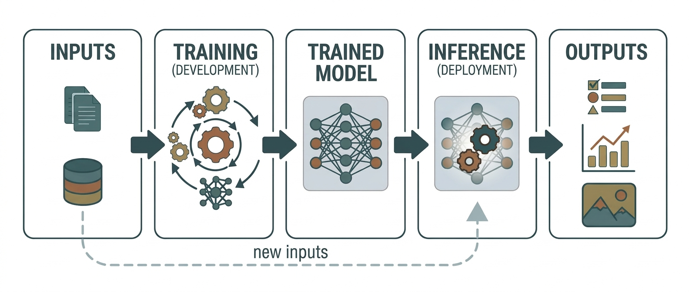

前面我们写了代码，现在我们来详细说说模型训练完成之后，用户上传一张图片时，背后到底发生了什么。

## 训练（Training）vs 推理（Inference）

这两个概念非常重要，一定要区分清楚：

| 对比维度 | 训练（Training） | 推理（Inference） |
|---------|-----------------|------------------|
| **目标** | 学习参数（权重和偏置） | 用学好的参数做预测 |
| **数据流向** | 前向 + 反向（梯度回流） | 只有前向（不需要反向） |
| **标签** | 需要（监督学习） | 不需要（预测标签） |
| **参数更新** | 每批数据都更新 | 参数固定不变 |
| **计算量** | 大（需要记录梯度） | 小（只需前向传播） |
| **Dropout** | 开启（随机丢弃神经元） | 关闭（全部神经元参与） |
| **BatchNorm** | 使用批次统计量 | 使用训练阶段积累的全局统计量 |

你可以在代码中看到这些区别：

- 训练时调用 `model.train()`，推理时调用 `model.eval()`
- 训练时在 `with torch.no_grad()` 之外（需要梯度），推理时在 `with torch.no_grad()` 之内（不需要梯度）

## 用户上传一张图片后的完整流程

假设你写了一个网页，用户可以上传手写数字图片，然后页面显示识别结果。后台的流程是这样的：

### Step 1: 图像加载与预处理

```python
from PIL import Image

# 用户上传的图片可能是彩色的、尺寸可能不同
user_image = Image.open("user_uploaded_digit.png")

# 预处理：
# 1. 转灰度图（因为我们训练时用的是灰度图）
user_image = user_image.convert("L")

# 2. 缩放至28×28（因为模型只认识28×28的尺寸）
user_image = user_image.resize((28, 28))

# 3. 转Tensor并标准化
transform = transforms.Compose([
    transforms.ToTensor(),
    transforms.Normalize((0.1307,), (0.3081,))
])
tensor = transform(user_image)  # 形状：[1, 28, 28]

# 4. 增加batch维度
tensor = tensor.unsqueeze(0)    # 形状：[1, 1, 28, 28]
```

### Step 2: 前向传播（推理）

```python
model = MNISTCNN()
model.load_state_dict(torch.load("mnist_cnn.pth"))
model.eval()

with torch.no_grad():
    logits = model(tensor)  # 形状：[1, 10]
```

这里 `logits` 是模型最后一层输出的原始数值，可能是 [-1.2, 3.5, 0.8, ...] 这样的一串数字。

### Step 3: Softmax 转换为概率

```python
probabilities = F.softmax(logits, dim=1)
```


从上图可以清楚地看到：

- **左侧**是神经网络的原始输出（logits），它的范围不稳定，可能是负数，也可能是正数，没有直观的物理含义
- **右侧**是经过 Softmax 后的概率分布，所有值都在 0~1 之间且和为 1，可以直接理解为"模型对每个数字的把握程度"

从图中可以看出，模型认为这个图片最可能是"3"（置信度 83.6%），其次是"8"（6.5%），其他数字的概率都很低。

### Step 4: 取概率最大的类别

```python
predicted = torch.argmax(probabilities, dim=1).item()  # 输出：3
```

### Step 5: 返回结果

```python
result = {
    "digit": predicted,            # 3
    "confidence": float(probabilities[0][predicted])  # 0.836
}
```

回到用户面前，她在网页上看到的就是："模型判断这张图片写的是 **数字 3**，置信度 83.6%"。

## 为什么模型最终能够判断图片中的数字？

经过前面所有的讲解，我们可以串联起完整的逻辑链条了：

1. **图片是数字矩阵**：一张 28×28 的图片，在计算机眼中就是 784 个数字
2. **CNN 提取特征**：通过卷积操作，模型学会了识别笔画的方向、边缘、形状
3. **多层抽象**：从像素到边缘，从边缘到笔画，从笔画到数字部件，最后到完整的数字
4. **学习来自数据**：经过 60,000 张图片的训练，模型在 10 轮训练中反复调整参数，最终学会了什么样的像素组合对应什么数字
5. **概率输出**：模型不是"死板地判断"，而是输出"每个数字的可能性"，然后选择可能性最高的那个

**本质上，模型学会的不是"这是什么数字"，而是"这张图片和我在训练集中看到的哪个数字最像"。**

---

# 十三、总结与展望


不知不觉写了这么多，我们来做个总结，再聊聊后面可以学什么。

## 我们从零到一做了什么

1. 理解了什么是智慧，以及生物智慧与人工智慧的区别
2. 建立了 AI 的函数视角——$f(x)=y$，以及图像、语音、文本等典型任务
3. 梳理了 AI 从图灵测试、达特茅斯会议到 XOR 与第一次 AI 寒冬的历史脉络
4. 理解了机器学习是什么——本质上就是**找一个函数**来映射输入和输出
5. 知道了三种学习方式（监督、无监督、强化）和三类问题（回归、分类、聚类）
6. 理解了图像在计算机中的表示——矩阵与像素
7. 补充了向量、矩阵、线性变换等必要数学基础
8. 深入了解了卷积神经网络——卷积、池化、特征提取、逐层学习
9. 掌握了神经网络的训练机制——前向传播、损失函数、反向传播、梯度下降
10. 认识了各种激活函数——为什么需要非线性
11. **实际写了完整的 PyTorch MNIST 代码并跑通了训练和推理**
12. 理解了推理过程和训练的区别

## 从机器学习到深度学习的发展历程

第三节已经介绍过：感知机（1950 年代）、XOR 困境与隐藏层的突破，为深度学习埋下了伏笔。那为什么直到 2010 年代才全面爆发？主要有三个推动因素同时成熟：

| 因素 | 说明 |
|------|------|
| **大数据** | 互联网时代产生了海量数据，有了训练大规模模型的基础 |
| **GPU 计算** | 显卡的并行计算能力让大规模矩阵运算变得可行 |
| **算法突破** | ReLU、Dropout、BatchNorm、Adam 等技术的出现让深层网络的训练变得稳定 |

这三个因素在 2012 年左右同时成熟，以 AlexNet 在 ImageNet 图像识别大赛上夺冠为标志，深度学习时代正式开启。

## 当前大语言模型（LLM）的基本原理

你可能听说过 ChatGPT、GPT-4、Claude、DeepSeek 等大语言模型。它们本质上和我们在本文中做的 MNIST 分类器是同一个原理——**都是神经网络**，只是规模大了很多个数量级：

| 对比 | 我们的 CNN | 大语言模型（GPT等） |
|------|-----------|-------------------|
| **参数数量** | 约 10 万个 | 数十亿到数万亿个 |
| **训练数据** | 60,000 张手写数字图片 | 互联网上的数万亿个文本 |
| **架构** | CNN（卷积神经网络） | Transformer（注意力机制） |
| **输出** | 10 个数字的概率 | 下一个词的概率 |
| **训练设备** | 普通电脑（CPU/低端GPU） | 数千台 GPU 训练数月 |

大语言模型的核心是 **Transformer 架构**，它和 CNN 最大的不同是——**注意力机制（Attention）**。注意力机制让模型在处理一个词的时候，能够"注意"到句子中所有其他词的相关性。

比如在翻译"他打开了电脑"这句话时，模型在生成"他"的时候会注意到这是动作的执行者，在生成"电脑"的时候会注意到这是动作的承受者。

## CNN、RNN、Transformer 的联系与区别

### 常见深度学习架构对比

| 架构 | 擅长领域 | 核心思想 |
|------|---------|---------|
| **CNN** | 图像、视频、空间数据 | 通过卷积核提取局部特征，逐层抽象 |
| **RNN / LSTM** | 序列数据（文本、语音、时间序列） | 按时间步依次处理，保留历史信息 |
| **Transformer** | 自然语言处理、多模态 | 注意力机制，并行处理所有位置 |

有趣的是，Vision Transformer（ViT）已经证明 Transformer 也能在图像任务上超过 CNN。而 CNN 也被用在文本模型中。**架构本身并没有绝对的界限，不同的架构擅长不同的模式。**

### 给初学者的学习路线建议

如果你读完这篇文章后对 AI 和深度学习产生了兴趣，这里有一个建议的学习路线：

**第 1 阶段：巩固基础（本文覆盖的内容）**
- ✓ 理解机器学习的基本概念
- ✓ 完成 PyTorch 的 MNIST 项目
- ✓ 理解 CNN 的原理

**第 2 阶段：系统学习（3~6 个月）**
1. **吴恩达的《深度学习》课程**：Andrew Ng 的课程非常推荐，讲解清晰、数学门槛适中
2. **《动手学深度学习》（Dive into Deep Learning）**：有免费中文版，代码 + 理论结合
3. **PyTorch 官方教程**：pyTorch.org 上的教程非常实用

**第 3 阶段：专项深入（6~12 个月）**
1. **计算机视觉**：学习更先进的 CNN 架构（ResNet、EfficientNet）、目标检测（YOLO）、图像分割
2. **自然语言处理**：学习 Transformer、BERT、GPT 的原理，可以动手微调一个 LLM
3. **生成式 AI**：学习 GAN、Diffusion Model 等生成模型

**第 4 阶段：工程实践**
1. 用自己训练/微调的模型做一个完整的 Web 应用
2. 学习模型部署（ONNX、TorchScript、TensorRT）
3. 阅读经典论文，跟上研究前沿

### 一些学习资源推荐

| 类型 | 资源 | 语言 |
|------|------|------|
| 课程 | 吴恩达《机器学习》《深度学习》 | 中文/英文（有中文字幕） |
| 课程 | 李沐《动手学深度学习》 | 中文 |
| 课程 | Stanford CS231n（计算机视觉） | 英文（课件可在线阅读） |
| 课程 | Stanford CS224n（自然语言处理） | 英文（课件可在线阅读） |
| 书籍 | 《深度学习》（花书）Ian Goodfellow | 中文 |
| 书籍 | 《统计学习方法》李航 | 中文 |
| 框架 | PyTorch 官方教程 | 中文/英文 |
| 社区 | GitHub、Hugging Face、Papers with Code | 英文为主 |

### 写在最后

机器学习和深度学习不是一个"高不可攀"的技术。你只需要：
- 会基础编程
- 愿意理解一些基本的数学概念
- 动手跟着教程写代码

就完全可以入门了。

这篇文章里我们用 PyTorch 写了一个能准确识别手写数字的 CNN 模型——短短 150 行代码，几十秒就能训练完。但这背后囊括了机器学习最核心的思想：数据 → 模型 → 学习 → 预测。

希望你读完这篇文章后，不仅能跑通代码，更重要的是建立起对机器学习本质的理解——**它不是一个黑魔法，它只是在"从数据中自动学习规律"。**

当你以后再看到"AI 识别"、"深度学习"这些词时，脑子里应该浮现出：

> "噢，不就是一堆矩阵乘法加上激活函数，再用梯度下降调整参数嘛。"

如果读完这篇文章后你产生了继续深入学习的兴趣，那就太好了——说明你已经迈出了从"用户"到"创造者"的第一步。

---

# 参考资料与扩展阅读

## 论文与经典文献

1. LeCun, Y., Bottou, L., Bengio, Y., & Haffner, P. (1998). **Gradient-based learning applied to document recognition.** *Proceedings of the IEEE*, 86(11), 2278-2324. —— 这篇就是 LeNet-5（最早将 CNN 成功应用于手写数字识别的经典论文）
2. Krizhevsky, A., Sutskever, I., & Hinton, G. E. (2012). **ImageNet classification with deep convolutional neural networks.** *Advances in Neural Information Processing Systems*, 25. —— AlexNet，深度学习时代的开端
3. Rumelhart, D. E., Hinton, G. E., & Williams, R. J. (1986). **Learning representations by back-propagating errors.** *Nature*, 323(6088), 533-536. —— 反向传播算法的经典论文
4. Vaswani, A., et al. (2017). **Attention is all you need.** *Advances in Neural Information Processing Systems*, 30. —— Transformer 架构，现代 LLM 的基础

## 在线课程

5. **吴恩达《机器学习》专项课程** - Coursera / 网易云课堂
6. **吴恩达《深度学习》专项课程** - Coursera / 网易云课堂
7. **李沐《动手学深度学习》** - d2l.ai（提供中文版）
8. **Stanford CS231n: Convolutional Neural Networks for Visual Recognition** - cs231n.stanford.edu
9. **Stanford CS224n: Natural Language Processing with Deep Learning** - web.stanford.edu/class/cs224n/

## 推荐书籍

10. Goodfellow, I., Bengio, Y., & Courville, A. (2016). **Deep Learning.** MIT Press. —— 俗称"花书"，深度学习理论的经典教材
11. 李航 (2019). **统计学习方法（第2版）.** 清华大学出版社. —— 中文世界最好的统计学习入门书之一
12. Géron, A. (2022). **Hands-On Machine Learning with Scikit-Learn, Keras, and TensorFlow (3rd ed.).** O'Reilly. —— 实战派的选择
13. Zhang, A., Lipton, Z. C., Li, M., & Smola, A. J. (2023). **Dive into Deep Learning.** Cambridge University Press. —— 免费在线版：d2l.ai

## 工具与框架文档

14. **PyTorch 官方文档与教程** - pytorch.org
15. **PyTorch MNIST 示例** - github.com/pytorch/examples/tree/main/mnist
16. **TorchVision 文档** - pytorch.org/vision/stable/index.html

## 社区与平台

17. **Kaggle** - kaggle.com（数据科学竞赛平台，有大量入门级项目和数据集）
18. **Papers with Code** - paperswithcode.com（论文 + 代码 + 评测排行榜）
19. **Hugging Face** - huggingface.co（模型库、数据集、Spaces 应用托管）
20. **GitHub Trending** - github.com/trending/python（关注 Python/AI 方向的热门项目）

## 扩展阅读（进阶方向）

21. **Batch Normalization: Accelerating Deep Network Training by Reducing Internal Covariate Shift** - BatchNorm 论文
22. **Deep Residual Learning for Image Recognition** - ResNet 论文，解决了极深层网络的训练问题
23. **An Image is Worth 16x16 Words: Transformers for Image Recognition at Scale** - ViT，Transformer 进军视觉领域的代表作
24. **Attention Is All You Need (The Annotated Transformer)** - 逐行实现 Transformer 的经典博客：nlp.seas.harvard.edu/annotated-transformer
