> 这篇文章面向对 AI 完全零基础、想先建立整体认知的读者。我会先从「什么是智慧」「人工智能是什么」讲起，再系统梳理 AI 从图灵测试、感知机、反向传播到 AlexNet、ResNet、Transformer 的发展脉络。
>
> 如果你还想继续学习机器学习、CNN 和 PyTorch 手写数字识别实战，请阅读续篇[《机器学习与 MNIST 手写数字识别入门》](/articles/machine-learning-and-mnist-handwritten-digit-recognition)。
>
> 如果你有一些编程基础但一直被各种 AI 术语劝退，这篇文章就是帮你先把地图看明白。

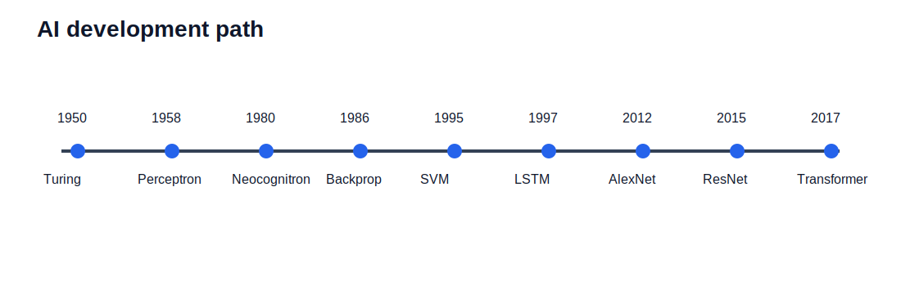

# 一、什么是智慧

在聊 AI 之前，我们先搞清楚一个更基础的问题：**什么是智慧？**

智慧是一种综合运用知识与经验，做出良好判断与决策的能力。你不需要背下整本字典才能判断「今天要不要带伞」——你会综合看天气预报、窗外的云、以及上次被淋湿的经验，然后做出决定。这就是智慧在日常生活中的样子。

## 生物智慧

人类和动物的智慧，来自成长过程中的学习与反馈：

- 学骑车时摔过几次，你就知道怎么保持平衡
- 背英语单词时，错得多的词你会多记几遍
- 被热水烫过一次，下次端杯子会先试探温度

生物智慧的核心是：**通过经验不断调整自身，从而具备判断和决策的能力。**

## 人工智能

人工智能则是另一条路：**由人类编写程序，让机器在特定任务上具备判断与决策的能力。**

注意这里的措辞——「特定任务」。AI 不是要复制人类的一切（不会饿、不会做梦、也不会因为失恋写情诗），而是在某个明确的目标上，模拟「输入 → 判断 → 输出」这一智慧特征。

| 类型 | 谁在学习 | 典型方式 |
|------|---------|---------|
| **生物智慧** | 人/动物 | 成长、试错、反馈 |
| **人工智能** | 机器 | 人类设计算法，机器执行或从数据中学习 |


搞懂这个区别，后面就不会把 AI 神化成「全知全能」，也不会把它贬低成「不过是 if-else 而已」——它是在特定问题上，用计算的方式逼近「做出好判断」这件事。

---

# 二、人工智能是什么

## 顾名思义

**人工智能（Artificial Intelligence，AI）** 指的是由人类创造出来的、具备「智慧」的机器或程序。它有别于生物智慧——不是自然演化出来的，而是工程师一行行代码、一次次实验堆出来的。

## AI 的本质：为问题寻找函数

如果把各种华丽包装拆掉，现代 AI 有一个非常好用的理解角度：

**AI ≈ 为各类问题寻找合适的函数（Function）。**

你给系统一些输入 $x$，它给出你需要的输出 $y$：

$$f(x) = y$$

这个 $x$ 可以是任何类型的数据，$y$ 可能是确定的答案，也可能是一组概率（「有多像猫」「下一个词是什么」）。

### 图像识别

如果 $x$ 是一张图片，在计算机里它就是一个二维矩阵——每个像素有 RGB（红、绿、蓝）或灰度值：

$$f(\text{像素矩阵}) = \text{「这是猫 / 狗 / 数字 5」的概率}$$

### 语音识别

如果 $x$ 是一段音频，可以表示为每个时间采样点上的频率和响度：

$$f(\text{音频采样序列}) = \text{转写文本、说话人性别等}$$

### 文本生成（大语言模型的雏形）

如果 $x$ 是一句没写完的话，比如「最高的山峰是____」：

$$f(\text{「最高的山峰是」}) = \text{下一个词（token）的概率}$$

可能的接龙是「珠」（珠穆朗玛峰）、「喜」（喜马拉雅山）——模型要学的，就是「在这种上下文里，下一个词最可能是什么」。

## 典型 AI 任务一览

| 任务 | 输入 $x$ | 输出 $y$ |
|------|---------|---------|
| **语音识别** | 声波采样 | 文字（如 "How are you"） |
| **图像识别** | 像素矩阵 | 类别（如 "Cat"）或标签 |
| **围棋对弈** | 棋盘状态 | 下一步落子（如 "5-5"） |

Speech Recognition、Image Recognition、Playing Go——看起来风马牛不相及，但底层思路一致：**找到从输入到输出的映射函数。**


本节只建立 AI 层面的函数视角。下一节我们看 AI 这条路上发生过什么；关于机器学习的具体原理与实战，请看续篇[《机器学习与 MNIST 手写数字识别入门》](/articles/machine-learning-and-mnist-handwritten-digit-recognition)。

---

# 三、人工智能的发展历史——从图灵测试到 Transformer

> 从 AI 的历史演进过程理解 AI 的基本原理。历史不是背年份，而是看清楚一条主线：人类到底应该把规则写进机器，还是让机器从数据中学出规律？

## 1950 · 图灵与「机器能思考吗？」

英国数学家、逻辑学家**艾伦·图灵（Alan Turing）** 被誉为计算机科学与人工智能之父。1950 年，他发表论文《计算机器与智能》（*Computing Machinery and Intelligence*），探讨了一个至今仍在争论的问题：**机器能不能思考？**

图灵没有直接定义「思考」是什么，而是提出一个更工程化的检验方式：如果一台机器在纯文字对话中已经让人无法可靠地区分它和真人，那我们至少可以说它表现出了某种智能。这就是著名的**图灵测试（Turing Test）**，也叫「模仿游戏」。

1. 一位询问者通过纯文字与两个对象对话，一个是人，一个是机器
2. 询问者看不到对方是谁
3. 如果询问者**无法可靠地区分**哪一个是人、哪一个是机器，就认为机器通过了测试

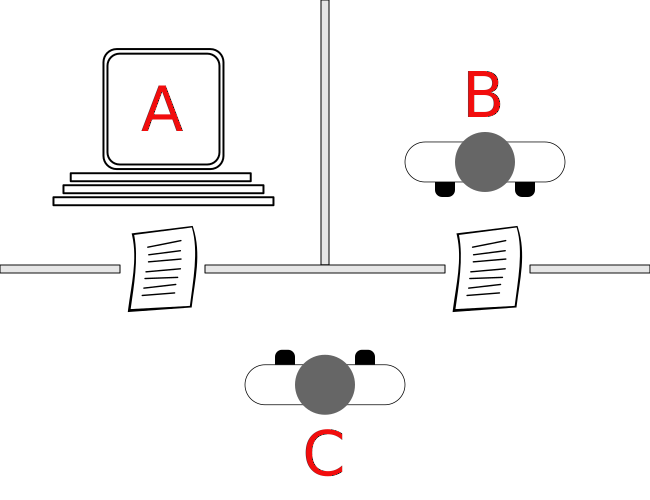

2023 年前后，ChatGPT 等大语言模型的出现，再次把「是否已经通过图灵测试」推上风口浪尖。今天的主流大语言模型在许多文字任务上的回复已经很难让普通人立即判断出是 AI 生成还是人类写作，因此传统图灵测试的区分力正在下降。也许我们需要更能评估推理、事实性、长期规划和真实世界行动能力的新测试。


图灵本人于 1954 年英年早逝。有兴趣的朋友可以去网上查询其死因和经历过的历史事件。科学探索往往与时代局限交织，但思想的长寿远超个人命运。

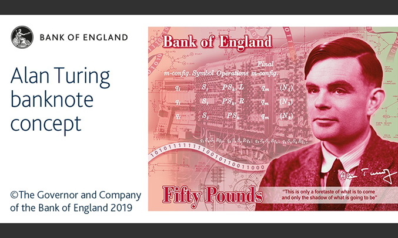

## 1955–1956 · 「人工智能」这个词诞生了

1955 年，计算机科学家**约翰·麦卡锡（John McCarthy）** 在一场研讨会上首次提出 **「人工智能」（artificial intelligence）** 这一术语。

1956 年的**达特茅斯会议（Dartmouth Workshop）** 被普遍视为 AI 学科的开端。麦卡锡、马文·明斯基（Marvin Minsky）、克劳德·香农（Claude Shannon）、赫伯特·西蒙（Herbert Simon）、艾伦·纽厄尔（Allen Newell）等科学家齐聚一堂，试图回答：「能否让机器像人一样使用语言、形成概念、解决人类专属的问题？」

这场会议的判断在今天看来非常乐观，却点燃了一个学科。麦卡锡后来因 AI 领域贡献获得图灵奖，他还发明了 LISP 语言。如果你读过《黑客与画家》，应该会听过这门在 AI 早期极其重要的编程语言。

## 1950s–60s · 两大路线：符号主义 vs 感知机

面对「如何让机器拥有智能」，早期研究者大致分裂成两条路线。它们的逻辑几乎相反，却共同奠定了现代 AI 的基础。

### 符号主义（Symbolism）

符号主义认为：**人类思考，本质上就是符号按逻辑规则运算。** 教机器「有礼貌」，符号主义的做法是写一本规则手册：遇到长辈说「您好」，收到礼物说「谢谢」，在图书馆保持安静。

代表技术包括**专家系统（Expert Systems）**、**知识图谱**、**一阶谓词逻辑**，以及从数据中自动归纳规则的**决策树**（ID3、C4.5 等）。

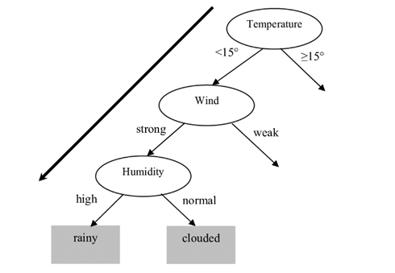

符号主义的优点是可解释：为什么系统得出某个结论，往往能沿着规则链条追溯。缺点也很明显：真实世界太复杂，规则写不完；规则之间还会互相冲突，维护成本极高。

### 感知机（Perceptron）——联结主义的代表

1958 年，弗兰克·罗森布拉特（Frank Rosenblatt）提出**感知机**，这是模仿人脑单个神经元的数学模型，也是早期联结主义路线的代表。

想象你要决定「今晚要不要吃火锅」：输入是天气、节假日、预算；每个输入有不同权重；加权求和超过阈值，就输出「去」，否则输出「不去」。

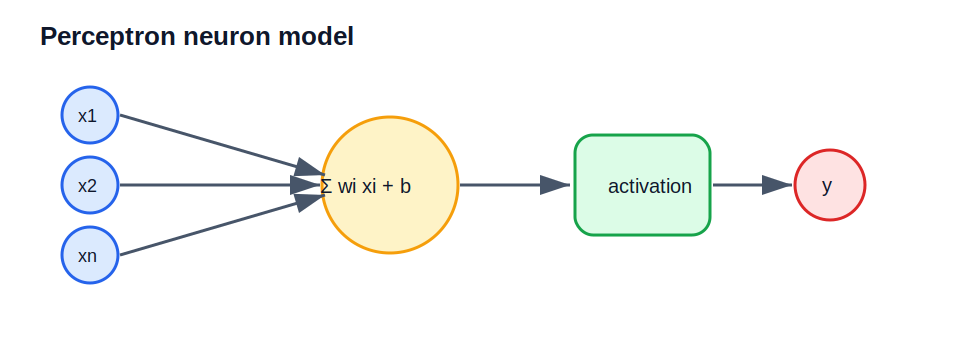

更关键的是：猜错了可以**调整权重**。这就是现代机器学习「训练」的雏形。相对符号主义「规则写死」，感知机可以从错误中学习。

## 1969–1970s · XOR 问题与第一次 AI 寒冬

单层感知机有一个致命弱点：**无法解决 XOR（异或）问题。** XOR 的规则是两个输入**不同**时输出 1，**相同**时输出 0。

| 输入 A | 输入 B | XOR 输出 |
|--------|--------|----------|
| 0 | 0 | 0 |
| 0 | 1 | 1 |
| 1 | 0 | 1 |
| 1 | 1 | 0 |

如果把四种情况画在平面上，你会发现：AND、OR 这类问题可以用一条直线分开，但 XOR 不行。单层感知机只能画直线分类，因此搞不定 XOR。

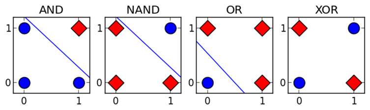

1969 年，明斯基和帕珀特在《Perceptrons》一书中系统指出单层感知机的局限。许多资助方由此认为神经网络路线前景有限，研究经费骤减，AI 进入**第一次寒冬（First AI Winter）**。

需要注意的是，XOR 并不是说「神经网络不行」，而是说「单层线性模型不够」。真正的转折点，是研究者后来意识到：**多层结构 + 可训练算法** 才是关键。

## 1979–1980 · Neocognitron：CNN 的远祖

1979 年到 1980 年，日本学者**福岛邦彦（Kunihiko Fukushima）** 提出 **Neocognitron**。它不是今天意义上的 CNN，但它的思想已经非常接近后来的卷积神经网络：

- 用局部感受野观察图像的一小块区域，而不是一次看完整图片
- 让低层单元检测简单边缘或局部模式
- 让高层单元组合低层模式，形成更抽象的形状识别能力
- 通过层级结构逐步获得一定的平移不变性

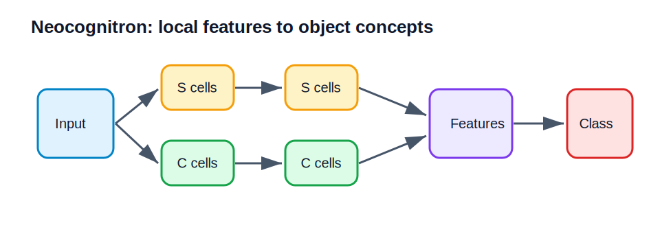

这和人类视觉系统很像：我们不是先记住每张猫的全部像素，而是先看边缘、纹理、眼睛、耳朵，再组合成「猫」这个概念。后来 CNN 中的**卷积层**和**池化层**，都能在 Neocognitron 里找到思想源头。

## 1980s · Hopfield 网络、Boltzmann Machine 与神经网络复兴

1982 年，约翰·霍普菲尔德（John Hopfield）提出 **Hopfield Network**，展示了一个重要思想：神经网络可以被看成一个能量系统，系统会从不稳定状态逐步收敛到某个稳定状态。

1985 年前后，**Boltzmann Machine** 出现。后来出现的 **Restricted Boltzmann Machine（RBM，受限玻尔兹曼机）** 简化了连接结构：可见层和隐藏层之间全连接，但同一层内部没有连接。

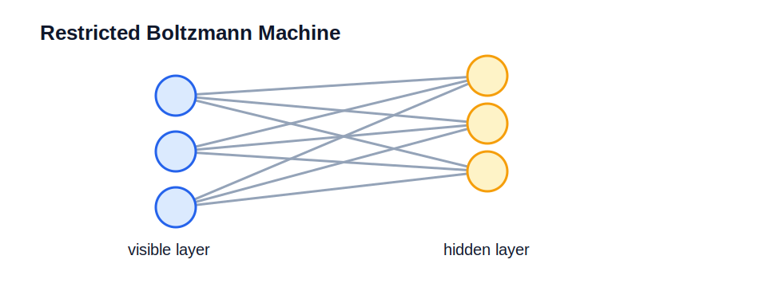

这些模型对今天的初学者来说可能不常用，但它们在 2000 年代中期曾经非常重要，因为它们提供了一种「先无监督预训练，再监督微调」的思路，为深层神经网络重新升温铺路。

## 1986 · Backpropagation：多层网络终于能有效训练

多层网络理论上可以解决 XOR，但还有一个现实问题：**怎么训练？** 如果网络有很多层，输出层的错误应该如何分摊给前面的每一层？第一层某个权重到底该改大还是改小？

1986 年，Rumelhart、Hinton 和 Williams 发表经典论文《Learning representations by back-propagating errors》，让**反向传播（Backpropagation）**重新进入主流视野。它的核心思想是：先前向传播得到预测，再用损失函数衡量错误，最后利用链式法则逐层计算梯度并更新参数。

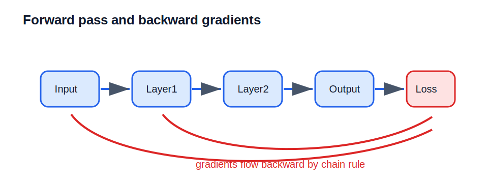

这件事的意义非常大：它让多层神经网络从「理论上可能」变成「工程上可训练」。今天 PyTorch、TensorFlow、JAX 里的自动求导，本质上都在做这件事的自动化版本。

## 1989 · UAT：神经网络为什么有表达能力

1989 年前后，Cybenko、Hornik 等学者给出了**通用近似定理（Universal Approximation Theorem，UAT）**的经典表述。它大致说明：只要隐藏层神经元足够多，并使用合适的非线性激活函数，一个前馈神经网络可以以任意精度逼近连续函数。

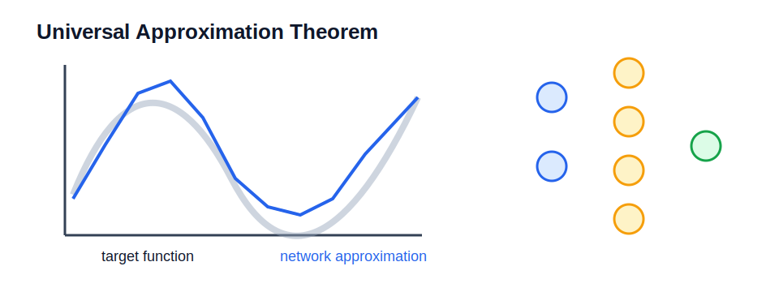

UAT 给了神经网络理论信心，但它也常被误解。它告诉我们「存在某个网络能做到」，并不保证你能用有限数据学到它，也不保证它一定能泛化到没见过的新样本。所以 UAT 更像一张「神经网络有表达能力」的许可证，而不是「随便堆网络就会成功」的保证书。

## 1989–1998 · LeNet、MNIST 与早期 CNN 落地

1989 年起，**杨立昆（Yann LeCun）** 等人将反向传播用于手写数字识别，并逐步发展出 LeNet 系列模型。1998 年的 **LeNet-5** 是一个非常经典的 CNN 架构，成功用于支票和邮政编码识别。

同一时期，**MNIST** 手写数字数据集成为机器学习入门和模型测试的经典数据集。它包含 0 到 9 的灰度手写数字图片，每张图片大小为 28×28。


这里先不要急着深入 CNN 细节。你只需要记住：LeNet 和 MNIST 证明了「神经网络 + 图像局部结构 + 反向传播」这条路可以在真实任务中工作。续篇会从像素、矩阵、卷积核、池化和 PyTorch 代码开始，把 MNIST 手写数字识别完整拆开。

## 1990s · SVM：深度学习爆发前的传统机器学习明星

1990 年代，**支持向量机（Support Vector Machine，SVM）** 成为机器学习中的明星方法。它的核心思想是：如果要分开两类样本，不只是找一条能分开的线，而是找一条**离两边样本都尽量远**的线。这个「尽量远」叫**最大间隔（maximum margin）**。

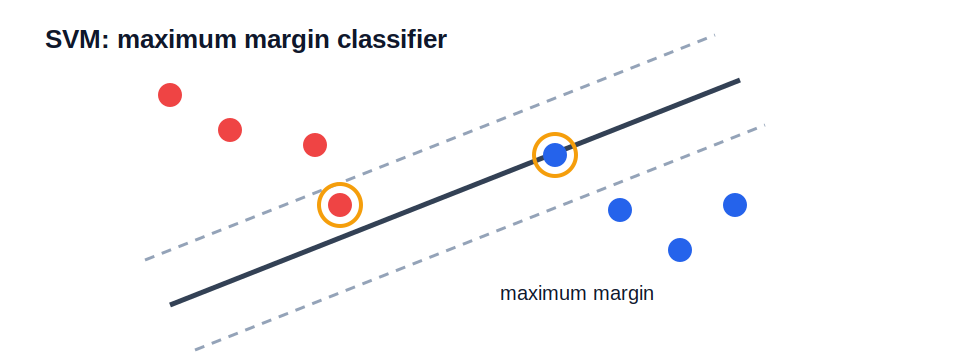

SVM 还有一个重要技巧：**核函数（Kernel Function）**。它可以在不显式计算高维坐标的情况下，把原本线性不可分的数据映射到更高维空间中，使问题变得可分。

在深度学习全面爆发前，SVM、随机森林、梯度提升树、朴素贝叶斯、隐马尔可夫模型等传统方法长期占据主流。它们依赖大量**特征工程**：人类专家先设计特征，再把特征喂给模型。深度学习后来的突破，不是把传统机器学习全部推翻，而是把「特征工程」的一大部分交给网络自己学习。

## 1980s–1997 · RNN 与 LSTM：让网络处理序列

图像有空间结构，语言和语音则有时间顺序。普通前馈网络一次看一个固定输入，不擅长处理「前后有关联」的数据。于是，**循环神经网络（Recurrent Neural Network，RNN）** 进入舞台。

RNN 的想法很自然：处理当前输入时，把上一步的隐藏状态也带过来。这样模型就拥有了某种「记忆」。

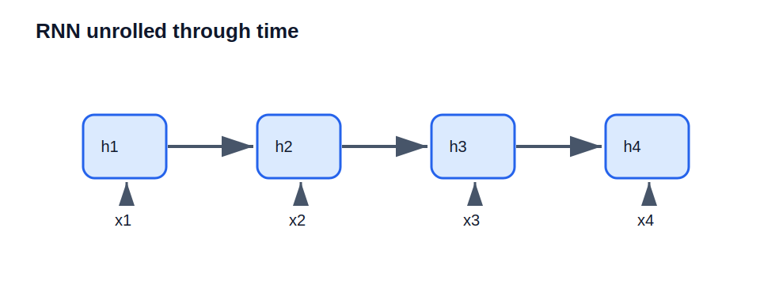

但普通 RNN 有严重问题：序列一长，早期信息很难传到后面，梯度在反向传播时容易消失或爆炸。

1997 年，Hochreiter 和 Schmidhuber 提出 **LSTM（Long Short-Term Memory，长短期记忆网络）**。LSTM 通过门控机制控制信息的写入、遗忘和输出，使网络更擅长保留长期依赖。2014 年左右，**GRU（Gated Recurrent Unit，门控循环单元）** 出现。它比 LSTM 结构更简单，参数更少，在许多任务上效果接近 LSTM。

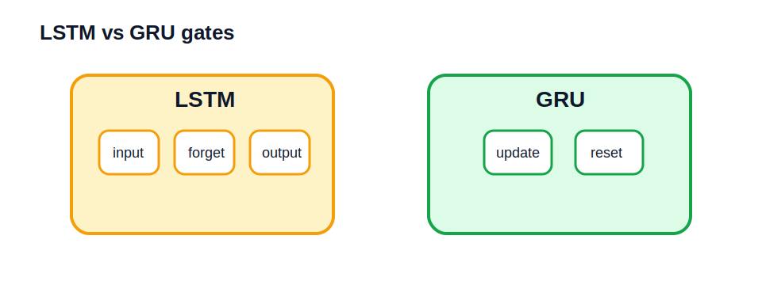

在 Transformer 出现之前，RNN、LSTM、GRU 长期是自然语言处理和语音建模的重要基础。

## 2006 · RBM Initialization：深度网络重新升温

2006 年，Hinton 等人提出深度信念网络（Deep Belief Network, DBN）的训练方法，让深层神经网络重新受到关注。一个关键思路是 **RBM Initialization**：先用 RBM 逐层做无监督预训练，把网络参数初始化到一个相对合理的位置，然后再用带标签数据进行监督微调。

为什么这在当时重要？因为那时深层网络直接随机初始化后训练很困难：层数一深，梯度容易消失；数据规模相对有限，容易过拟合；计算资源不够，训练一次成本高；ReLU、BatchNorm、残差连接等后来的技巧还没有成熟。

虽然今天我们更多使用 He/Xavier 初始化、BatchNorm、残差连接、大规模数据和 GPU 训练，但 RBM 预训练是深度学习复兴史上的重要阶段。

## 2009–2012 · ImageNet 与 AlexNet：深度学习时代开启

2009 年，李飞飞团队推动的 **ImageNet** 数据集发布。它包含大规模带标签图片，并配套 ImageNet Large Scale Visual Recognition Challenge（ILSVRC）竞赛。ImageNet 的意义不只是「图片多」，而是它给计算机视觉提供了一个统一的大规模评测舞台。

2012 年，Alex Krizhevsky、Ilya Sutskever 和 Geoffrey Hinton 提出的 **AlexNet** 在 ImageNet 竞赛中大幅领先传统方法，成为深度学习爆发的标志性事件。

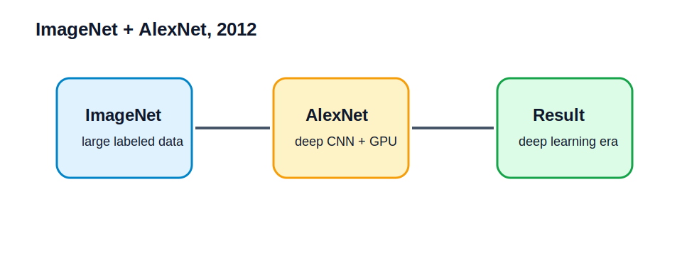

AlexNet 的关键不是某一个单点魔法，而是多个因素同时成熟：更大的数据集、更强的 GPU 算力、更深的 CNN、ReLU、Dropout 和数据增强。从这之后，计算机视觉的主流迅速转向深度 CNN。2012 年也常被看作现代深度学习时代的起点。

## 2015 · ResNet：让网络可以非常深

AlexNet 之后，研究者自然想问：网络是不是越深越好？答案并不简单。深层网络理论上表达能力更强，但实际训练时会遇到退化问题：层数增加后，训练误差反而可能变差。

2015 年，何恺明等人提出 **ResNet（Residual Network，残差网络）**，核心设计是**残差连接 / 跳跃连接（skip connection）**：让某一层的输入可以直接加到后面层的输出上。

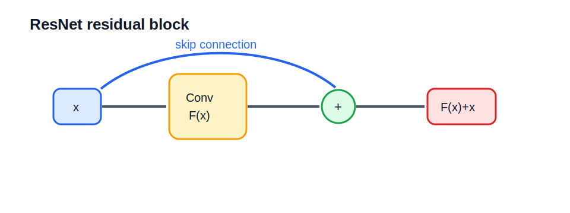

你可以把它理解成：网络不必每一层都重新学习完整变换，只需要学习「在原有输入基础上应该改多少」。这降低了深层网络训练难度，让上百层甚至上千层网络变得可行。

## 2017 · Transformer：注意力机制改变 NLP 与大模型

2017 年，Vaswani 等人发表论文《Attention Is All You Need》，提出 **Transformer** 架构。它最初用于机器翻译，但后来成为 BERT、GPT、T5、Claude、DeepSeek 等大语言模型的基础。

Transformer 的核心是**自注意力机制（Self-Attention）**。它让模型在处理某个词时，可以直接查看同一句话里的所有词，并根据相关性分配注意力权重。

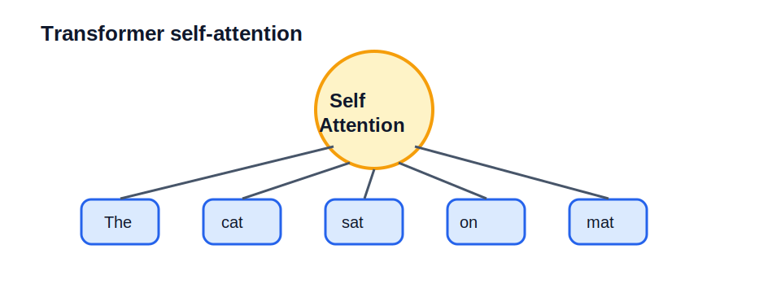

这和 RNN 的逐步处理不同。RNN 像一个人从左到右读句子，读到后面时要靠记忆保留前文；Transformer 则像把整句话摊开，同时比较所有词之间的关系。它并行训练效率高、长距离依赖更强、扩展性好，因此成为现代大语言模型的核心基础设施之一。

## AI、机器学习与深度学习：谁包含谁？

走完这段历史，我们可以把概念关系放回一张地图里看。AI 的实现方式远不止机器学习一种：

```
人工智能（AI）
├── 符号主义：专家系统、知识图谱、逻辑推理
├── 传统机器学习：决策树、朴素贝叶斯、SVM、随机森林、梯度提升树
├── 概率模型：贝叶斯网络、隐马尔可夫模型、条件随机场
├── 机器学习（Machine Learning）
│   ├── 监督学习、无监督学习、强化学习
│   └── 深度学习（Deep Learning）
│       ├── CNN：图像、视频、空间结构
│       ├── RNN / LSTM / GRU：序列、语音、时间序列
│       ├── ResNet：极深视觉网络
│       └── Transformer：语言、多模态、大模型
└── 其他路线：搜索、规划、进化算法、群体智能等
```

**机器学习是 AI 的一种实现方式；深度学习是机器学习的一种实现方式。**

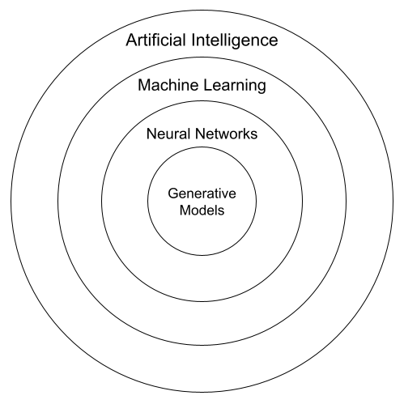

如果把这段历史压缩成一条主线，可以这样理解：图灵提出问题，达特茅斯会议命名领域，符号主义尝试写规则，感知机尝试学权重，XOR 暴露单层模型限制，Neocognitron 预示图像层级特征，反向传播让多层网络可训练，UAT 解释表达能力，SVM 代表传统机器学习高峰，RNN/LSTM/GRU 处理序列，RBM 初始化推动深度网络复兴，ImageNet 和 AlexNet 开启现代深度学习时代，ResNet 解决极深网络训练问题，Transformer 则把注意力机制带入大模型时代。


## 继续阅读

到这里，你已经建立了 AI 的基本概念，也了解了 AI 从图灵测试到 Transformer 的主要发展脉络。如果你接下来想真正进入**机器学习**的世界，学习 CNN 原理，并亲手用 PyTorch 训练一个 MNIST 手写数字识别模型，请继续阅读：

**[《机器学习与 MNIST 手写数字识别入门》](/articles/machine-learning-and-mnist-handwritten-digit-recognition)**

那篇文章会从「机器学习到底是什么」讲起，逐步覆盖图像像素表示、卷积神经网络、反向传播、激活函数，以及完整的 PyTorch 实战代码。

---

# 参考资料与扩展阅读

## 论文与经典文献

1. Rumelhart, D. E., Hinton, G. E., & Williams, R. J. (1986). **Learning representations by back-propagating errors.** *Nature*, 323(6088), 533-536. —— 反向传播算法的经典论文
2. Krizhevsky, A., Sutskever, I., & Hinton, G. E. (2012). **ImageNet classification with deep convolutional neural networks.** *Advances in Neural Information Processing Systems*, 25. —— AlexNet，深度学习时代的开端
3. Vaswani, A., et al. (2017). **Attention is all you need.** *Advances in Neural Information Processing Systems*, 30. —— Transformer 架构，现代 LLM 的基础
4. Fukushima, K. (1980). **Neocognitron: A self-organizing neural network model for a mechanism of pattern recognition unaffected by shift in position.** *Biological Cybernetics*, 36, 193-202. —— CNN 层级视觉思想的重要源头
5. Cybenko, G. (1989). **Approximation by superpositions of a sigmoidal function.** *Mathematics of Control, Signals and Systems*, 2, 303-314. —— 通用近似定理的经典表述之一
6. Cortes, C., & Vapnik, V. (1995). **Support-vector networks.** *Machine Learning*, 20, 273-297. —— 支持向量机经典论文
7. Hochreiter, S., & Schmidhuber, J. (1997). **Long Short-Term Memory.** *Neural Computation*, 9(8), 1735-1780. —— LSTM 经典论文
8. Deng, J., et al. (2009). **ImageNet: A large-scale hierarchical image database.** *CVPR*. —— ImageNet 数据集论文
9. He, K., Zhang, X., Ren, S., & Sun, J. (2016). **Deep Residual Learning for Image Recognition.** *CVPR*. —— ResNet 论文
10. Cho, K., et al. (2014). **Learning phrase representations using RNN encoder-decoder for statistical machine translation.** *EMNLP*. —— GRU 相关早期论文

## 在线课程

1. **吴恩达《机器学习》专项课程** - Coursera / 网易云课堂
2. **吴恩达《深度学习》专项课程** - Coursera / 网易云课堂

## 推荐书籍

1. 李航 (2019). **统计学习方法（第2版）.** 清华大学出版社. —— 中文世界最好的统计学习入门书之一
