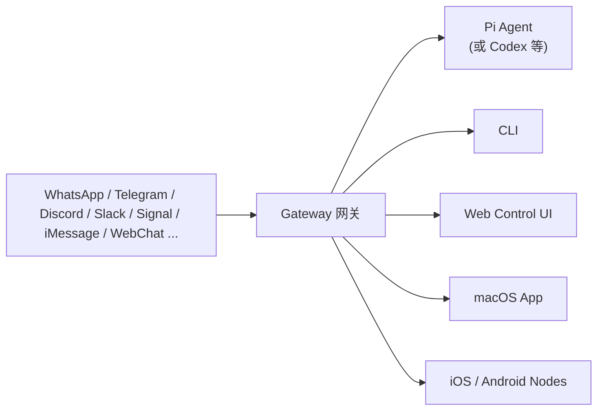

> 2026 年被很多人称为"AI Agent 元年"。从 AutoGPT 到 Claude Code，从 OpenAI Operator 到 OpenClaw，AI 正在从"聊天的机器人"进化成"能动手的智能体"。这篇文章会从 AI Agent 的概念讲起，带你认识 2026 年最火的 AI Agent 网关 OpenClaw（小龙虾），再深入分析一个基于 Gemini 的轻量级 Agent 工具 gemini-operator 的完整实现。
>
> 如果你听说过" Agent "但一直没搞清楚它到底是什么、能做什么，这篇文章就是写给你的。

# 引言：AI Agent —— 从"动嘴"到"动手"

## 传统 AI 的局限

传统的 AI 助手（ChatGPT、Claude、Gemini 等）本质上是一个**对话系统**：

```
你问 → AI 回答 → 你再问 → AI 再回答
```

它可能回答得非常好，但它始终停留在"动嘴"的层面。你让它"帮我查一下下周的天气并添加到日历"，它只能告诉你"好的，你应该打开日历应用，然后……"——它自己什么都做不了。

这就像你有一个非常聪明的顾问，但他没有手没有脚，只能给你建议，不能替你执行。

## AI Agent 的核心突破

AI Agent（智能体）的出现改变了这一点。Agent 的定义是：**能感知环境、做出决策、执行行动的自主系统**。

用一句话说：Agent 不只是"回答问题"，而是"完成任务"。

```
传统 AI：  输入问题 → 输出答案
AI Agent： 输入目标 → 规划步骤 → 调用工具 → 完成任务
```

一个典型的 AI Agent 包含四个核心组件：

| 组件 | 作用 | 类比 |
|------|------|------|
| **大脑（LLM）** | 理解任务、规划步骤、推理决策 | CEO |
| **工具（Tools）** | 执行具体操作（读文件、写代码、调用 API） | 员工的手脚 |
| **记忆（Memory）** | 记录上下文、历史、偏好 | 企业的数据库 |
| **渠道（Channel）** | 与用户交互的界面（聊天、CLI、Web） | 办公室的电话 |

## 2023-2026：AI Agent 的进化简史

AI Agent 不是 2026 年突然冒出来的。看一下这几年的发展脉络：

```
2023 年 —— AutoGPT 引爆 Agent 概念
  ↓
2024 年 —— Claude Code、GPT-4 带工具使用；Agent 框架百花齐放
  ↓
2025 年 —— MCP 协议标准化；OpenAI Operator、Claude Computer Use 发布
  ↓
2026 年 —— OpenClaw 成为现象级开源项目（GitHub 300K+ Stars）
           → Agent 从"实验品"变成了"基础设施"
```

2026 年 1 月，OpenClaw 正式发布，短短两个月就获得了超过 24 万 GitHub Stars，成为 GitHub 历史上增长最快的开源项目。小米 MiMo 负责人罗福莉在 2026 中关村论坛上评价道：

> OpenClaw 是 Agent 框架层面非常革命性、颠覆性的事件……它把国内还没有完全逼近闭源模型、但已经位于开源模型赛道前列的模型上限显著拉高。

---

# 一、OpenClaw（小龙虾）是什么？

## 项目背景

OpenClaw（绰号"小龙虾"）是一个**自托管的 AI Agent 网关（Gateway）**。它的 Logo 是一只太空龙虾，这也解释了为什么中文社区亲切地叫它"小龙虾"。


它的核心定位非常清晰：**让你通过各种聊天软件，像发消息一样调用 AI Agent 来执行实际任务**。

## 它解决了什么问题？

在 OpenClaw 出现之前，你要使用 AI Agent，通常需要：

1. 打开某个特定的网页/应用
2. 在特定的对话框里输入
3. 等它回答
4. 整个流程局限在"聊天窗口"里

OpenClaw 的思路完全不同：

- 你在 **WhatsApp** 上发一条消息给 Agent
- 或者在 **Telegram** 上发
- 或者在 **Discord** 上发
- 或者直接通过 **WebChat**、**CLI**、**macOS 应用** 来交互

所有这些渠道都连接到同一个 Gateway，由 Gateway 调度 Agent 来执行任务。


## 为什么叫"小龙虾"？

OpenClaw 的吉祥物是一只**太空龙虾（Space Lobster）**。这源于项目创始人 Peter Steinberger 的个人趣味——项目的口号是"EXFOLIATE! EXFOLIATE!"（脱壳！脱壳！），隐喻龙虾脱壳成长的过程，也象征着 AI Agent 在不断迭代中进化。

中文社区因为"龙虾"这个视觉符号，亲切地称之为"小龙虾"。这个称呼在 2026 年迅速传播，以至于小米甚至推出了"Xiaomi MiMo Claw"（小米龙虾）服务。

---

# 二、OpenClaw 的工作原理

## 整体架构

OpenClaw 的架构可以用一张图来概括：



**Gateway 网关是会话、路由和渠道连接的单一事实来源。**

## Gateway —— 核心枢纽

Gateway 是一个长期运行的后台进程（daemon），它是整个系统的"神经中枢"：

- **渠道管理**：同时维护多个聊天平台的连接（WhatsApp 通过 Baileys 协议，Telegram 通过 grammY，等等）
- **消息路由**：把来自不同渠道的消息统一格式后，路由给 Agent
- **会话管理**：维护每个用户的会话上下文、记忆
- **WebSocket 服务**：为 CLI、Web UI、移动节点等控制平面客户端提供连接
- **工具执行**：Agent 决定的工具调用（Shell、文件操作、浏览器等）通过 Gateway 执行

## Agent —— 智能大脑

OpenClaw 默认集成了 **Pi Agent**（一个专为编码场景优化的 Agent），也支持 Codex CLI 等其他 Agent 运行时。

Agent 的运行遵循 **ReAct（Reasoning + Acting）模式**：

```
1. 收到用户消息
2. 理解任务（Reasoning）
3. 决定要做什么（Planning）
4. 调用工具执行（Acting）
5. 观察执行结果（Observing）
6. 决定下一步（Reasoning again）
7. ... 循环直到任务完成
```

## Skills —— 技能系统

Skills 是 OpenClaw 中非常创新的设计。它是一个**声明式的技能（工具）定义系统**——每个技能是一个 Markdown 文件（`SKILL.md`），告诉 Agent 在什么场景下可以使用什么工具。

Skills 的加载优先级：

| 优先级 | 来源 | 路径 |
|--------|------|------|
| 1（最高） | 工作区技能 | `<workspace>/skills` |
| 2 | 项目 Agent 技能 | `<workspace>/.agents/skills` |
| 3 | 个人 Agent 技能 | `~/.agents/skills` |
| 4 | 本地技能 | `~/.openclaw/skills` |
| 5 | 内置技能 | 安装时自带 |
| 6（最低） | 额外目录 | 插件技能 |

这种设计使得 OpenClaw 极其灵活——你可以在工作区级别覆盖默认技能，插件也可以贡献新的技能。

## Channels —— 多渠道接入

OpenClaw 支持极其丰富的渠道矩阵：

| 渠道类型 | 示例 |
|----------|------|
| 内置渠道 | WebChat、CLI、macOS App |
| 捆绑插件 | Discord、Google Chat、iMessage、Matrix、Microsoft Teams、Signal、Slack、Telegram、WhatsApp、Zalo |
| 移动节点 | iOS App、Android App |

这意味着你可以**用同一个 Agent 实例，从多个平台同时访问**，所有会话和记忆都是共享的。

## Nodes —— 移动节点

iOS 和 Android 节点通过 WebSocket 连接到 Gateway，提供以下能力：

- Canvas（画布）
- 相机
- 屏幕录制
- 位置获取
- 语音工作流

节点与 Gateway 配对后，Agent 可以直接在手机上执行操作。

---

# 三、OpenClaw 与 AI 的关系

## OpenClaw 不是 AI 模型

这是一个需要特别强调的点：**OpenClaw 本身不是一个 AI 模型**。它不训练模型，也不提供推理能力。

它是：

```
OpenClaw = LLM（大脑）× Channels（渠道）× Tools（工具）× Skills（技能）
         = 一个完整的 AI Agent 运行时
```

你可以把它理解为 **AI 的操作系统**——它管理资源（渠道）、调度任务（路由）、提供运行环境（执行沙箱）。

## 它如何与 AI 协同工作

OpenClaw 的工作流程：

1. **用户通过聊天渠道发消息** → "帮我检查一下服务器状态"
2. **Gateway 接收消息** → 标准化格式 → 路由给 Agent
3. **Agent（Pi）接收任务** → 调用 LLM 理解意图 → 规划执行步骤
4. **Agent 调用工具** → 执行 Shell 命令 `ssh user@server 'uptime && free -h'`
5. **工具返回结果** → Agent 分析结果 → 决定是否继续
6. **Agent 生成回复** → 通过 Gateway → 回到用户的聊天界面

整个过程对用户来说，就像在跟一个全能助手聊天。但实际上背后是一个复杂的 **AI + 工具 + 渠道** 的编排系统。

## 支持哪些 AI 模型

OpenClaw 是**模型无关**的，支持几乎所有主流 LLM：

| 提供商 | 模型示例 |
|--------|---------|
| OpenAI | GPT-4o、GPT-4.1 |
| Anthropic | Claude 4、Claude 3.5 |
| Google | Gemini 2.5 Pro、Gemini 2.5 Flash |
| 小米 | MiMo V2 Pro、MiMo V2 Flash |
| 阿里 | Qwen 3 |
| DeepSeek | DeepSeek V4 |
| 本地模型 | Ollama、vLLM |

只需要配置对应的 API Key，OpenClaw 就能使用该模型作为 Agent 的"大脑"。

---

# 四、Gemini Operator —— 一个轻量级的 AI Shell 助手

介绍完重量级的 OpenClaw，我们来看一个轻量级的 AI Agent 实现——**gemini-operator**。

## 项目简介

[gemini-operator](https://github.com/cw1997/gemini-operator) 是一个基于 Google Gemini 大模型开发的命令行 AI Shell 助手。它的目标非常简单直接：

> **用自然语言描述任务，Gemini 帮你转换成 Shell 命令并执行。**

项目地址：https://github.com/cw1997/gemini-operator

核心功能：

| 功能 | 说明 |
|------|------|
| 自然语言转命令 | 你说"看看磁盘空间"，它生成 `df -h` |
| 跨平台支持 | 自动识别 Windows cmd / Linux bash / macOS zsh |
| 命令解释 | 在执行前告诉你"这条命令会做什么" |
| 交互确认 | y=执行 / n=取消 / e=编辑，避免误操作 |
| 模型选择 | 支持所有 Gemini 模型，可交互选择 |

## 与 OpenClaw 的对比

如果说 OpenClaw 是一个**企业级的 Agent 网关**，那 gemini-operator 就是一个**轻量级的个人 Shell 助手**。

| 维度 | OpenClaw | Gemini Operator |
|------|----------|-----------------|
| 定位 | 多渠道 Agent 网关 | 命令行 Shell 助手 |
| 复杂度 | 大型系统（Node.js） | 单文件 Python 脚本 |
| 渠道 | WhatsApp/Telegram/Discord 等 | CLI 终端 |
| 安装 | npm install -g | git clone + pip install |
| 用户 | 团队/高级用户 | 个人开发者 |

## 安装与配置

```bash
# 克隆仓库
git clone https://github.com/cw1997/gemini-operator.git
cd gemini-operator

# 安装依赖
pip install -r requirements.txt

# 设置 Gemini API Key
export GEMINI_API_KEY="your-api-key-here"

# 运行
python gemini_operator.py
```

就这么简单——只有一个依赖 `google-generativeai>=0.8.0`。

---

# 五、gemini-operator 代码深度解析

现在我们来深入分析这个项目的完整代码。虽然它只有 300 多行，但包含了一个 AI Agent 的完整闭环。

我先把完整的源码贴出来，然后逐段解析其中的关键设计。

## 项目依赖

```python
import getpass
import json
import os
import platform
import subprocess
import sys

import google.generativeai as genai
from google.api_core import exceptions as google_api_exceptions
```

整个项目只依赖一个外部库——Google 官方的 Gemini SDK。其他全是 Python 标准库。

## 核心架构概览

gemini-operator 的完整执行流程如下：

```text
用户输入自然语言
      ↓
detect_os() → 检测操作系统
      ↓
build_model() → 构建带 OS 特定 System Prompt 的 Gemini 模型
      ↓
ask_gemini() → 调用 Gemini API，解析 JSON 响应
      ↓
prompt_user_action() → 展示命令，让用户 y/n/e 确认
      ↓
run_command() → 在对应 Shell 中执行命令
      ↓
显示执行结果
```

## 关键代码逐段分析

### 1. OS 检测 —— 跨平台适配

```python
def detect_os() -> str:
    system = platform.system().lower()
    if system == "windows":
        return "windows"
    if system == "darwin":
        return "macos"
    return "linux"
```

这是 Agent 的"感知层"——自动识别用户的操作系统。这个信息会被注入到 System Prompt 中，让 Gemini 生成特定平台的命令：

```python
OS_SHELL_NAME = {
    "windows": "Windows Command Prompt (cmd.exe)",
    "macos": "macOS bash/zsh shell",
    "linux": "Linux bash shell",
}
```

这里的核心思想是：**Agent 必须感知环境，否则生成的命令可能在当前系统上不适用**。这就像一个人到了不同国家要说不同的语言。

### 2. System Prompt 设计 —— Agent 的"行为准则"

```python
SYSTEM_PROMPT_TEMPLATE = """\
You are a command-line expert.  The user is running {os_display}.

When the user describes a task in natural language, you must respond with a
JSON object (no markdown fences, no extra commentary) with exactly two keys:

  "command"     – the single shell command (or short pipeline) to accomplish
                  the task on {os_display}, suitable for copy-paste execution.
  "explanation" – a concise, plain-English explanation of what the command
                  does, including any side-effects the user should be aware of.

Rules:
- Use only commands that are available by default on {os_display}.
- For Windows use cmd.exe syntax; for macOS/Linux use bash/sh syntax.
- Never produce multiple alternative commands – pick the best single command.
- If the task cannot be safely expressed as a single command, chain with &&
  (Linux/macOS) or & (Windows).
- Output ONLY the raw JSON object, nothing else.
"""
```

这个 System Prompt 是 gemini-operator 的核心设计。它做了几件关键的事：

1. **角色设定**：告诉模型它是"命令行专家"
2. **格式约束**：要求输出严格的 JSON（`{command, explanation}`）
3. **平台约束**：只使用当前 OS 默认存在的命令
4. **行为约束**：不输出多个备选方案，只选最优的
5. **安全约束**：提示包含副作用说明

这体现了 AI Agent 设计的一个重要原则：**不要给模型太多自由——约束越清晰，输出越可靠**。

### 3. 模型构建 —— 注入 System Prompt

```python
def build_model(
    api_key: str, current_os: str, model_name: str
) -> genai.GenerativeModel:
    genai.configure(api_key=api_key)
    system_prompt = SYSTEM_PROMPT_TEMPLATE.format(
        os_display=OS_SHELL_NAME[current_os]
    )
    return genai.GenerativeModel(
        model_name=model_name,
        system_instruction=system_prompt,
    )
```

这里使用了 Gemini SDK 的 `system_instruction` 参数。Gemini 是少数原生支持 System Prompt 的模型 API（这点和 OpenAI 类似），这对 Agent 应用非常关键。

### 4. API 调用与 JSON 解析 —— Agent 的"推理层"

```python
def ask_gemini(model: genai.GenerativeModel, prompt: str) -> tuple[str, str]:
    response = model.generate_content(prompt)
    raw = response.text.strip()

    # 如果模型加了 markdown 代码块标记，剥除掉
    if raw.startswith("```"):
        lines = raw.splitlines()
        raw = "\n".join(
            line for line in lines if not line.startswith("```")
        ).strip()

    try:
        data = json.loads(raw)
    except json.JSONDecodeError as exc:
        raise ValueError(
            f"Gemini returned non-JSON output:\n{raw}"
        ) from exc

    command = data.get("command", "").strip()
    explanation = data.get("explanation", "").strip()

    if not command:
        raise ValueError("Gemini returned an empty command.")

    return command, explanation
```

这里有几个值得注意的设计：

- **容错处理**：虽然 System Prompt 要求输出纯 JSON，但模型有时还是会加 markdown 代码块——代码做了后处理
- **严格验证**：如果返回的不是合法 JSON 或者 command 为空，直接抛异常而不是默默失败
- **类型安全**：返回值是 `tuple[str, str]`，明确了两个返回值的类型语义

### 5. 交互确认 —— 人机回环（Human-in-the-Loop）

```python
def prompt_user_action(command: str) -> str:
    print()
    print(_colour("┌─ Command to execute " + "─" * 45, CYAN))
    print(_colour("│  ", CYAN) + _colour(command, YELLOW, BOLD))
    print(_colour("└" + "─" * 66, CYAN))
    print(_colour("⚠  Review the command carefully before executing it.", YELLOW))
    print()
    print(
        _colour("[y]", GREEN) + " Execute   "
        + _colour("[n]", RED) + " Cancel   "
        + _colour("[e]", YELLOW) + " Edit command"
    )

    while True:
        choice = input(_colour("Your choice [y/n/e]: ", BOLD)).strip().lower()

        if choice in ("y", "yes", ""):
            return command
        if choice in ("n", "no"):
            return ""
        if choice in ("e", "edit"):
            print(_colour(f"Current command: {command}", CYAN))
            edited = input(...).strip()
            if not edited:
                return command
            return edited
        print(_colour("Please enter y, n, or e.", RED))
```

这是 **Human-in-the-Loop** 的经典实现。AI 生成建议，人类做最终决策。

三种交互模式：

| 操作 | 含义 | 适用场景 |
|------|------|---------|
| `y` | 确认执行 | AI 生成的命令看起来完全正确 |
| `n` | 取消执行 | AI 理解错了意图，或命令有风险 |
| `e` | 编辑命令 | AI 的意图对了但命令需要微调 |

### 6. 命令执行 —— 安全沙箱

```python
def run_command(command: str, current_os: str) -> int:
    if current_os == "windows":
        result = subprocess.run(["cmd.exe", "/C", command])
    else:
        result = subprocess.run(["/bin/bash", "-c", command])
    return result.returncode
```

执行部分很简洁，但需要注意安全设计：

- 使用 `subprocess.run` 而不是 `os.system`（后者更不安全）
- 区分 OS 使用不同的 shell
- 只返回退出码，不自动处理输出（让用户看到原始输出）

### 7. API Key 管理 —— 安全的密钥获取

```python
def resolve_api_key() -> str:
    key = os.environ.get("GEMINI_API_KEY", "").strip()
    if key:
        return key

    print(_colour("GEMINI_API_KEY is not set. Paste your Gemini API key ...", YELLOW, BOLD))
    while True:
        key = getpass.getpass("API key: ").strip()
        if key:
            return key
        print(_colour("Key cannot be empty.", RED))
```

设计要点：

- **环境变量优先**：遵循 12-Factor App 的最佳实践
- **交互式回退**：如果环境变量没设，通过 `getpass` 隐藏输入
- **永不硬编码**：API Key 不会出现在任何配置文件中

### 8. 模型选择 —— 动态枚举

```python
def fetch_models_via_sdk(api_key: str) -> list[str]:
    genai.configure(api_key=api_key)
    found: list[str] = []
    for m in genai.list_models():
        methods = getattr(m, "supported_generation_methods", None) or []
        if "generateContent" not in methods:
            continue
        found.append(_model_id_from_list_name(m.name))
    return sorted(set(found))
```

这个函数通过 Gemini SDK 动态获取当前 API Key 可用的模型列表。好处是：

- **不过时**：不需要硬编码模型 ID 列表
- **兼容性好**：当 Google 发布新模型时，自动出现在列表中

### 9. ANSI 颜色输出 —— 更好的 UX

```python
RESET = "\033[0m"
BOLD = "\033[1m"
GREEN = "\033[32m"
YELLOW = "\033[33m"
CYAN = "\033[36m"
RED = "\033[31m"
MAGENTA = "\033[35m"

def _colour(text: str, *codes: str) -> str:
    if sys.stdout.isatty():
        return "".join(codes) + text + RESET
    return text
```

注意 `isatty()` 检测——当输出被重定向（piped）时，自动禁用颜色，避免在日志文件或管道中输出乱码。

---

# 六、完整的执行流程

把上面所有代码串起来，gemini-operator 的完整执行流程是这样的：

```
程序启动
    │
    ├─ 1. resolve_api_key()
    │   ├─ 检查环境变量 GEMINI_API_KEY
    │   └─ 如果没有，交互式输入
    │
    ├─ 2. detect_os()
    │   └─ 返回 "windows" / "macos" / "linux"
    │
    ├─ 3. resolve_model_name()
    │   ├─ 检查环境变量 GEMINI_MODEL
    │   ├─ 如果没有，调用 fetch_models_via_sdk() 枚举可用模型
    │   └─ 交互式选择模型
    │
    ├─ 4. build_model()
    │   └─ 创建带 OS 特定 System Prompt 的 Gemini 模型
    │
    ├─ 5. print_banner() → 显示启动信息
    │
    └─ 进入主循环（REPL）
            │
            ├─ 等待用户输入
            │
            ├─ 检查 exit/quit 命令
            │
            ├─ 6. ask_gemini()
            │   ├─ 调用 Gemini API
            │   ├─ 解析 JSON 响应
            │   └─ 返回 (command, explanation)
            │
            ├─ 显示 explanation（命令说明）
            │
            ├─ 7. prompt_user_action()
            │   ├─ [y] → 执行
            │   ├─ [n] → 取消
            │   └─ [e] → 编辑
            │
            ├─ 8. run_command()
            │   ├─ Windows: cmd.exe /C
            │   └─ Linux/macOS: /bin/bash -c
            │
            └─ 显示执行结果（成功/失败/退出码）
                    │
                    └─ 回到循环开始，等待下一条指令
```

---

# 七、安全注意事项

AI 生成并执行 Shell 命令是一个**高风险操作**。gemini-operator 在设计上已经考虑了一些安全措施，但用户也需要自己注意。

## 项目的安全机制

| 机制 | 实现 | 说明 |
|------|------|------|
| 命令预览 | `prompt_user_action()` | 执行前一定会展示完整命令 |
| 编辑能力 | 支持 [e] 编辑 | 发现命令有问题可以直接改 |
| 解释说明 | `explanation` | 模型会说明命令的副作用 |
| API Key 安全 | 环境变量 / getpass | 不硬编码，不留痕 |
| 非 root 运行 | README 警告 | 建议不要以 root 身份运行 |

## 用户需要注意的事项

1. **永远不要以 root / Administrator 身份运行**——这相当于把系统 root 权限交给了 AI
2. **仔细阅读每次的 explanation**——模型会说明命令的副作用
3. **不确定时选 [n] 取消**——安全总比后悔好
4. **复杂的危险命令用 [e] 拆分**——比如 `rm -rf /` 这种命令应该一眼就能识别出来
5. **定期轮换 API Key**——不要把密钥存在长期不用的环境变量里

---

# 八、完整的运行示例

以下是一个完整的会话演示：

```text
╔══════════════════════════════════════════════════════════════════╗
║              gemini-operator  –  AI Shell Assistant             ║
╚══════════════════════════════════════════════════════════════════╝

Detected OS: Linux (bash)
Model: gemini-flash-lite-latest

gemini-operator> 查看当前目录下有哪些文件

ℹ  Explanation:
   Lists all files and directories in the current directory with details.

┌─ Command to execute ─────────────────────────────────────────────
│  ls -la
└──────────────────────────────────────────────────────────────────
⚠  Review the command carefully before executing it.

[y] Execute   [n] Cancel   [e] Edit command
Your choice [y/n/e]: y

▶ Running: ls -la
────────────────────────────────────────────────────────────────────
total 420
drwxr-xr-x  1 user user   0 Jun 13 03:46 .
drwxr-xr-x  1 user user   0 Jun 13 03:46 ..
-rw-r--r--  1 user user  91 Jun 13 03:46 gemini_operator.py
-rw-r--r--  1 user user  20 Jun 13 03:46 requirements.txt
✔ Command completed successfully.

gemini-operator> 查看内存使用情况

ℹ  Explanation:
   Displays memory usage statistics in human-readable format.

┌─ Command to execute ─────────────────────────────────────────────
│  free -h
└──────────────────────────────────────────────────────────────────

[y] Execute   [n] Cancel   [e] Edit command
Your choice [y/n/e]: y

▶ Running: free -h
────────────────────────────────────────────────────────────────────
              total        used        free      shared  buff/cache   available
Mem:           31Gi        12Gi        14Gi       1.2Gi       4.5Gi        17Gi
Swap:         8.0Gi       1.2Gi       6.8Gi
✔ Command completed successfully.

gemini-operator> 退出
Goodbye!
```

---

# 九、总结与对比

## 两种不同的 Agent 设计思路

通过这篇文章，我们看到了两种截然不同的 AI Agent 实现方式：

### OpenClaw —— 企业级 Agent 基础设施

- **定位**：自托管 Gateway 网关
- **架构**：Gateway + Agent + Channels + Skills + Nodes
- **语言**：Node.js
- **用户**：团队／高级个人用户
- **安装**：`npm install -g openclaw@latest`
- **核心优势**：多渠道、多 Agent、可扩展、社区驱动
- **适用场景**：
  - 团队共享一个 AI 助手
  - 需要从多个聊天平台接入
  - 需要定时任务、自动化工作流
  - 需要精细的权限控制和技能管理

### Gemini Operator —— 轻量级个人 Shell 助手

- **定位**：命令行 AI 助手
- **架构**：单文件 Python + Gemini API
- **语言**：Python
- **用户**：个人开发者
- **安装**：`git clone + pip install`
- **核心优势**：简洁、透明、易于理解和修改
- **适用场景**：
  - 个人日常命令行操作
  - 学习 AI Agent 原理的入门项目
  - 不想离开终端的开发者
  - 需要快速原型验证

## 两者的共同之处

尽管规模和复杂度不同，但它们都体现了 AI Agent 的核心设计模式：

| 模式 | OpenClaw | Gemini Operator |
|------|----------|-----------------|
| **感知** | 通过渠道接收消息 | 检测 OS、读取用户输入 |
| **推理** | Pi Agent + LLM | Gemini API + System Prompt |
| **工具** | Skills 系统 / Shell / 浏览器等 | Shell 命令执行 |
| **记忆** | 会话管理 / 持久化 | 无（纯 stateless） |
| **安全** | 权限控制 / 沙箱/审批流 | 命令预览 / 交互确认 |
| **反馈** | 执行结果 → Agent → 用户 | 命令输出 → 终端 |

## 如果你想要……

| 你的需求 | 推荐工具 |
|----------|---------|
| 一个能从手机发消息调用的 AI 助手 | OpenClaw |
| 一个能帮你写命令行的终端工具 | Gemini Operator |
| 学习 AI Agent 的系统架构设计 | 两个都看 |
| 快速上手写一个自己的 Agent | 从 gemini-operator 开始改 |
| 给团队搭建 AI 基础设施 | OpenClaw |

---

> **最后的话**：
>
> AI Agent 正在从 2023 年的"玩具"进化为 2026 年的"工具"。OpenClaw 展示了 Agent 的"上限"——一个完整的企业级 Agent 基础设施应该长什么样；而 gemini-operator 展示了 Agent 的"下限"——最少需要多少代码就能实现一个有用的 Agent 闭环。
>
> 无论你是想在自己的机器上搭一个个人 AI 助手，还是想理解 AI Agent 的工作原理，希望这篇文章能给你一个清晰的起点。
>
> 有任何问题欢迎提 issue 或者直接在本文下方评论区留言。
