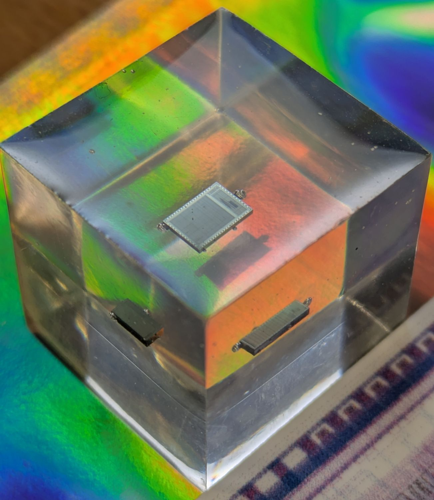
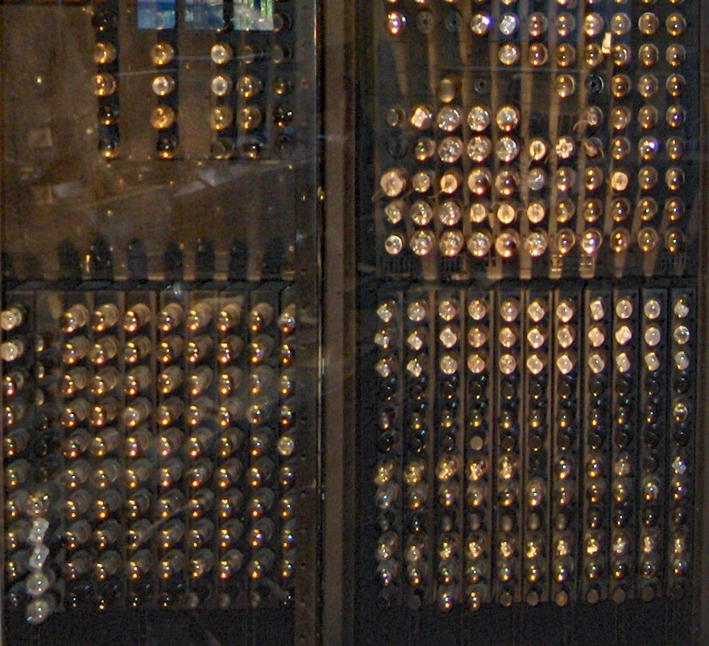
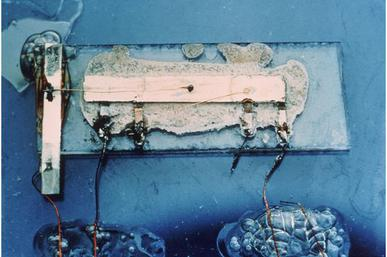
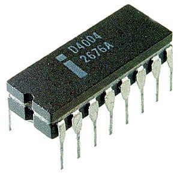
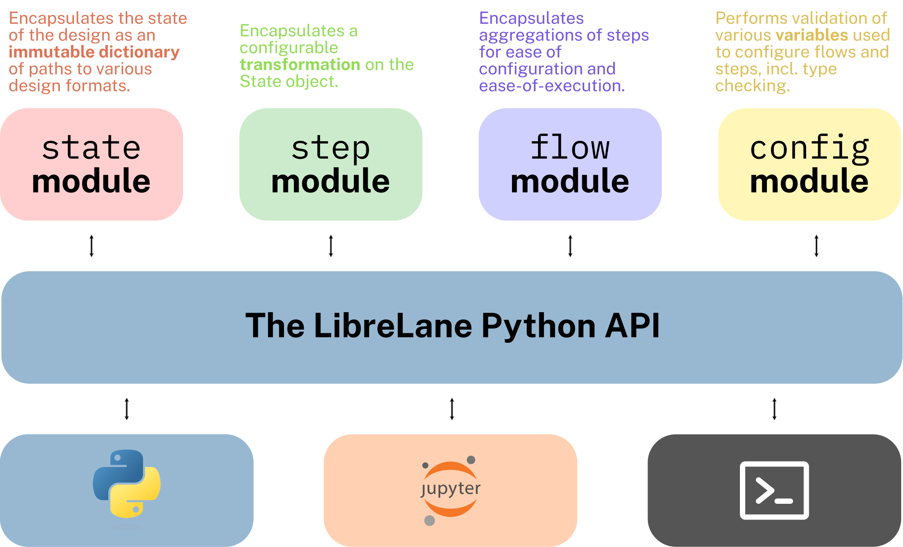
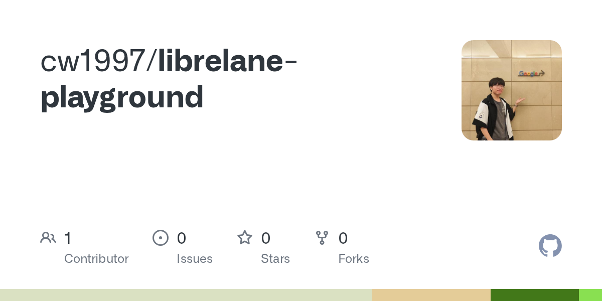
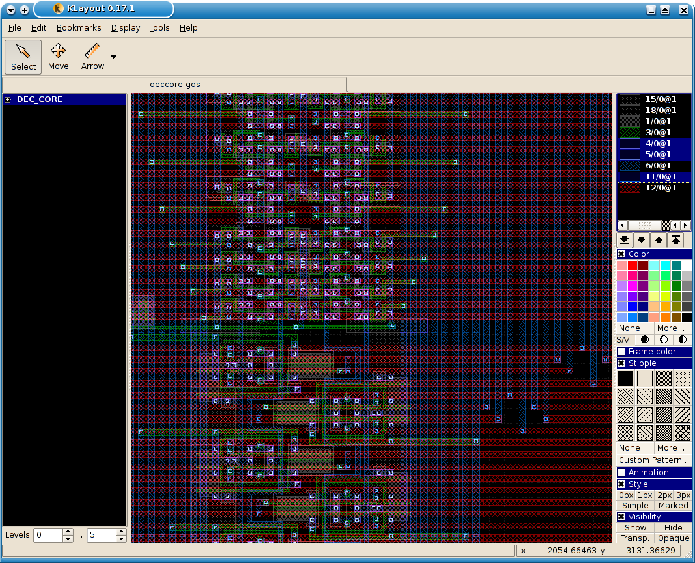
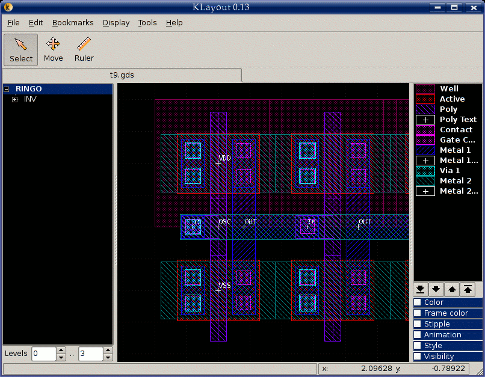
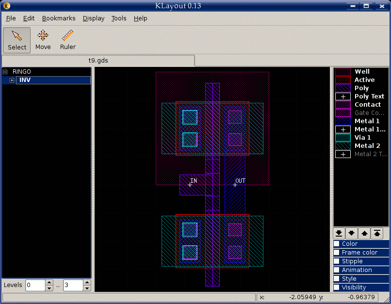

# 从沙子到芯片：一文读懂集成电路的设计与制造，以及如何用 LibreLane 免费做一颗自己的芯片

> 本文面向完全没有接触过 **IC（Integrated Circuit，集成电路）** 设计和流片的读者，将用科普的视角从最基础的概念开始介绍，并在每个英文专业缩写第一次出现时标注其完整英文全称和中文翻译。



---

## 一、集成电路（IC）是什么？它就在你身边

你可能没有意识到，此刻正有几十亿个晶体管在你周围工作。

你口袋里那台手机——里的 CPU（Central Processing Unit，中央处理器）、GPU（Graphics Processing Unit，图形处理器）、内存芯片、Wi-Fi 芯片、蓝牙芯片、电源管理芯片，每一颗都是 **IC（Integrated Circuit，集成电路）**。你的笔记本电脑、智能手表、电视遥控器、汽车（一辆普通家用车至少有 50-100 颗 IC）、医院里的 CT 机、地铁的刷卡闸机、甚至楼下快递柜的扫码模块——每一件电子设备的核心都有一颗或多颗 IC。

**IC（集成电路）** 是什么？简单说，就是把原本由分立元件（晶体管、电阻、电容）组成的电路，通过光刻等工艺全部制造在一块小小的半导体材料（通常是硅）上。一颗指甲盖大小的芯片上，可以集成数十亿个晶体管。世界上最大的芯片——Cerebras Wafer Scale Engine——甚至在整张晶圆上集成了 **2.6 万亿个晶体管**。

这一切的起点，是 1958 年 **Jack Kilby（杰克·基尔比）** 在德州仪器展示的第一块集成电路——在一块锗片上集成了一个振荡器。几个月后，**Robert Noyce（罗伯特·诺伊斯）** 在仙童半导体发明了基于硅的平面工艺，奠定了现代 IC 制造的基础。两人后来分别创办了后来改变世界的公司：Kilby 留在 TI，Noyce 则参与了 Intel 的创立。

而到了 2026 年的今天，你已经可以用 **$100 美元** 设计并制造一颗属于自己的芯片——我们将在本文的最后部分手把手演示如何做到。

---

## 二、IC 是如何被设计出来的？

一颗 IC 从脑海里的一个想法，到变成可以在代工厂制造的数据文件，通常需要 6-18 个月的时间。这个过程叫做 **IC 前端设计（IC Frontend Design）**。

整个设计的核心思路是：用 **HDL（Hardware Description Language，硬件描述语言）**——比如 Verilog 或 VHDL——来描述硬件的行为和结构，然后用 EDA 工具将这些描述自动转换成可以在代工厂制造的版图。

在深入设计流程之前，我们先回答一个更根本的问题：**为什么需要"集成电路"？以及为什么我们需要用代码来"描述"电路？**

### 2.1 从分立器件到集成电路：为什么要"集成"？

#### 2.1.1 分立器件时代——一个零件一个功能

在集成电路诞生之前，所有的电子设备都是用**分立器件（Discrete Components）** 搭建的：每个晶体管、每个电阻、每个电容都是单独封装、单独购买、手工焊接到 PCB（Printed Circuit Board，印刷电路板）上的独立零件。

1946 年问世的 **ENIAC**（世界上第一台通用电子数字计算机）是分立器件时代的顶峰之作——它用了约 **18,000 个真空管**、70,000 个电阻、10,000 个电容、1,500 个继电器，占地 **1500 平方英尺（约 140 ㎡）**，重达 **30 吨**，功耗 **150 千瓦**。为了给这些真空管散热，ENIAC 需要配备专用的空调系统。而它的计算能力，只相当于今天一个电子计算器。



1947 年，贝尔实验室的 **John Bardeen、Walter Brattain 和 William Shockley** 发明了点接触晶体管——比真空管更小、更省电、更可靠的开关器件，三人因此获得了 1956 年的诺贝尔物理学奖。但即使换用了晶体管，每个晶体管仍然是一个独立的分立元件，需要和其他元件一起焊在电路板上。

> 晶体管（Transistor）这个名称来自 **Transfer + Resistor**（转移 + 电阻），因为它能在"导通"和"关断"两种状态之间切换，相当于一个用电流控制的开关。在数字电路里，晶体管就是最基本的"0"和"1"的实现者。

#### 2.1.2 "数的暴政"——为什么非集成不可？

随着电路越来越复杂，分立器件的局限性变得越来越尖锐。到 1950 年代末，这个问题已经有了一个专门的名词——**Tyranny of Numbers（数的暴政）**：

| 问题 | 具体表现 |
|------|---------|
| **体积** | 一台用晶体管搭建的复杂计算机可能需要数百万个分立元件，体积堪比仓库 |
| **可靠性** | 每个焊点都是一个潜在的故障点——ENIAC 有约 **500 万个手工焊点**，平均每两天就有一个真空管烧坏 |
| **成本** | 每个元件需要单独制造、测试和装配 |
| **速度** | 分立元件之间的长连线引入了寄生电阻和电容，限制了电路的最高工作频率 |
| **功耗** | 每个元件单独工作，整体功耗随规模线性增长 |

工程师们意识到：**电路的复杂度和性能已经不再受限于晶体管本身，而是受限于晶体管之间的互连。** 唯一出路——把所有的元件都制造在同一块半导体材料上，让互连也"集成"进去。

#### 2.1.3 集成电路的诞生——两块硅片改变世界

**1958 年夏天**，德州仪器（TI）的新员工 **Jack Kilby（杰克·基尔比）** 由于没有年假资格，整个夏天都在实验室里思考一个问题——"既然晶体管、电阻、电容都可以用半导体材料制造，为什么不能在同一个硅片（确切地说，当时用的是锗）上同时做出所有元件？"

**1958 年 9 月 12 日**——集成电路的诞生日。Kilby 向 TI 管理层展示了一个简陋的装置：一小片锗片上，用金丝连接了几个元件。当他按下示波器的开关时，一条连续的正弦波出现在屏幕上——这是一个完整的振荡器，所有元件（一个晶体管、一个电容和三个电阻）都在同一块半导体材料上。**人类历史上第一块集成电路**诞生了。



**几个月后**，仙童半导体（Fairchild Semiconductor）的 **Robert Noyce（罗伯特·诺伊斯）** 提出了关键的改进——使用 **平面工艺（Planar Process）**：在硅片上生长一层二氧化硅（SiO₂）作为绝缘层，然后在上面沉积金属导线来连接元件。这个方案将互连也做在了芯片内部，不再需要 Kilby 方案中的"飞线"。这正是现代 IC 的基础。

1966 年，TI 和 Fairchild 达成交叉授权协议。**Kilby 和 Noyce 被共同认定为集成电路的发明者**——Kilby 在 2000 年获得诺贝尔物理学奖（Noyce 已于 1990 年去世，诺贝尔奖不追授）。

#### 2.1.4 集成的深远意义

把分立元件集成到一块芯片上带来了几个数量级的飞跃：

- **体积**：从一间屋子 → 指甲盖大小
- **可靠性**：没有了数千个分立焊点，故障率大幅下降
- **成本**：一次光刻同时制造数百万个晶体管，单管成本趋近于零
- **速度**：片上互连距离从厘米级缩短到微米级
- **功耗**：更小的寄生电容意味着更低的动态功耗

这也开启了半导体行业最著名的预言——**摩尔定律（Moore's Law）** 的时代。1965 年，Intel 联合创始人 **Gordon Moore（戈登·摩尔）** 在《Electronics》杂志上发表文章，预言芯片上集成的晶体管数量大约每 **18-24 个月翻一番**。

这个预言在接下来的 **60 年** 里基本得到验证：

| 年份 | 芯片 | 晶体管数 |
|------|------|---------|
| 1971 | Intel 4004（第一个商用微处理器） | **2,300** |
| 1982 | Intel 80286 | **134,000** |
| 1993 | Intel Pentium | **3,100,000** |
| 2007 | Intel Core 2 Quad | **582,000,000** |
| 2024 | NVIDIA Blackwell B200 | **208,000,000,000** |

**60 年间翻了约 9000 万倍**。这就是集成的力量。

### 2.2 从电路图到硬件描述语言——代码如何变成电路？

#### 2.2.1 手绘版图的年代

在 IC 诞生后的最初十余年（1960s-1970s），工程师们是这样设计芯片的：

1. 在纸上画出逻辑电路图——用 AND、OR、NOT 等逻辑门符号画出所有电路
2. 在被称为"光刻模板"的大张坐标纸上，**用手工**画出每个晶体管的版图（Layout）
3. 将版图拍照缩小，制成光掩膜——然后送去代工厂制造

**Intel 4004**（1971 年，世界上第一个商用微处理器）的 **2,300 个晶体管**，就是这样一个一个人工画出来的。4004 的版图设计由 **Federico Faggin** 带领完成，耗时超过一年。



#### 2.2.2 Schematic Capture——从铅笔到 CAD

进入 1980 年代，设计规模增长到数万晶体管，手工画图已不现实。**Schematic Capture（电路图捕获）** 工具应运而生——工程师在计算机屏幕上拖拽逻辑门符号，用线连接，然后由 CAD 工具自动生成网表（Netlist）。

但 Schematic Capture 的本质仍然是**画逻辑门**。到了 1990 年代，芯片规模达到 **数百万到数千万晶体管**——工程师不可能一个一个地摆放 AND 门和 OR 门。一种全新的抽象方式势在必行。

#### 2.2.3 HDL——用代码描述硬件

**硬件描述语言（HDL，Hardware Description Language）** 不是"软件"——它写出来的是**对硬件行为的描述**，而不是运行在 CPU 上的指令序列。

两种主流 HDL 的历史：

| 语言 | 诞生 | 标准化 | 设计者 | 特点 |
|------|------|--------|--------|------|
| **Verilog** | 1984 年 | IEEE 1364-1995 | Gateway Design Automation（后被 Cadence 收购） | 语法类似 C，简洁 |
| **VHDL** | 1980 年代 | IEEE 1076-1987 | 美国国防部 | 语法类似 Ada，严格 |
| **SystemVerilog** | 2005 年 | IEEE 1800-2005 | Accellera / 多家 EDA 公司 | Verilog 的超集，增加类型、断言、OOP |

> **命名由来**："Verilog" = **Veri**fication + **Log**ic（验证 + 逻辑）。"VHDL" = **VHSIC**（Very High Speed Integrated Circuit，超高速集成电路）**H**ardware **D**escription **L**anguage。

当前业界的主流是 **SystemVerilog**（IEEE 1800-2023），它既是设计语言也是验证语言，被 Synopsys VCS、Cadence Xcelium、Siemens Questa 等商业仿真器以及开源的 Verilator 和 Yosys 广泛支持。

### 2.3 RTL 编码——Verilog 入门与门级对照

#### 2.3.1 什么是 RTL？

**RTL（Register Transfer Level，寄存器传输级）** 的含义：数字电路本质上就是 **寄存器（Registers）+ 组合逻辑（Combinational Logic）** 的交替级联：

```
组合逻辑 A → 寄存器 → 组合逻辑 B → 寄存器 → 组合逻辑 C → ...
                  ↑ 时钟信号 ↑
```

- **寄存器**（D 触发器）在时钟边沿锁存当前状态
- **组合逻辑** 在两个寄存器之间计算下一个状态或输出值

Verilog/SystemVerilog 中的对应写法：
- `assign` 或 `always_comb` → 组合逻辑（AND、OR、MUX 等）
- `always_ff @(posedge clk)` → 时序逻辑（D 触发器）

#### 2.3.2 每一行代码都是一堆逻辑门

理解 HDL 最关键的概念：**你写的每一行代码，最终都会变成物理世界里的逻辑门和连线。** 这个翻译过程叫做"综合（Synthesis）"（详见 2.7 节），但在写代码时就要知道手中的"笔"画出来的究竟是怎样的电路。

以下是 Verilog/SystemVerilog 语法和它对应的物理电路：

| Verilog 语法 | 对应的物理电路 | 说明 |
|-------------|--------------|------|
| `assign y = a & b;` | AND 门 | 连续赋值 |
| `assign y = a \| b;` | OR 门 | 连续赋值 |
| `assign y = ~a;` | NOT 门（反相器） | 连续赋值 |
| `assign y = a ^ b;` | XOR 门 | 连续赋值 |
| `assign y = (sel) ? a : b;` | 2 选 1 多路选择器 | 三目运算符 → MUX |
| `assign {cout, sum} = a + b + cin;` | 全加器 | 算术运算 → 加法器 |
| `always_ff @(posedge clk) q <= d;` | D 触发器 | 边沿触发 → 寄存器 |
| `case (sel) ... endcase` | 多路选择器 | 选择语句 → MUX 树 |
| `if (a > b) ... else ...` | 比较器 + 多路选择器 | 条件判断 → 比较 + MUX |

#### 2.3.3 实例：一个全加器的三种写法

来看一个 **1-bit 全加器（Full Adder）**。它的功能很简单：将三个输入（a、b、进位输入 cin）相加，产生和（sum）与进位输出（cout）。

**逻辑表达式：**
```
sum  = a XOR b XOR cin
cout = (a AND b) OR (a AND cin) OR (b AND cin)
```

##### 方式一：门级建模

直接实例化逻辑门，最接近物理实现，但写起来最繁琐：

```verilog
module full_adder_gate (
    input  a, b, cin,
    output sum, cout
);
    wire s1, c1, c2, c3;

    xor g1 (s1,   a,  b);
    xor g2 (sum,  s1, cin);
    and g3 (c1,   a,  b);
    and g4 (c2,   a,  cin);
    and g5 (c3,   b,  cin);
    or  g6 (cout, c1, c2, c3);
endmodule
```

##### 方式二：数据流建模

用 `assign` 连续赋值和逻辑运算符，一行一个表达式：

```verilog
module full_adder_df (
    input  a, b, cin,
    output sum, cout
);
    assign sum  = a ^ b ^ cin;
    assign cout = (a & b) | (a & cin) | (b & cin);
endmodule
```

综合工具会自动将 `assign sum = a ^ b ^ cin` 翻译为 **两个 XOR 门串联**，将 `assign cout = ...` 翻译为 **三个 AND 门 + 一个 OR 门**。

> **一个重要的认知**：以上两种写法**综合后的电路完全相同**（假设相同的工艺库和约束）。差别仅在于代码的表达方式——方式二更简洁、易读、易维护，因此是实际工业中的主流选择。

##### 方式三：行为级建模

用 `always_comb` 和 `if/else` 或 `case` 来描述功能，最接近软件编程：

```verilog
module full_adder_beh (
    input  a, b, cin,
    output logic sum, cout
);
    always_comb begin
        {cout, sum} = a + b + cin;
    end
endmodule
```

综合工具会把 `a + b + cin` 推断为一个 **加法器宏单元**（如果工艺库中有全加器标准单元）或将其拆解为多个基本逻辑门。

#### 2.3.4 实例：D 触发器与计数器

除了组合逻辑，数字电路的另一半是**时序逻辑**——需要"记忆"的电路。最基本的时序单元是 **D 触发器（D Flip-Flop，DFF）**：

```verilog
// 一个带异步复位的 D 触发器
module dff_example (
    input  logic clk,      // 时钟
    input  logic rst_n,    // 异步复位（低有效）
    input  logic d,        // 数据输入
    output logic q         // 数据输出
);
    always_ff @(posedge clk or negedge rst_n) begin
        if (!rst_n)
            q <= 1'b0;     // 复位时输出 0
        else
            q <= d;        // 时钟上升沿将 d 传送到 q
    end
endmodule
```

每个 `always_ff @(posedge clk)` 在综合后都会变成**一组 D 触发器**，触发器的位宽由赋值目标的宽度决定。

利用触发器可以构建**计数器**——几乎所有数字芯片的基础模块：

```verilog
module counter (
    input  logic        clk,
    input  logic        rst_n,
    input  logic        en,         // 使能
    output logic [7:0]  count       // 8 位计数器
);
    always_ff @(posedge clk or negedge rst_n) begin
        if (!rst_n)
            count <= 8'b0;
        else if (en)
            count <= count + 1;     // 每使能一次 +1
    end
endmodule
```

综合后的电路：**8 个 D 触发器**（保存 count 值）+ **1 个 8 位加法器**（实现 count + 1）+ 一些控制逻辑。

```
                       ┌────────────────────────┐
count (D 触发器阵列) ──┤                        │
                       │   8 位加法器            │
                   +1 ─┤   count + 1            ├──→ 下次时钟沿写入触发器
                       │                        │
                       └────────────────────────┘
```

这是 RTL（寄存器传输级）这个名字的来源——描述的就是**数据如何在寄存器之间传输和运算**。

#### 2.3.5 SystemVerilog 基本语法要点

对于未接触过 Verilog/SystemVerilog 的读者，以下是理解后续内容所需的最小语法知识：

| 语法元素 | 示例 | 说明 |
|---------|------|------|
| 模块定义 | `module name (input a, output b); ... endmodule` | 所有代码都在模块内部 |
| 连续赋值 | `assign y = a & b;` | 组合逻辑，y 随 a/b 即时变化 |
| 时序赋值 | `always_ff @(posedge clk) q <= d;` | 非阻塞赋值（`<=`），在时钟沿触发 |
| 组合块 | `always_comb begin ... end` | 组合逻辑过程块 |
| 信号类型 | `logic` / `wire` | SystemVerilog 统一用 `logic` |
| 参数化 | `#(parameter WIDTH = 8)` | 模块可配置 |
| 模块实例化 | `counter #(.WIDTH(8)) u_cnt(.clk(clk), ...)` | 像芯片一样插接模块 |

### 2.4 需求定义与规格制定（Specification）

好比盖房子前要确定房子用途、面积和预算。芯片设计也需要先明确：做什么功能？跑多快？功耗多少？面积多大？选用什么工艺节点（180nm、28nm、7nm 还是 3nm）？

**规格书（Specification Document）** 通常由产品经理和系统架构师协作完成，是一份 **数十到数百页** 的文档，详细定义：

- **功能需求**：支持哪些协议？处理哪些数据格式？
- **性能指标**：工作频率（MHz/GHz）、吞吐量（Gbps/Gbps）、延迟（ns）
- **功耗预算**：主动功耗（mW/W）、待机功耗（μW/mW）
- **物理约束**：芯片面积（mm²）、封装类型、引脚数
- **接口定义**：输入/输出信号列表、协议规范（I²C、SPI、USB、PCIe）
- **工艺选择**：180nm / 130nm / 65nm / 28nm / 7nm / 3nm——工艺越先进，性能和功耗越好，但 NRE 呈指数增长（详见 4.6 节）

> 规格书是芯片设计的"宪法"——后续所有环节的决策都以它为依据。规格一旦确定就很难更改，因为修改意味着全流程重来。

### 2.5 架构设计（Architecture）

把需求翻译成芯片的"装修图"——架构师需要做出关键的系统级决策：

- **计算核心**：选用什么处理器核？ARM Cortex-M 系列？开源 RISC-V 核（如 VexRiscv、Ibex）？还是纯硬件状态机？
- **总线架构**：AMBA AXI（高性能）、AHB（中等）、APB（外设总线），或开源 Wishbone？
- **存储层次**：片内 SRAM 容量、是否需要 Cache（L1/L2）、是否需要外部 DRAM 接口
- **外设接口**：GPIO、I²C、SPI、UART、USB、Ethernet、PCIe——根据规格选配
- **功耗管理**：时钟门控（Clock Gating）、电源门控（Power Gating）、动态电压频率调整（DVFS）
- **安全特性**：加密引擎、安全启动、物理不可克隆函数（PUF）

架构阶段的核心产出是**高层次框图（High-Level Block Diagram）**，展示所有主要模块和它们之间的连接关系——就像建筑的平面图，不涉及每块砖怎么砌，但要确定哪里是客厅、哪里是厨房。

### 2.6 RTL 编码（RTL Coding，寄存器传输级编码）

用 Verilog 或 SystemVerilog 写出硬件的功能描述。这是"写代码"的阶段，但要时刻记住——写的是**对硬件的描述**，不是软件。每一行 Verilog 最终都会变成物理世界的逻辑门和触发器（详见 2.3 节的门级对照）。

实际工程中的 RTL 编码准则：
- **可综合**：写出的代码必须能被综合工具翻译为硬件，不是所有 Verilog 语法都可综合（不可综合的语法用于测试平台）
- **避免锁存器（Latch）**：`if` 有条件不完整或 `case` 未穷举时，综合工具会推断出锁存器——通常应该避免
- **同步设计**：尽量用单一时钟域 + 同步复位，避免异步逻辑

### 2.7 功能验证（Functional Verification）

这是整个 IC 设计流程中最耗时的阶段——通常占项目周期的 **50%-70%**。原因很简单：**一颗芯片流片一次的成本可能高达千万到上亿美元，所有 Bug 都必须在流片之前被抓出来。** 软件可以发补丁，硬件一旦制造出来就改不了。

#### 验证的主要方法

| 方法 | 工具 | 说明 |
|------|------|------|
| **动态仿真** | VCS、Xcelium、Questa、Verilator | 运行测试向量，检查输出 |
| **形式化验证** | VC Formal、JasperGold | 数学证明设计属性 |
| **等价性检查** | Formality、Yosys EQY | 对比 RTL 和门级网表功能是否一致 |

#### 典型验证环境结构

```
Testbench（测试平台）
 ├── Stimulus Generator（激励生成器）→ 产生测试事务
 ├── Driver（驱动）→ 将事务转换为信号时序
 ├── DUT（Design Under Test，被测设计）
 ├── Monitor（监视器）→ 观察输出信号
 └── Scoreboard（记分板）→ 比较预期结果和实际结果
```

#### UVM——行业标准验证方法学

**UVM（Universal Verification Methodology，通用验证方法学）** 基于 SystemVerilog 的面向对象特性，提供一套可复用的验证组件框架（Agent、Sequencer、Driver、Monitor、Scoreboard）。现代大型 SoC 验证几乎必用 UVM。

#### 回归测试与覆盖率

- **回归测试（Regression）**：每天自动运行数千到数百万个测试用例，确保修改不会破坏已有功能
- **代码覆盖率（Code Coverage）**：行覆盖、条件覆盖、跳转覆盖——检查代码是否都被执行到
- **功能覆盖率（Functional Coverage）**：检查验证是否覆盖了所有关键场景

### 2.8 逻辑综合（Logic Synthesis）

**综合（Synthesis）** 是将 RTL 代码翻译为**门级网表（Gate-Level Netlist）** 的过程。网表由目标工艺库（PDK）中的标准单元（AND、OR、NAND、NOR、XOR、DFF、MUX 等）和它们之间的连线组成。

#### 综合工具的内部步骤

```
RTL (.v) ─→ 解析（Parsing）→ 优化（Optimization）→ 技术映射（Tech Mapping）→ 门级网表 (.v)
                        ↑                             ↑
                 布尔代数化简、常数传播             匹配工艺库的标准单元
```

1. **解析（Parsing）**：读取 Verilog/SystemVerilog，构建语法树
2. **优化（Optimization）**：逻辑化简（`a & a → a`、`a & ~a → 0`）、常数传播、资源共享
3. **技术映射（Technology Mapping）**：将优化后的逻辑匹配到目标工艺库的特定标准单元——比如某个 2 输入 AND 门，库中可能有驱动强度为 ×1、×2、×4、×8 等不同版本
4. **时序优化（Timing Optimization）**：根据时序约束调整门的大小、插入缓冲器，确保所有路径满足时序

#### 标准单元库（Standard Cell Library）

工艺库是一组经过硅验证的、可制造的基本电路单元。以 SkyWater 130nm 开源 PDK 为例，其标准单元库包含：

| 单元类型 | 示例 | 用途 |
|---------|------|------|
| 基本逻辑门 | AND2、OR2、NAND2、NOR2、XOR2、INV | 组合逻辑 |
| 多路选择器 | MUX2、MUX4 | 信号选择 |
| 触发器 | DFF、DFFR（带复位）、DFFS（带置位）、SDFF（扫描触发器） | 时序逻辑 |
| 加法器 | FA、HA | 算术运算 |

每个单元有多个驱动强度（×1、×2、×4、×8、×16），综合工具自动选择最优强度来满足时序。

#### 时序约束

综合工具必须知道**速度要求**才能做时序优化。时序约束通常用 **SDC（Synopsys Design Constraints）** 格式表达：

```tcl
create_clock -period 20 [get_ports clk]        # 时钟周期 20ns → 50MHz
set_input_delay 2 -clock clk [get_ports data_in]   # 输入信号到达延迟
set_output_delay 3 -clock clk [get_ports data_out] # 输出信号建立时间
```

综合工具会检查每条路径的**传播延迟**是否 ≤ 时钟周期，留有正 **Slack（余量）** 就是通过了。

#### 综合产出

- **门级网表（Gate-level Netlist）**：只包含标准单元实例和互连的 Verilog 文件
- **标准延迟格式（SDF，Standard Delay Format）**：每个标准单元的时序参数文件
- **时序报告**：列出所有时序路径的 Slack，标注关键路径

### 2.9 DFT 插入（DFT, Design for Test，可测试性设计）

芯片制造出来之后，怎么知道它有没有制造缺陷？答案是——在设计阶段就插入了测试电路。

**DFT（可测试性设计）** 的核心技术：

- **扫描链（Scan Chain）**：将所有 D 触发器在测试模式下连接成一条"串行移位寄存器"链。测试时，ATE 通过扫描链将测试向量串行输入 → 运行一个正常时钟周期 → 再串行读出结果。每个触发器的值都可以被直接设置和读取，大幅提高了**故障覆盖率（Fault Coverage）**
- **BIST（Built-In Self-Test，内建自测试）**：在芯片内部集成测试电路——如 SRAM BIST 可以在芯片内部自动测试每一块片上存储器的所有存储单元
- **MBIST（Memory BIST）**：专门测试片上存储器的自测试引擎

行业标杆工具：**Siemens EDA Tessent**（市占率第一）。

### 2.10 布局规划（Floorplanning）

确定芯片的物理尺寸、各功能模块的位置、I/O（Input/Output，输入/输出）管脚的排列和电源网络的规划。好比确定房子每间房的位置和主电线的走向。

布局规划阶段的产出：
- **Die 尺寸和形状**
- **宏单元（MACRO）位置**：SRAM、PLL、ADC/DAC 等大模块的放置
- **I/O Pad 环排列**：信号引脚和电源/地引脚的分配
- **电源网络（PDN，Power Distribution Network）初步规划**：供电环（Power Ring）、供电带（Power Strap）的位置

### 2.11 单元放置（Placement）

把逻辑综合产生的数百万个标准单元安排到芯片上精确的坐标位置。分为两个子阶段：

1. **全局放置（Global Placement）**：粗略将所有单元分布在芯片面积上，目标是最小化总连接线长
   - 常用算法：**Nesterov 方法**（在 OpenROAD 的 RePlAce 中实现）、力导向放置
2. **详细放置（Detailed Placement）**：在全局放置的基础上，将每个单元对齐到工艺规定的最小网格上，消除单元重叠（合法化），并进一步优化时序

放置的好坏直接影响：时序（线长越短越快）、拥塞（布线的拥挤程度）、功耗（长线消耗更多动态功耗）。

### 2.12 CTS（Clock Tree Synthesis，时钟树综合）

芯片中所有触发器都依赖一个同步的"心跳"——**时钟信号**。CTS 构建一个分布网络（时钟树），确保时钟信号**几乎同时**到达所有触发器的时钟端。

时钟树的形状：

```
                   ┌─── BUF ──→ Flip-Flop A
                   │
时钟源 ─→ BUF ────┼─── BUF ──→ Flip-Flop B
        (根部)     │
                   └─── BUF ──→ Flip-Flop C
```

目标是最小化 **Clock Skew（时钟偏斜）**——同一时钟沿到达不同触发器的时间差。理想情况下 skew = 0，实际设计中 skew 通常控制在时钟周期的 5%-10% 以内。例如 20ns 周期的时钟（50MHz），skew 应 < 1-2ns。

### 2.13 布线（Routing）

用金属导线把放置好的所有标准单元按照网表连接起来。先进工艺下芯片有 **10-15 层金属**，布线需要在各层之间用**通孔（Via）** 垂直连接。

布线也分两个阶段：

1. **全局布线（Global Routing）**：将芯片划分为粗粒度网格，为每条线分配大致路径，检测拥塞区域
2. **详细布线（Detailed Routing）**：在全局布线的基础上，精确到每根导线的具体走向、宽度、间距——确保满足 DRC 规则，这是整个流程中**计算量最大的步骤**，通常占据 30%-50% 的总运行时间

布线完成后还要处理**天线效应**——长金属线在刻蚀时可能像天线一样收集电荷损坏晶体管栅极。解决方案：在长线附近插入二极管单元（Antenna Diode）来泄放电荷。

### 2.14 物理验证（Physical Verification）

检查版图是否满足制造规则：

- **DRC（Design Rule Check，设计规则检查）**：验证版图是否符合代工厂的物理制造规则
  - 最小线宽（130nm 工艺中多晶硅最小宽度 ~150nm）
  - 最小间距（同一层金属间的最小距离）
  - 最小包围（接触孔被周围材料覆盖的宽度）
  - 密度检查（每层材料的"覆盖率"必须在某个范围内，太高或太低都会导致制造失败）
- **LVS（Layout vs. Schematic，版图与原理图对比）**：从版图中提取晶体管级电路，与综合后的门级网表进行对比——确保"画出来的"和"设计的"完全一致
- **XOR 对比**：对比两套独立生成的 GDSII（如 Magic 和 KLayout 各导出一次），检查是否一致

行业标准工具：**Siemens EDA Calibre**（DRC/LVS 签核的黄金标准）。

### 2.15 STA 签核（STA Signoff，静态时序分析签核）

提取导线电阻电容（寄生参数），生成 **SPEF（Standard Parasitic Exchange Format）** 文件，反标回时序分析工具，逐条路径验证所有触发器的**建立时间（Setup Time）** 和**保持时间（Hold Time）** 是否满足。

- **建立时间违例（Setup Violation）**：数据到达太快（路径太短）→ 可通过插入缓冲器修复
- **保持时间违例（Hold Violation）**：数据到达太慢（路径太长）→ 可通过增大门驱动强度或减少缓冲器修复

STA 需要在**多个工艺角（Process Corner）** 下分别验证——如最差情况（Slow-slow，低温低压）和最好情况（Fast-fast，高温高压），确保芯片在各种条件下都能正常工作。

行业标准工具：**Synopsys PrimeTime**——STA 签核的黄金标准。

### 2.16 GDSII 生成

将最终版图导出为 **GDSII（Graphic Data System II）** 格式——这是代工厂制造掩膜的标准格式。GDSII 文件本质上是一个二进制数据库，包含所有几何图形的形状、层号和坐标。

除了主 GDSII，通常还会导出 **DEF（Design Exchange Format）** 文件——包含布局布线的详细信息。

### 2.17 Tapeout（流片）

将 GDSII 文件正式交付给代工厂。"Tapeout"这个名称来源于 1970-80 年代，设计数据体积很大（当时以 MB 计已经算巨大），使用**磁带（Magnetic Tape）** 来保存和运送设计数据。虽然现在都用网络传输了，但这个名称一直沿用至今。

Tapeout 完成后，芯片设计阶段就正式结束了——接下来就是"看天吃饭"：等待 4-6 个月后，代工厂送回的第一批晶圆和封测芯片。如果一切正常——恭喜，你的芯片"一次流片成功"（First-Silicon Success）；如果发现了 Bug——那就是一次昂贵的教训（Eco Spin，修改后再流片一次）。

---

## 三、IC 设计公司与 EDA 三巨头

完成以上设计流程需要两大类角色：**EDA（Electronic Design Automation，电子设计自动化）工具公司** 提供设计软件，**Fabless（无晶圆厂）设计公司** 使用这些工具来设计芯片。

### EDA 三巨头

全球 EDA 市场是一个典型的寡头垄断市场，前三家合计占约 85% 以上的份额。

 

#### Synopsys（新思科技）
- **总部**：美国加州桑尼韦尔
- **市占率**：约 35-41%，全球最大
- **核心产品**：
  - **Design Compiler / Fusion Compiler**：逻辑综合（Logic Synthesis），行业黄金标准
  - **IC Compiler II**：布局布线（Place & Route）
  - **PrimeTime**：静态时序分析，签核黄金标准
  - **VCS**：数字仿真器
  - **VC Formal**：形式化验证
- **定价**：单工具年许可费约 $5 万起，全套流程每年 $100 万 - $5000 万+
- **历史趣事**：Synopsys 由 **Aart de Geus** 于 1986 年创立，他当年在通用电气工作时开发了综合工具的雏形。公司名来自 **SYNthesis and OPtimization SYStems**（综合与优化系统）

#### Cadence（铿腾电子）
- **总部**：美国加州圣何塞
- **市占率**：约 30-36%
- **核心产品**：
  - **Genus**：逻辑综合
  - **Innovus**：布局布线
  - **Tempus**：静态时序分析
  - **Xcelium**：数字仿真器
  - **Virtuoso**：定制/模拟版图设计，行业事实标准
  - **JasperGold**：形式化验证
- **历史**：Cadence 由 **SDA Systems** 和 **ECAD** 两家公司于 1988 年合并而成，**陈立武（Lip-Bu Tan）** 在 2009-2021 年间担任 CEO，将公司带到新高度，后于 2024 年起担任 Intel 董事长

#### Siemens EDA（原 Mentor Graphics）
- **总部**：美国德州普莱诺（西门子数字工业旗下）
- **市占率**：约 13-15%
- **核心产品**：
  - **Calibre**：DRC/LVS 物理验证，行业标准
  - **Tessent**：DFT，市占率第一
  - **Questa**：数字仿真器

### EDA 工具为什么这么贵？

EDA 工具的定价没有公开报价单，每个客户单独谈判：

- 小型团队（5-15 人）：每年 $20 万 - $80 万
- 中型企业：每年 $30 万 - $100 万+
- 大型企业（NVIDIA、Qualcomm 等）：每年 $1000 万 - $5000 万+
- 顶级客户：每年超过 $1 亿

除了许可费，**认证锁定**也极为严重——代工厂针对每个新工艺节点都要重新认证 EDA 工具的流程，切换供应商成本极高。

### 全球知名的 IC 设计公司（Fabless）

这些公司不自己制造芯片，而是专注于设计：

| 公司 | 总部 | 核心产品 | 2025 年营收（约） |
|------|------|---------|----------------|
| **NVIDIA（英伟达）** | 美国加州 | GPU、AI 加速器、自动驾驶芯片 | $1300+ 亿 |
| **Qualcomm（高通）** | 美国加州 | 手机 SoC（骁龙）、5G 基带、物联网 | $440 亿 |
| **Broadcom（博通）** | 美国加州 | 网络芯片、无线连接芯片、存储控制器 | $510 亿 |
| **AMD（超威半导体）** | 美国加州 | CPU（Ryzen）、GPU（Radeon）、数据中心 | $260 亿 |
| **MediaTek（联发科）** | 台湾新竹 | 手机 SoC（天玑）、电视芯片、物联网 | $200 亿 |
| **Apple（苹果）** | 美国加州 | A 系列（iPhone）、M 系列（Mac）自研芯片 | —（内部使用）|
| **Marvell（美满电子）** | 美国加州 | 网络、存储、数据中心芯片 | $60 亿 |

---

## 四、IC 是如何被制造出来的？

设计完成并 Tapeout（流片）后，GDSII 文件被送到代工厂，开启了一段奇妙的旅程——把设计数据变成真正的物理芯片。

### 4.1 掩膜制作（Photomask Manufacturing）

**Photomask（光掩膜）** 是芯片制造中的"底片"——一块高精度石英玻璃板，表面覆盖的铬金属层上刻有电路图案。

掩膜制作流程：
1. **MDP（Mask Data Preparation，掩膜数据准备）**：代工厂将 GDSII 转为掩膜写入器的格式。在先进节点，由于光的衍射效应，必须应用 **OPC（Optical Proximity Correction，光学邻近效应修正）**——把本来应该是整齐矩形的图案，修改成带有复杂锯齿状顶角的形状，才能保证在晶圆上投影出正确的电路
2. **掩膜写入**：电子束光刻机逐行扫描，将图案写入掩膜。一套 7nm 的高级掩膜，单个掩膜版写入时间可能超过 24 小时
3. **掩膜检测与修复**：自动化设备扫描缺陷，用 FIB（Focused Ion Beam，聚焦离子束）修复
4. **保护膜安装**：在掩膜表面张紧一层极薄的透明 Pellicle，保护掩膜免受颗粒污染

掩膜成本随节点急剧上升：

| 节点 | 掩膜层数 | 全套掩膜成本 |
|------|---------|-------------|
| 180nm | ~18-24 | $10 万 - $20 万 |
| 28nm | ~40-46 | $80 万 - $150 万（双重曝光开始）|
| 7nm | ~60-75 | $300 万 - $600 万（首次 EUV）|
| 3nm | ~85-100 | $1000 万 - $2000 万+（几乎全 EUV）|
| 2nm | ~100+ | $1500 万 - $3000 万+（High-NA EUV）|

关于 **EUV（Extreme Ultraviolet，极紫外光刻）**：EUV 使用 13.5nm 波长的极紫外光（相对传统 DUV 193nm 深紫外光），可以实现更小的特征。但 EUV 光无法穿透玻璃，所以 EUV 掩膜是**反射式**的——由多层钼/硅 Bragg 反射镜组成。ASML 的最新 High-NA EUV 光刻机（EXE:5000），每台售价约 **$3.5-4 亿**。

### 4.2 晶圆制造（Wafer Fabrication）

晶圆制造是整个过程中最耗时、最核心的环节，涉及 **300-1000+ 道工序**（视节点）。核心流程围绕一个循环反复执行（每层掩膜重复一次）：

**核心循环层：**
1. **清洗**——表面预处理
2. **沉积**——通过 CVD（Chemical Vapor Deposition，化学气相沉积）/PVD（Physical Vapor Deposition，物理气相沉积）/ALD（Atomic Layer Deposition，原子层沉积）生长薄膜
3. **光刻**——涂光刻胶 → 掩膜对准 → 曝光 → 显影
4. **刻蚀**——等离子干法刻蚀（精密）或湿法刻蚀
5. **去胶**——去除剩余光刻胶
6. **量测**——检测和测量

**FEOL（Front-End-of-Line，前段工艺）——晶体管制造：**
- 阱形成、STI（Shallow Trench Isolation，浅槽隔离）
- 栅氧化层生长、金属栅极沉积
- 离子注入实现源/漏掺杂

**BEOL（Back-End-of-Line，后段工艺）——互连布线：**
- 沉积层间介质
- 刻蚀通孔和沟槽
- 铜填充（电镀）→ CMP 平坦化
- 重复 10-15 层金属

### 4.3 CP 测试（Wafer Sort / 晶圆探针测试）

晶圆制造完成后，在划片之前，每个 die（裸晶）都要接受探针测试：
- **WPT（Wafer Parametric Test）**：测量划片线中的测试结构（晶体管 Vt、漏电流等）
- **WFT（Wafer Functional Test）**：探针卡接触芯片焊盘，ATE 运行测试向量，按速度/功耗分 Bin

一片 300mm 晶圆上的数千个 die，典型测试时间 1 至数小时。

### 4.4 封装（Packaging）

晶圆经过背面减薄 → 划片 → 好 die 进入封装线：

1. **Die Attach（芯片贴装）**：用环氧树脂将芯片固定在基板上
2. **Wire Bonding（引线键合）**：用 20-50μm 粗的金线连接芯片焊盘到封装引脚
3. **或 Flip-Chip（倒装焊）**：芯片翻转直接通过微凸点焊接到基板
4. **Molding（塑封）**：环氧树脂注塑
5. **Ball Attach（植球）**：安装焊球（BGA 封装）
6. **测试与打标**

常见封装类型：

| 封装 | 每颗成本 | 典型用途 |
|------|---------|---------|
| **QFN** | $0.08-0.80 | 工业级标准，原型验证 |
| **WLCSP** | $0.15-0.50 | 手机、可穿戴（体积最小）|
| **BGA** | $0.50-8.00 | 高引脚数芯片 |
| **FC-BGA** | $8.00+ | CPU、GPU |
| **CoWoS**（TSMC） | ~$70 | AI 加速器（NVIDIA H100、AMD MI300X）|

### 4.5 从 Tapeout 到芯片到手的完整时间线

| 阶段 | 成熟节点（180nm-65nm） | 先进节点（28nm-16nm） | 前沿节点（7nm-3nm） |
|------|---------------------|--------------------|-------------------|
| 掩膜制作 | 2-3 周 | 3-4 周 | 4-8 周 |
| 晶圆制造 | 6-10 周 | 8-12 周 | 12-16 周 |
| CP 测试 | 1-2 天 | 2-3 天 | 3-5 天 |
| 封装 | 2-4 周 | 3-6 周 | 4-8 周 |
| 最终测试 | 1-2 周 | 1-2 周 | 1-2 周 |
| **总计** | **~8-14 周** | **~12-20 周** | **~16-30+ 周** |

### 4.6 什么是 NRE？芯片设计的真实成本

**NRE（Non-Recurring Engineering，非重复性工程费用）** 包括掩膜 + 设计人力 + EDA 许可 + IP 授权 + 测试开发等一次性投入：

| 节点 | 低端 NRE | 高端复杂 SoC NRE |
|------|---------|----------------|
| 180nm | ~$110 万 | ~$520 万 |
| 28nm | ~$1580 万 | ~$4450 万 |
| 7nm | ~$1.03 亿 | ~$2.55 亿 |
| 3nm | ~$2.10 亿 | ~$6.01 亿 |
| 2nm | ~$3.15 亿 | ~$7.54 亿 |

一颗 3nm 的复杂 SoC，整体 NRE 可能高达 **$5-6 亿**。这就是为什么只有 Apple、NVIDIA、Qualcomm 这样的巨头才能站在芯片技术的最前沿。

---

## 五、全球知名的 IC 制造公司（代工厂）

**Foundry（晶圆代工厂）** 是专门为其他公司制造芯片的工厂。全球代工市场的格局如下：

### TSMC（台积电）——绝对霸主

| 维度 | 数据 |
|------|------|
| **创立** | 1987 年（世界第一家纯代工厂），创始人 **张忠谋（Morris Chang）** |
| **总部** | 台湾新竹 |
| **全球市占率** | **64.9%**（2024 Q3）——超过其后所有代工厂之和 |
| **核心客户** | Apple、NVIDIA、AMD、Qualcomm、MediaTek、Broadcom |
| **2024 营收** | ~$900 亿 |

**关键工艺节点：**

| 节点 | 类型 | 状态 | 说明 |
|------|------|------|------|
| 28nm | Planar | 成熟 | 成本性能最佳平衡点——半导体界的"丰田卡罗拉" |
| 16nm/12nm | FinFET | 成熟 | TSMC 首个 FinFET 节点 |
| 7nm (N7) | FinFET + EUV | 成熟 | AI 推理、5G、HPC |
| 5nm (N5) | FinFET + EUV | 量产 | iPhone 用，34% 营收 |
| **3nm (N3)** | **FinFET** | **量产** | **当前最先进逻辑量产节点，26% 营收** |
| 2nm (N2) | Nanosheet GAA | 2025 H2 量产 | 环绕栅极纳米片晶体管 |

**核心竞争力**：纯代工（不与客户竞争）、最高良率、最可预测交期、最完整生态系统。张忠谋于 2018 年退休后，由 **刘德音（Mark Liu）** 和 **魏哲家（C.C. Wei）** 接棒。台积电近期启动了在日本熊本（JASM）、美国亚利桑那（Fab 21）和德国德累斯顿（ESMC）的全球化产能布局。

### Samsung Foundry——追赶者

| 维度 | 数据 |
|------|------|
| **归属** | Samsung Electronics（IDM，垂直整合） |
| **全球市占率** | **9.3%** |
| **核心客户** | Qualcomm（部分）、三星 Exynos、Tesla（宣布） |

**关键节点：**
- **3nm (SF3)**：全球首个 GAA（Gate-All-Around，环绕栅极）量产节点（2022 年发布），但良率仅 ~40-50%
- **2nm (SF2)**：2025 H2 量产，231 MTr/mm² 密度
- 一贯策略：**激进定价**，通常比 TSMC 便宜 10-20%

### Intel Foundry Services (IFS)——第三极

| 维度 | 数据 |
|------|------|
| **归属** | Intel Corporation（从 IDM 转型代工） |
| **2024 代工亏损** | $23 亿（Q4）——转型代价巨大 |
| **核心节点** | **Intel 18A**（RibbonFET + PowerVia），2025 H2 量产 |

Intel 18A 的 **PowerVia（背面供电）** 是一项独特技术——将电源线从芯片正面移到背面，显著改善供电效率。**RibbonFET（ ribbon 形环绕栅极）** 是 Intel 对 GAA 的实现。

### SMIC（中芯国际）——中国芯的扛旗者

| 维度 | 数据 |
|------|------|
| **总部** | 中国上海 |
| **挑战** | 2020 年起受美国实体清单制裁，10nm 以下设备获取受限 |
| **成就** | 使用 DUV 设备（无 EUV）为华为 Mate 60 生产了 7nm 级 Kirin 9000S |
| **代价** | 良率仅 ~15%，成本比 TSMC 贵 40-50% |

### GlobalFoundries（格芯）——成熟节点专家

2018 年退出 7nm 竞赛后，专注于 **特色工艺**：
- **22FDX（22nm FD-SOI）**：超低功耗、RF 集成
- **SiGe BiCMOS**、**GaN**、**Fotonix（硅光）**
- 唯一不位于中国/台湾的规模化纯代工厂

### SkyWater——开源芯片运动的基石

| 维度 | 数据 |
|------|------|
| **总部** | 美国明尼苏达 |
| **核心** | **SKY130**——130nm 开源 PDK（Apache 2.0 许可）|
| **意义** | 全球首个无需 NDA 的可制造开源 PDK，催生了整个开源芯片生态 |

### IHP——SiGe 的世界纪录保持者

| 维度 | 数据 |
|------|------|
| **总部** | 德国法兰克福（奥得河畔）|
| **世界纪录** | 硅基晶体管最高振荡频率 **720 GHz** |
| **开源 PDK** | SG13G2（130nm SiGe:C，fmax 500GHz），Tiny Tapeout 采用 |

### 其他重要代工厂

| 代工厂 | 总部 | 核心定位 |
|-------|------|---------|
| **UMC（联电）** | 台湾新竹 | 成熟/特色工艺，月产能 >88 万片 |
| **Tower Semiconductor** | 以色列 | 现属 Intel Foundry；模拟/RF 专用 |
| **X-FAB** | 德国 | 模拟/混合信号/MEMS/SiC |
| **VIS（世界先进）** | 台湾新竹 | 特色代工，TSMC 持股 ~28% |

### MPW——让个人做芯片成为可能

**MPW（Multi-Project Wafer，多项目晶圆，也称 Shuttle 班车计划）** 把多个客户的芯片设计拼在同一套掩膜上，成本分摊。MPW 让成本降低了 **80-95%**：

| 节点 | MPW 成本（约） | 全套掩膜 | 节省 |
|------|--------------|---------|------|
| 180nm | $8,000-$15,000 | $10-20 万 | 85-95% |
| 28nm | $26,000-$80,000 | $80-150 万 | 95-99% |
| 7nm | $15-50 万 | $300-600 万 | 99%+ |

#### Tiny Tapeout——$100 做芯片！

**Tiny Tapeout** 由 **Matt Venn** 创办，是门槛最低的 MPW 服务。每个设计只占 **150μm × 170μm**（针尖大小），在 SkyWater 130nm 下成本只需 **$100-150 美元**。

历经 16+ 个批次，制造了 **3000+ 个设计**，最小参与者仅 4 岁。它使用 LibreLane 作为后端流程，支持 SkyWater 130nm、IHP SG13G2 和 GlobalFoundries 180nm。

---

## 六、开源芯片设计——LibreLane 与 librelane-playground

前文介绍的商业 EDA 工具价格高昂（每年数十万到上亿美元），但在过去几年间，一套完全开源的工具链已经成熟，足以完成从 RTL 到 GDSII 的完整流程。这套工具链的核心就是 **LibreLane**。

### LibreLane 的前世今生

**2019 年底**，谷歌与 SkyWater 发布了全球首个可制造的开源 PDK（工艺设计套件），但与之配套的设计流程仍然是商业 EDA 的天下。

**2020 年**，**Efabless** 公司推出了 **OpenLane**——一个基于 Docker 的"一键式"开源 RTL-to-GDSII 流程。其核心目标：让普通用户无需理解底层工具细节，只需一个配置文件，就能跑完整个芯片设计流程。

**2024 年 2 月**，**OpenLane 2** 发布——使用 Python 从零重写，围绕 **Flow**（流程）和 **Step**（步骤）两个核心抽象构建，支持配置快照、可复现性和增量执行。

**2025 年初**，Efabless 因融资困难关闭。就在关闭前几天，团队刚完成关键的芯片硅验证。关键时刻，**Mohamed Gaber** 将项目转移到 **FOSSi Foundation（Free and Open Source Silicon Foundation）** 旗下，更名为 **LibreLane**（"Libre"意为自由）。当前版本 **3.0.x**（2026 年 3 月）。

### LibreLane 技术栈

 

LibreLane 集成了以下开源 EDA 工具：

| 工具 | 创作者 | 功能 | 商业对标 |
|------|-------|------|---------|
| **Yosys** | Claire Xenia Wolf（2013） | 逻辑综合（RTL→门级网表） | Synopsys Design Compiler |
| **OpenROAD** | DARPA 资助（UCSD 牵头） | 布局规划 + 放置 + CTS + 布线 | Synopsys IC Compiler II |
| **OpenSTA** | Parallax 开源版 | 静态时序分析 | Synopsys PrimeTime |
| **KLayout** | Matthias Koefferlein | 版图查看 + DRC 验证 | Calibre RV + DRC |
| **Magic** | John Ousterhout（1983！）| 版图编辑 + GDS 导出 + DRC | Virtuoso |
| **Netgen** | Tim Edwards | LVS 验证 | Calibre LVS |
| **CVC** | D. Mitch Bailey | 电路有效性检查 | Calibre PERC |
| **Verilator** | Wilson Snyder（始于 DEC 1994）| Lint + 高速编译仿真 | VCS、Xcelium |

### Classic Flow——78 个步骤的完整流程



LibreLane 的 Classic Flow 包含 **78 个 Step（步骤）**，分布在 6 个 Phase（阶段）中：

**总体运行时间：**

| 设计规模 | 典型单元数 | 预估总时间 |
|---------|-----------|-----------|
| 极小（计数器、简单状态机） | <1K | 10-30 分钟 |
| 小（简单 RISC-V） | <10K | 30 分钟 - 2 小时 |
| 中 | 10K-100K | 2-8 小时 |
| 大 | 100K-500K | 8-24 小时 |

**时间占比分布**：详细布线 30-50% > DRC/LVS 10-20% > 全局布线 5-15% > 放置 5-15% > CTS 2-5% > 综合 2-5%。

---

#### Phase 0：设计准备与 Lint（4 步，~1 分钟）

在 RTL 进入综合之前，先进行代码质量检查。

| # | 步骤名称 | 工具 | 功能 | 耗时 | 商用对标 |
|---|---------|------|------|------|---------|
| 0.1 | **Verilator.Lint** | Verilator | 静态 Lint：语法错误、未初始化变量、组合环路 | ~5-30s | SpyGlass Lint |
| 0.2 | **Checker.LintTimingConstructs** | Python | 检查时序构造 | <1s | SpyGlass CDC |
| 0.3 | **Checker.LintErrors** | Python | Lint 错误则终止 | <1s | SpyGlass |
| 0.4 | **Checker.LintWarnings** | Python | 可选：警告也终止 | <1s | SpyGlass |

---

#### Phase 1：综合 Synthesis（8 步，1-10 分钟）

| # | 步骤名称 | 工具 | 功能 | 耗时 | 商用对标 |
|---|---------|------|------|------|---------|
| 1.0 | **Yosys.JsonHeader** | Yosys | 综合元数据 JSON | 秒级 | — |
| 1.1 | **Yosys.Synthesis** | Yosys+ABC | **核心综合**：RTL→门级网表，8 种策略（DELAY/AREA 0-3） | 1-10 分钟 | Synopsys DC |
| 1.2 | **Checker.YosysUnmappedCells** | Python | 检查技术映射完整性 | <1s | DC `check_design` |
| 1.3 | **Checker.YosysSynthChecks** | Python | 组合环路、无驱动线、意外锁存器等 | <1s | DC `check_mv` |
| 1.4 | **Checker.NetlistAssignStatements** | Python | 检查残留 `assign` | <1s | — |
| 1.5 | **OpenROAD.CheckSDCFiles** | OpenROAD | 验证 SDC 约束 | 秒级 | PrimeTime `check_timing` |
| 1.6 | **OpenROAD.CheckMacroInstances** | OpenROAD | 验证宏实例 | 秒级 | — |
| 1.7 | **OpenROAD.STAPrePNR** | OpenSTA | 综合后 STA | 秒-分钟 | PrimeTime |

---

#### Phase 2：布局规划 Floorplanning（14 步，1-5 分钟）

| # | 步骤名称 | 工具 | 功能 | 耗时 | 商用对标 |
|---|---------|------|------|------|---------|
| 2.0 | **OpenROAD.Floorplan** | OpenROAD | 定义 Die/Core Area | 秒级 | ICC2 |
| 2.1 | **Odb.CheckMacroAntennaProperties** | OpenDB | 检查宏天线属性 | 秒级 | — |
| 2.2 | **Odb.SetPowerConnections** | OpenDB | 设置 VDD/VSS 全局网 | <1s | `derive_pg_connection` |
| 2.3 | **Odb.ManualMacroPlacement** | OpenDB | 宏单元手动放置 | 秒级 | ICC2 |
| 2.4 | **OpenROAD.CutRows** | OpenROAD | 宏周围切割行 | 秒级 | ICC2 |
| 2.5 | **OpenROAD.TapEndcapInsertion** | OpenROAD | 插入 Tap Cell / Endcap Cell | 秒级 | ICC2 |
| 2.6 | **Odb.AddPDNObstructions** | OpenDB | 宏上方加障碍 | 秒级 | — |
| 2.7 | **OpenROAD.GeneratePDN** | OpenROAD | **PDN 电源网络生成**：Core Ring + Straps + Power Rails | 1-5 分钟 | ICC2 |
| 2.8 | **Odb.RemovePDNObstructions** | OpenDB | 清理障碍 | <1s | — |
| 2.9 | **Odb.AddRoutingObstructions** | OpenDB | IO 预留空间 | 秒级 | — |
| 2.10 | **OpenROAD.GlobalPlacementSkipIO** | OpenROAD | IO 初始放置 | 秒级 | — |
| 2.11 | **OpenROAD.IOPlacement** | OpenROAD | **IO 管脚放置**，四周排布 | 秒级 | ICC2 `place_pins` |
| 2.12 | **Odb.CustomIOPlacement** | OpenDB | 用户自定义 | 秒级 | — |
| 2.13 | **Odb.ApplyDEFTemplate** | OpenDB | 导入 DEF 模板 | 秒级 | — |

---

#### Phase 3：放置 Placement（7 步，5-30 分钟）

| # | 步骤名称 | 工具 | 功能 | 耗时 | 商用对标 |
|---|---------|------|------|------|---------|
| 3.0 | **OpenROAD.GlobalPlacement** | RePlAce | **全局放置**：Nesterov 方法，最小化线长 | 5-30 分钟 | ICC2 |
| 3.1 | **Odb.WriteVerilogHeader** | OpenDB | 生成 Verilog 头 | <1s | — |
| 3.2 | **Checker.PowerGridViolations** | PSM | 检查 PDN 未连接节点 | 秒级 | Voltus |
| 3.3 | **OpenROAD.STAMidPNR**（1st）| OpenSTA | 放置后 STA | 分钟级 | PrimeTime |
| 3.4 | **OpenROAD.RepairDesignPostGPL** | Resizer | 缓冲端口、修复线长/转换违例 | 1-10 分钟 | ICC2 |
| 3.5 | **Odb.ManualGlobalPlacement** | OpenDB | 用户手动覆盖 | 秒级 | — |
| 3.6 | **OpenROAD.DetailedPlacement** | OpenDP | **合法化**：对齐站点、消除重叠 | 1-10 分钟 | ICC2 |

---

#### Phase 4：时钟树综合 CTS（4 步，5-20 分钟）

| # | 步骤名称 | 工具 | 功能 | 耗时 | 商用对标 |
|---|---------|------|------|------|---------|
| 4.0 | **OpenROAD.CTS** | TritonCTS | **时钟树综合**：H-tree 分布、插入缓冲器、最小化 skew | 2-15 分钟 | CCOpt |
| 4.1 | **OpenROAD.STAMidPNR**（2nd）| OpenSTA | CTS 后 STA（传播时钟） | 分钟级 | PrimeTime |
| 4.2 | **OpenROAD.ResizerTimingPostCTS** | Resizer | Setup/Hold 修复 | 2-15 分钟 | ICC2 |
| 4.3 | **OpenROAD.STAMidPNR**（3rd）| OpenSTA | 验证修复 | 分钟级 | PrimeTime |

---

#### Phase 5：布线 Routing（18 步，15 分钟 - 2 小时+）

| # | 步骤名称 | 工具 | 功能 | 耗时 | 商用对标 |
|---|---------|------|------|------|---------|
| 5.0 | **OpenROAD.GlobalRouting** | FastRoute | **全局布线**：粗粒度网格分配资源、检测拥塞 | 5-30 分钟 | ICC2 |
| 5.1 | **OpenROAD.CheckAntennas**（1st）| OpenROAD | 天线违例检查 | 秒-分钟 | ICV |
| 5.2 | **OpenROAD.RepairDesignPostGRT** | Resizer | 全局布线后修复（可选） | 分钟级 | ICC2 |
| 5.3 | **Odb.DiodesOnPorts** | OpenDB | IO 端口天线二极管 | 秒级 | ICC2 |
| 5.4 | **Odb.HeuristicDiodeInsertion** | OpenDB | 启发式二极管插入 | 秒-分钟 | — |
| 5.5 | **OpenROAD.RepairAntennas** | OpenROAD | 自动天线修复 | 1-10 分钟 | ICV |
| 5.6 | **OpenROAD.ResizerTimingPostGRT** | Resizer | 全局布线后时序优化（可选） | 分钟级 | ICC2 |
| 5.7 | **OpenROAD.STAMidPNR**（4th）| OpenSTA | 全局布线后 STA | 分钟级 | PrimeTime |
| 5.8 | **OpenROAD.DetailedRouting** | TritonRoute | **详细布线**——最大步骤：Pin Access→轨道分配→Search & Repair→DRC 引擎 | 10-60 分钟（30-50% 总时间）| ICC2 NanoRoute |
| 5.9 | **Odb.RemoveRoutingObstructions** | OpenDB | 清理障碍 | <1s | — |
| 5.10 | **OpenROAD.CheckAntennas**（2nd）| OpenROAD | 最终天线检查 | 秒-分钟 | ICV |
| 5.11 | **Checker.TrDRC** | Python | 布线 DRC 检查 | <1s | Calibre |
| 5.12 | **Odb.ReportDisconnectedPins** | OpenDB | 未连接引脚报告 | 秒级 | — |
| 5.13 | **Checker.DisconnectedPins** | Python | 关键未连接引脚检查 | <1s | — |
| 5.14 | **Odb.ReportWireLength** | OpenDB | 线长统计 | 秒级 | — |
| 5.15 | **Checker.WireLength** | Python | 最大线长阈值检查 | <1s | — |
| 5.16 | **OpenROAD.FillInsertion** | OpenROAD | **填充单元插入**：Fill/Decap Cell | 1-5 分钟 | ICC2 |
| 5.17 | **Odb.CellFrequencyTables** | OpenDB | 单元使用频率统计 | <1s | — |

---

#### Phase 6：签核验证 Signoff Verification（22 步，10-40 分钟）

| # | 步骤名称 | 工具 | 功能 | 耗时 | 商用对标 |
|---|---------|------|------|------|---------|
| 6.0 | **OpenROAD.RCX** | OpenRCX | **寄生 RC 提取**：生成 SPEF | 2-15 分钟 | StarRC |
| 6.1 | **OpenROAD.STAPostPNR** | OpenSTA | **最终多 Corner STA**：Setup/Hold 签核 | 2-15 分钟 | PrimeTime |
| 6.2 | **OpenROAD.IRDropReport** | PSM | IR Drop 分析 | 1-5 分钟 | Voltus |
| 6.3 | **Magic.StreamOut** | Magic | Magic GDSII 导出 | 1-5 分钟 | Virtuoso |
| 6.4 | **KLayout.StreamOut** | KLayout | KLayout GDSII 导出 | 1-5 分钟 | Virtuoso |
| 6.5 | **Magic.WriteLEF** | Magic | LEF 抽象视图 | 秒-分钟 | — |
| 6.6 | **Odb.CheckDesignAntennaProperties** | OpenDB | LEF 天线属性检查 | 秒级 | — |
| 6.7 | **KLayout.XOR** | KLayout | **双 GDS XOR 对比** | 1-10 分钟 | Calibre LVS-D |
| 6.8 | **Checker.XOR** | Python | XOR 差异检查 | <1s | — |
| 6.9 | **Magic.DRC** | Magic | Magic DRC | 2-15 分钟 | Calibre |
| 6.10 | **KLayout.DRC** | KLayout | KLayout DRC（独立验证） | 2-15 分钟 | Calibre |
| 6.11 | **Checker.MagicDRC** | Python | Magic DRC 错误检查 | <1s | — |
| 6.12 | **Checker.KLayoutDRC** | Python | KLayout DRC 错误检查 | <1s | — |
| 6.13 | **Magic.SpiceExtraction** | Magic | SPICE 网表提取 | 2-10 分钟 | ICV |
| 6.14 | **Checker.IllegalOverlap** | Python | 非法重叠检查 | <1s | — |
| 6.15 | **Netgen.LVS** | Netgen | **LVS 验证**：SPICE vs 网表 | 1-10 分钟 | Calibre LVS |
| 6.16 | **Checker.LVS** | Python | LVS 错误检查 | <1s | — |
| 6.17 | **Yosys.EQY**（可选）| Yosys | 形式等效性检查 | 分钟级 | Formality |
| 6.18-6.21 | **Checkers x4** | Python | Setup/Hold/Slew/Cap 违例 | <1s | — |
| 6.22 | **Misc.ReportManufacturability** | Python | 综合可制造性报告 | <1s | `report_qor` |

---

## 七、librelane-playground 实战——你能做一颗交通信号灯芯片

现在，让我们用实际项目把以上理论知识串起来。[librelane-playground](https://github.com/cw1997/librelane-playground) 是一个最小化的 SystemVerilog **交通信号灯控制器（Traffic Light Controller）** 项目，设计用于演示开源 ASIC 综合流程。



### 项目目录结构

```
librelane-playground/
├── rtl/                          # SystemVerilog RTL 源文件
│   ├── top.sv                    # 顶层交通信号灯控制器（状态机）
│   ├── debounce.sv               # 按键消抖模块
│   └── edge_detect.sv            # 上升沿检测模块
├── tb/                           # 自检测试平台
│   └── top_tb.sv
├── sim/                          # 仿真 Makefile
│   └── Makefile
├── syn/                          # 综合/物理设计
│   ├── top.sdc                   # 时序约束
│   └── librelane/                # LibreLane 配置和脚本
├── .github/workflows/            # CI/CD: 自动仿真 + 综合
├── AGENTS.md                     # 编码规范
└── README.md
```

### 设计架构

整个设计由三个层级组成：

```
top.sv（顶层状态机）
 ├── debounce.sv（按键消抖）
 └── edge_detect.sv（边沿检测）
```

按键按下后，状态机循环：**GREEN（绿灯）→ YELLOW（黄灯）→ RED（红灯）→ GREEN（绿灯）**。

**debounce.sv**——机械按键在按下和释放瞬间会抖动（产生数毫秒的随机电平），必须经过消抖才能用作数字输入。原理：两级同步器将输入同步到时钟域 → 计数器测量输入是否稳定了指定时间（默认 10ms，即 500,000 个时钟周期）→ 输出只在计数满后才翻转。

**edge_detect.sv**——消抖后的电平变化需要被检测为单周期脉冲来触发状态机。实现：将输入延迟一个时钟 → `posedge_out = sig_in & ~sig_d1`。

**top.sv**——三段式 FSM：状态寄存器（时序逻辑）+ 次态逻辑（组合）+ 输出逻辑（组合）。`unique case` 确保所有分支穷举，避免综合出锁存器。

### 仿真验证

```bash
cd sim
make sim      # 编译并运行（预期输出末尾为 PASS）
make lint     # Verilator lint 检查
```

测试平台模拟完整按键循环：复位 → GREEN → 按 6 次 → 验证所有状态跳转，每条检查输出 PASS/FAIL。

### 时序约束（SDC）

50MHz 主时钟（周期 20ns），`set_false_path` 标记异步复位，I/O 延迟约束给出外部走线余量。

### LibreLane 综合

**最小 JSON 配置：**

```json
{
    "DESIGN_NAME": "top",
    "VERILOG_FILES": [
        "dir::../../rtl/debounce.sv",
        "dir::../../rtl/edge_detect.sv",
        "dir::../../rtl/top.sv"
    ],
    "CLOCK_PERIOD": 20,
    "CLOCK_PORT": "clk"
}
```

**完整 Tcl 配置**（`config.tcl`）：300μm × 300μm 面积、45% 利用率、面积优先综合、6 层金属、启用所有物理验证。

**执行：**

```bash
cd syn/librelane
./build.sh
```

LibreLane 自动执行 **78 个 Step**：从 Verilator Lint → Yosys 综合 → OpenROAD 布局/放置/CTS/布线 → Magic+KLayout GDS 生成 → DRC/LVS/XOR 签核。

### 查看结果

```bash
./view_klayout.sh
```



放大查看芯片局部细节：



查看单个标准单元的内部结构——晶体管的扩散区、多晶硅栅极和各层金属走线：



产出文件：

| 文件 | 格式 | 说明 |
|------|------|------|
| `results/final/gds/top.gds` | GDSII | 最终版图文件 |
| `results/final/def/top.def` | DEF | 布局布线数据 |
| `results/final/netlist/top.v` | Verilog | 综合后网表 |
| `reports/` | 文本 | 时序/面积报告 |

### CI/CD——全自动化

项目配置了 GitHub Actions：每次推送代码 → 自动运行仿真和 Verilator Lint → 自动执行 LibreLane 完整流程 → 综合结果保留 14 天。

---

## 八、总结

我们从沙子开始，走完了一颗芯片的全部旅程。

你知道了集成电路（IC）无处不在——从手机到汽车到医疗设备，每一件电子设备的灵魂都是一颗 IC。你了解了 IC 如何从需求规格开始，经过 RTL 编码、验证、综合、布局布线，最终变成 GDSII 文件交付给代工厂。你认识了支撑整个半导体行业的 EDA 三巨头（Synopsys、Cadence、Siemens EDA）和设计芯片的 Fabless 巨头（NVIDIA、Qualcomm、Apple、AMD 等）。你走过了 IC 制造的全程——掩膜制作、晶圆制造（FEOL+BEOL）、CP 测试、封装、最终测试——也认识了制造这些芯片的代工厂（TSMC、Samsung、Intel、SMIC、GlobalFoundries、SkyWater 等）。你理解了为什么 3nm 芯片的 NRE 可以高达 $6 亿，也知道了 MPW（多项目晶圆）如何让个人开发者用 $100-$15,000 就能流片。

最后，通过 librelane-playground 这个实际的交通信号灯控制器项目，我们亲手操作了一次完整的开源 ASIC 综合——从一行的 `module top(...)` 开始，经过 78 个流程步骤，最终在 KLayout 中看到了真实的 GDSII 版图。

十年前，做一颗芯片是千万美元起步的游戏。而在 2026 年的今天，借助 **SkyWater 130nm 开源 PDK**、**LibreLane 开源 EDA 流程** 和 **Tiny Tapeout 低成本 MPW 服务**，任何人都可以用 $100 起步的价格实现自己的芯片设计。

如果你对开源芯片设计感兴趣，欢迎在 GitHub 上 Clone [librelane-playground](https://github.com/cw1997/librelane-playground) 仓库，按 README 的指引运行完整的综合流程。有任何问题欢迎提交 Issue 或在下方评论区留言。

### 相关链接

- [LibreLane 官方网站](https://librelane.org)
- [LibreLane 文档](https://librelane.readthedocs.io/en/latest/)
- [LibreLane GitHub 仓库](https://github.com/librelane/librelane)
- [librelane-playground 项目](https://github.com/cw1997/librelane-playground)
- [SkyWater 开源 PDK](https://github.com/google/skywater-pdk)
- [FOSSi 基金会](https://fossi-foundation.org/)
- [Tiny Tapeout](https://tinytapeout.com)
- [Yosys 综合框架](https://yosyshq.net/yosys/)
- [OpenROAD 项目](https://theopenroadproject.org)
- [KLayout 版图查看器](https://www.klayout.de)
- [Matt Venn 的 Zero to ASIC 课程](https://zerotoasiccourse.com)
