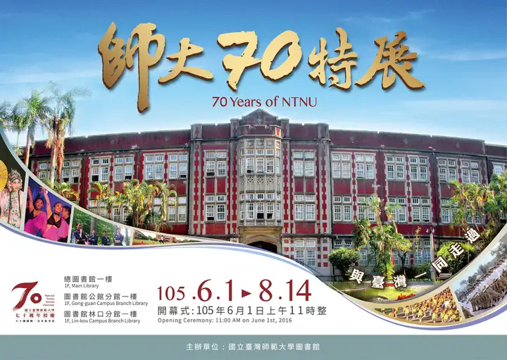
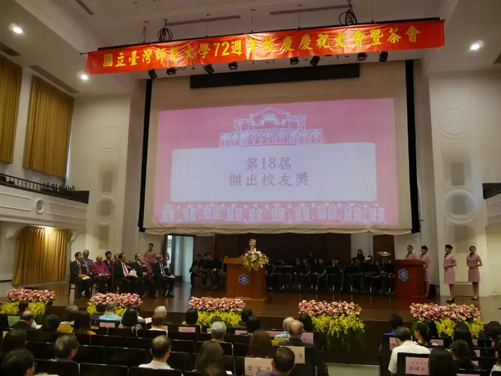
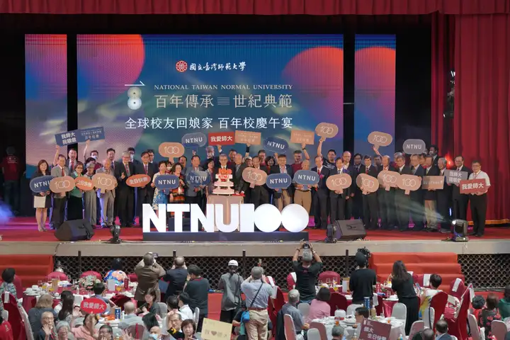
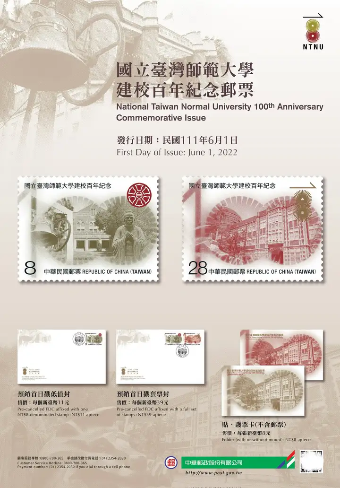
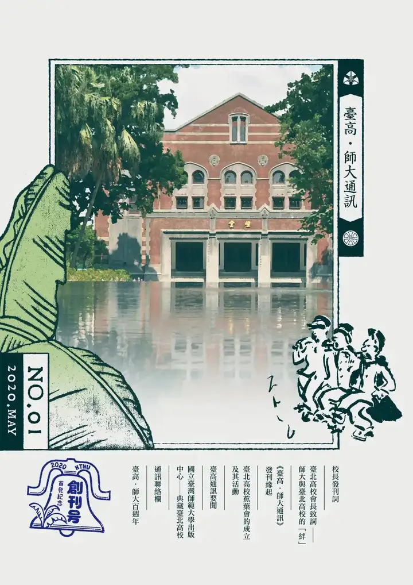
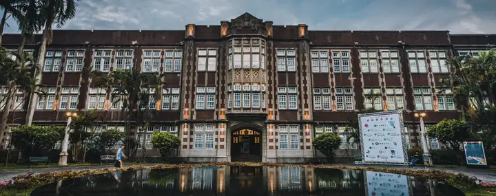
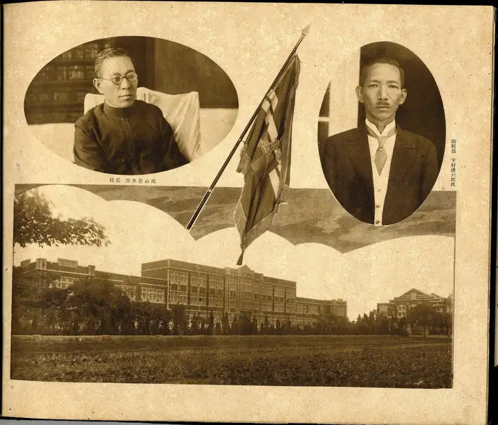
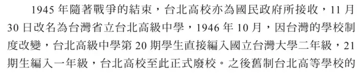
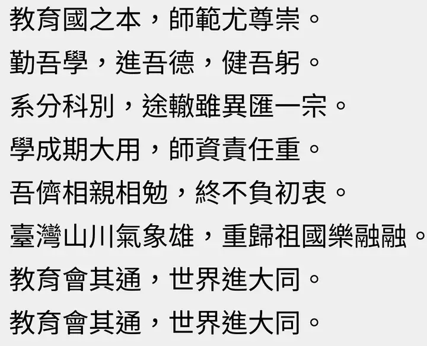
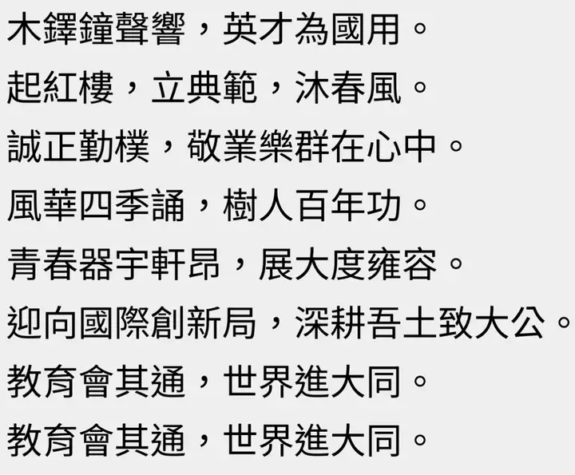

# 關於台灣師範大學校史的那些事

> 我在師大就讀期間，對校史一直有著濃厚的興趣。這篇文章整理了一些關於臺師大校史的冷知識和有趣的故事，算是為自己的大學生活留下一些記錄。

## 校史的起點：1922 年還是 1946 年？

如果你問一個師大學生「學校是哪一年創立的」，大部分人的答案可能停留在「1946 年」。但事實上，2018 年 11 月 27 日，臺師大校務會議通過了一項重要決議——將校史追溯至 1922 年日治時期的「臺灣總督府臺北高等學校」。

所以現在官方的說法是：師大的前身是 1922 年創立的臺灣總督府臺北高等學校。這在日本時代是全國 38 所菁英養成高校之一，也是臺灣唯一的一所高校，具備帝國大學預科性質，畢業生可申請免試直升臺北帝國大學（現在的國立臺灣大學）。

也就是說，師大的歷史其實比國民政府來臺還要早了二十多年。

## 臺北高等學校：師大的「貴族」前身

臺北高等學校成立於 1922 年（大正十一年），最初是七年一貫制（尋常科四年 + 高等科三年）的學校。當時主要招收在臺日人子弟，但也錄取少部分臺灣本地學生。

1926 年，學校從借用的臺北一中（今建國中學）校舍遷至古亭町現址，也就是今天的師大和平校區。校本部那些歌德風格的古蹟建築——行政大樓、普字樓、禮堂、文薈廳——都是那個時代留下來的。

其中最有故事的是禮堂（講堂），建於 1929 年，採用歌德建築風格，屋頂女牆作城垛造型，門窗採用尖拱設計。講堂後牆至今仍保存著日治時期教育敕語的保險櫃。這四棟建築現在都是臺北市的市定古蹟。

## 從臺北高中到師範學院：共用校地的三年

二戰結束後，國民政府接收臺北高校，於 1945 年 11 月將其改為「臺灣省立臺北高級中學」。但因為戰後日籍教師陸續遣返，中等教育師資出現嚴重缺口，於是在 1946 年 6 月 5 日成立了「臺灣省立師範學院」。

有意思的是，師範學院成立後，並沒有馬上拿到自己的校地。在 1946 年到 1949 年間，師範學院與臺北高中共同使用同一校區，行政大樓、圖書館、實驗室等設施都是兩校輪流使用。直到 1949 年臺北高中最後一屆學生畢業奉令停止招生，師範學院才正式承繼了全部校地與設備。

這段「同居」歲月其實並不輕鬆。隨著師範學院的學生越來越多，兩校共用空間變得十分擁擠，管理上也相當不易。

## 四六事件：師大校史上沉重的一頁

1949 年 3 月，師範學院與臺灣大學的學生因共乘腳踏車遭警員取締，擦槍走火引發衝突。兩校學生集結數百人包圍警局，要求釋放同學，卻被政府認為是發動全省學潮的前兆。

1949 年 4 月 6 日清晨，軍警大規模進入校園逮捕學生。據校友洪貴己回憶：

> 清晨六點謝東閔院長、訓導主任陳蔡煉昌勸導學生交出鬧事的學生……結果大家都不願交出，於是警察、衛戍部隊包圍了師大宿舍，向空中開槍。學生以碗椅作抵抗，後來有一位學生被打的頭破血流，於是大家都躲到床底下，後來一個一個被捕，住校四百多學生通通被捕。

這場「四六事件」導致師範學院全面停課。後來由立法委員劉真擔任主任委員兼任代理院長，成立整頓學風委員會，與警備總司令部交涉後，百餘名學生才被釋放。

## 美援時代：師大的現代化起點

1950 年代韓戰爆發後，臺灣獲得大量美國援助。從 1953 年起，師範學院開始接受美援，用於增建校舍及擴充學系。

工教與家政兩系的建築就是靠美援完成的，學校也利用美援擴充了教學實習機具、各類器材儀器與參考圖書。更關鍵的是，美援技術援助項目資助了師範學院教師出國進修，各系也把握機會與外國大學簽約合作，開始了國際學術交流。

可以說，美援時期是師大從一所單純的師資培育機構走向國際化、現代化的重要轉折點。

## 從省立到國立：兩次改制

1955 年 6 月 5 日，政府提出「師資第一，師範為先」方針，師範學院正式改制為「臺灣省立師範大學」，設有文學院、理學院、教育學院及教育研究所。大門上的「師範大學」四個大字，是由當時的教育部長張其昀題寫的。

1967 年 7 月 1 日，隨著臺北市升格為直轄市，省立師大又進一步改制為「國立臺灣師範大學」，增設藝術學院，編制擴大，經費增加，設備也日臻完善。

## 三個校區的形成

師大現在的校地格局是逐步形成的：

- **和平校區（校本部）**：日治時期臺北高等學校的原址，是師大最早的校區。後來又擴展了圖書館校區（校本部Ⅱ）。
- **公館校區**：1975 年，因學生人數越來越多，校地不敷使用，學校向臺灣省政府爭取後完成土地整理，將理學院遷至公館。
- **林口校區**：2005 年，師大在原有的僑生教育基礎上，整合了國立僑生大學先修班，成立林口校區。

## 校訓「誠正勤樸」的由來

師大的校訓「誠正勤樸」是由第三任校長劉真所定。他對這四個字的解釋是：

- **誠**：不虛偽、不欺妄，凡事能做到始終如一、擇善固執
- **正**：不偏私、不枉曲，凡事能做到光明正大、貞固剛毅
- **勤**：不怠惰、不因循，凡事能做到自強不息、鍥而不捨
- **樸**：不奢靡、不浮華，凡事能做到質樸無華、闇然尚絅

## 從師資搖籃到綜合型大學

回顧師大的發展歷程，從 1922 年的臺北高等學校，到 1946 年的師範學院，再到 1955 年的省立師大、1967 年的國立師大，師大早已不再只是一所「老師的學校」。

今天的師大涵蓋教育、文、理、藝術、科技、國際與華語文等多元領域，並且與鄰近的臺灣大學、臺灣科技大學合組「國立臺灣大學系統」，共享學術資源，互開跨校輔系及雙主修。2022 年，師大迎來了百年校慶，出版了《百年學思路》校慶專刊。

從日治時代的菁英養成高校，到戰後的師資培育搖籃，再到今天的國際綜合型大學，師大的百年歷程某種程度上也是臺灣現代教育發展史的縮影。

## 校史爭議

文章前面提到，2018 年 11 月校務會議通過將校史追溯至 1922 年的臺北高等學校。但這個決定並非沒有爭議——事實上，師大在相當長一段時間裡，一直是以 1946 年「臺灣省立師範學院」成立作為創校年份來計算的。

2016 年，學校舉辦的是「師大 70 週年特展」，對應的正是 1946 加 70 等於 2016 這條時間線：

到 2018 年校慶，官方口徑仍是 72 週年：

然而就在同一年的 11 月，校務會議突然決議將校史上溯至日治時期的臺北高等學校。於是到了 2022 年，師大便「順理成章」地辦起了百年校慶：

中華郵政還專門發行了兩款紀念郵票：

師大採用的是在台灣相當常見的「校址追溯法」——既然校園裡仍保留著幾棟臺北高等學校時期的老建築，那就可以把這段歷史算進來。2020 年創刊的《臺高・師大通訊》封面右上角，也正是臺北高等學校的校徽：

今天的和平校區裡，行政大樓等歌德式紅磚建築仍是校園地標：

但如果仔細梳理史料，就會發現這個「新祖宗」認起來其實有點蹊蹺。臺北高等學校在戰後被國民政府接收，1945 年 11 月改名為「臺灣省立臺北高級中學」，並持續辦學到 1949 年才停招。也就是說，臺北高校並沒有在 1946 年就「變成」師範學院——師範學院是和臺北高中共用校區、平行運作的（這一點在前文「從臺北高中到師範學院」一節已有說明）。

更關鍵的是，臺北高等學校最後幾屆學生，是被編入國立臺灣大學就讀的，而非師範學院：

另外，臺北高等學校創立之初，其實是借臺北第一中學（今建國中學）的校舍辦學的。若完全按「校址追溯」的邏輯，校史似乎還能再往上推算好幾年……

----

既然校史改了，校歌也跟著調整。師大在 2021 年更換了新版校歌。舊版校歌裡有一句「臺灣山川氣象雄，重歸祖國樂融融」，在新版中被替換掉了——「紅樓」指的正是前文提到的臺北高等學校老樓：

兩相比較，不難看出究竟是哪一句「連累」了舊校歌被換下。不過這些爭議並不影響我個人對校園裡那些百年建築的喜愛——無論校史從哪一年算起，走進和平校區的那幾棟紅磚古蹟，確實能讓人感受到這所學校深厚的歷史沉澱。
