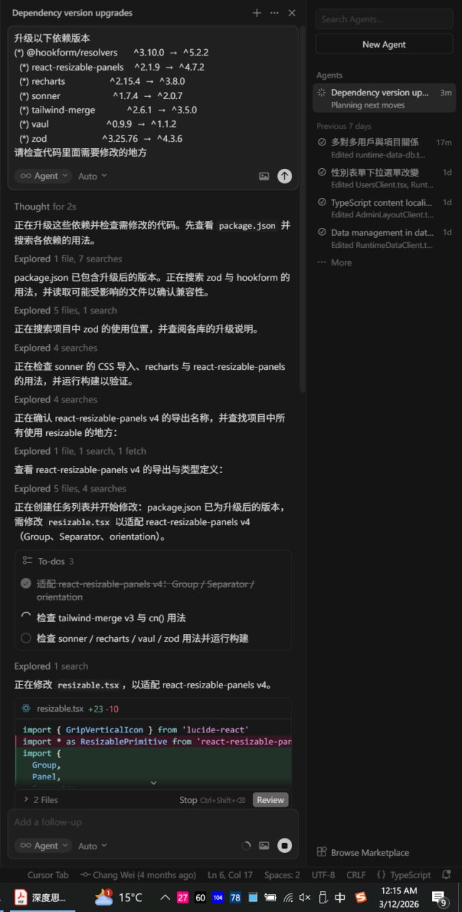

> 本文整理自 [X 推文](https://x.com/changwei1006/status/2031767459532050932)。原帖讨论的是：AI 对软件工程里长期存在的「屎山」问题，究竟能帮上多少忙——尤其是依赖库 major version 升级时那一堆 breaking changes。

# AI 如何帮助啃下依赖大版本升级这块硬骨头

软件工程里有个老问题：项目越活越久，技术债就越厚。大家口头上的「屎山」，很多时候并不是某一个人写坏了，而是**时间、人员流动、业务压力**叠在一起，最后变成一坨谁都懒得碰的代码。

其中有一块特别磨人：**依赖库大版本升级**。

## 没有 AI 的时代：changelog 与 Ctrl+Shift+F

在没有 AI 辅助的年代，升级一个大版本通常意味着：

1. 打开官方 Release Notes 或 CHANGELOG，往往好几页 A4 纸长度的全英文说明；
2. 逐条对照自己项目里有没有用到被删掉的 API、改名的导出、行为变更的配置项；
3. 手写迁移脚本，或者在 IDE 里全局搜索 `Ctrl+Shift+F`，把旧写法批量替换成新写法；
4. 跑测试、修编译错误、再搜一轮——循环直到 CI 变绿。

这套流程**能做完**，但极其耗神。breaking changes 往往散落在几十个文件里，有的藏在类型定义、有的藏在间接依赖的 re-export 里。人脑要记住「这个库 v3 把 `foo` 改成了 `bar`，v4 又把 `bar` 拆成了 `baz` 和 `qux`」——光是记版本差异就够累了，更别说还要同时兼顾业务需求。

## AI 时代：把「读文档 + 搜代码 + 改调用」串成一条链

AI 的发展，对于解决这类问题有非常大的帮助。

不是说 AI 能 magically 把屎山变黄金，而是它特别擅长做几件以前最花时间、又最机械的事：

- **快速扫一遍代码库**，找出某个依赖在哪些文件、哪些函数里被用到；
- **对照 changelog 语义**，判断「这条 breaking change 会不会打到我们」；
- **按文件逐个改**，并给出 diff 让人 review；
- **改完跑 build / test**，把报错再喂回去迭代。

像是依赖库版本升级 major version 时出现各种 breaking changes，用现在的 AI Agent（Cursor Composer、Claude Code、OpenCode 等）往往能快速推进——至少比一个人从头啃 changelog 快一个数量级。

## 一次真实的大版本升级

下面这张图来自我实际用 Cursor 升级一批 npm 依赖时的 Composer 会话。当时要一口气升多个 major version：

| 包名 | 旧版本 | 新版本 |
|------|--------|--------|
| `@hookform/resolvers` | ^3.10.0 | ^5.2.2 |
| `react-resizable-panels` | ^2.1.9 | ^4.7.2 |
| `recharts` | ^2.15.4 | ^3.8.0 |
| `sonner` | ^1.7.4 | ^2.0.7 |
| `tailwind-merge` | ^2.6.1 | ^3.5.0 |
| `vaul` | ^0.9.9 | ^1.1.2 |
| `zod` | ^3.25.76 | ^4.3.6 |

Agent 自动做了这些事：读 `package.json`、搜索各依赖的引用、对照 v4 的 API 变更（例如 `react-resizable-panels` 的 `Group` / `Separator` / `orientation`）、改 `resizable.tsx` 等封装组件，再列 todo 逐项检查 `tailwind-merge`、`sonner`、`recharts` 等是否还有遗漏。

以前这种「七个 major bump 打包处理」的任务，我可能会拖好几个星期——不是不能升，是**心理成本高**。现在有 AI 把探索、搜索、改代码串起来，一个下午就能推进到可 review 的状态。

## 仍然需要人：AI 是加速器，不是甩手掌柜

值得强调的是：**AI 辅助不等于无脑 Accept**。

- breaking change 的语义是否理解正确，要靠人 spot check；
- 批量替换可能漏掉动态 import、测试里的 mock、文档里的示例代码；
- 有些库的迁移需要业务判断（例如 `zod` v4 的 schema 写法变了，是否顺带重构校验逻辑？）。

所以更准确的说法是：AI 把「屎山」里**最脏最累的那层土**先铲掉，工程师负责**结构对不对、边界安不安全**。这和 [2026 年使用 AI 辅助 Coding 的一些小技巧](/programming/tips-for-ai-assisted-coding-in-2026) 里强调的 workflow 是一致的——Plan 可以交给便宜模型，Build 用强模型，但 **diff 一定要人看**。

## 小结

| 阶段 | 没有 AI | 有 AI 辅助 |
|------|---------|------------|
| 读 changelog | 人工逐条翻译、做笔记 | Agent 摘要 + 对照代码库 |
| 找影响面 | 全局搜索 + grep + 经验 | 语义搜索 + 引用分析 |
| 改代码 | 手写 / 批量替换 | 分文件生成 patch，人 review |
| 验证 | 手动跑 test | Agent 跑 build/test，失败则迭代 |

依赖大版本升级只是屎山问题的一个切面，但它很典型：**文档长、影响散、重复劳动多**——恰恰是 LLM + Agent 工具链 today 最擅长的场景。

如果你也在拖延某个 `^2` → `^4` 的升级，不妨把 changelog 链接和 `package.json` 丢给 Agent，让它先出一份「影响文件清单 + 迁移 todo」。往往你会发现，那座山没有想象中那么高。
