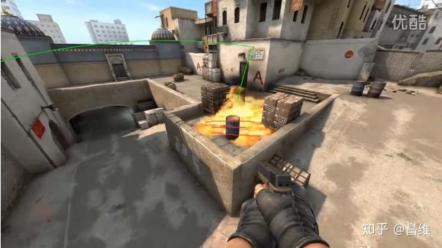
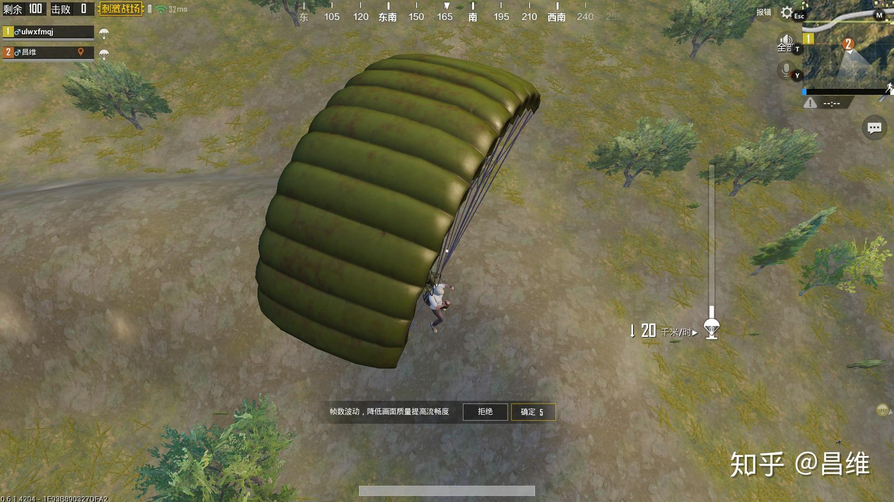
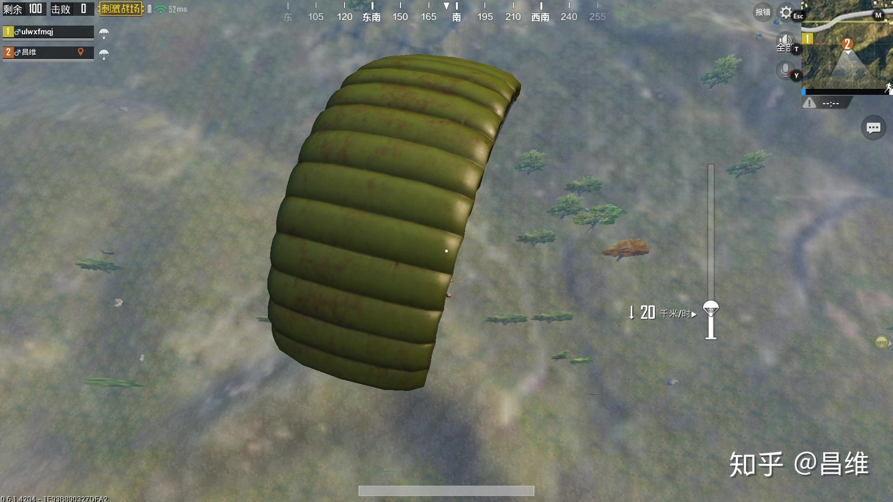
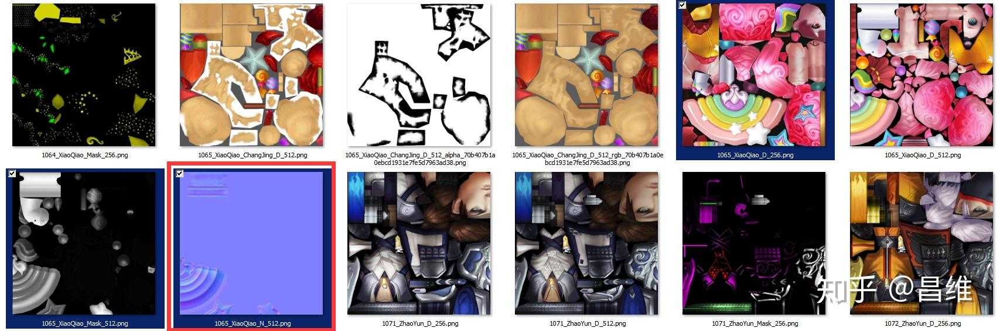
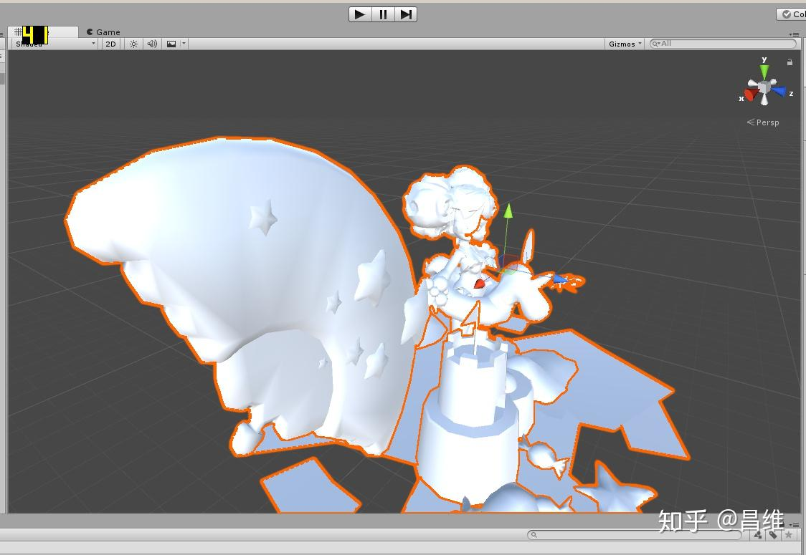
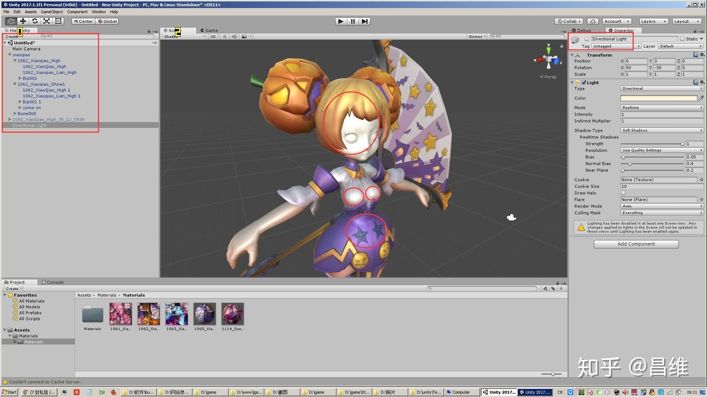
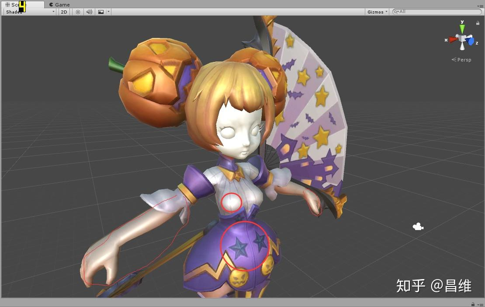
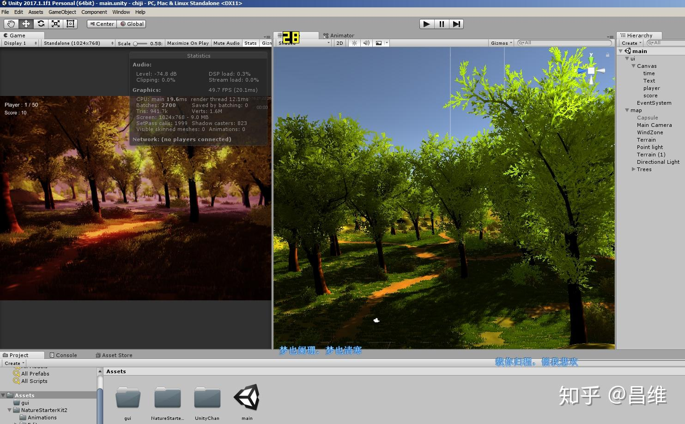
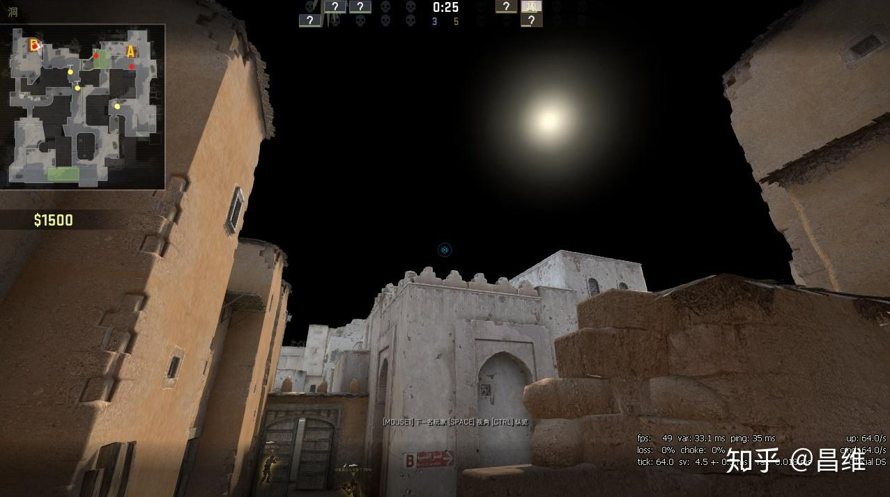

# 开发游戏时，有哪些欺骗人眼睛的技巧（trick）？

## 1.2D精灵粒子
很多游戏的树木其实只是一个静态的2D图片，然后你在游戏里面走动的时候，那些静态的2D图片在不断的调整Z轴，使树的图片正面永远朝向你（还是不明白吗？想想向日葵的性质？）。这类素材在手游上尤其见得多。端游CSGO里面的燃烧瓶火焰效果其实也是这样做的，CSGO只渲染了一个2D的火焰燃烧效果，但是通过不断调整Z轴使得这个2D效果一直正对着摄像机（玩家），具体可以看下图我用红线划出来的地方，这就是2D图片密度不够，导致中间有间隙，从而露馅了。

手游，例如绝地求生刺激战场的烟雾弹和远景的树木房子其实都是这样的。

请仔细观察上图 左下角的树木和右上角树木的区别

## 2.无限滚动条
很多游戏里面都有无限滚动的滚动条，或者一些横版过关跑酷类游戏的底板都会无限滚动，其实他们是做了一个具有重复特征的图片，然后按一定的时间频率来不停的移动，移动距离就是这个重复特征的高或者宽，如下图所示，这是我自己做的一个《男人就下一百层》的小游戏中，侧边墙面的滚动。

<video controls src="infinite-scroll-demo.mp4" poster="infinite-scroll-poster.jpg"></video>

## 3.法线贴图技术
拿王者荣耀小乔这款价值上百的缤纷独角兽皮肤来看。这款皮肤的扇子部分有着凹凸不平的纹理，如果将这个凹凸不平的效果直接做在模型上，那么就会导致模型的多边形面数增大，影响游戏性能。而有了法线贴图技术，我们只要把模型做成平整光滑的样子，然后再通过法线贴图的RGB通道来读取出原始贴图对应像素上XYZ坐标轴上的法线偏移角度（还记得初中物理学光的反射吗），根据这个法线角度计算出此处的反光量和反射方向等等，从而使得此处的平面光滑模型看起来具有层次感和凹凸感。由于在Z轴上法线通常是不会偏移的，因此Z轴对应的B通道比较多，所以法线贴图看起来都是蓝色的。

我们可以看到原始的扇子上是没有明显同心圆层次的

## 5.静态反光（灯光烘培）
指的是将反光效果直接事先通过灯光烘培系统烘培到贴图上，然后无论场景光源怎么变化，实际模型上的反光效果都不会有任何变化（因为反光效果已经固化在了贴图上），这也是为什么王者荣耀等手游画质看起来普遍很假的一个原因，毕竟手机的GPU性能有限。

我们可以看到整个场景在没有任何光源的情况下，小乔模型的胸部和腹部仍然有反光效果，这是因为贴图本身固化了反光效果，和shader着色器共同作用产生的材质效果看起来就像真的有反光一样。
（细心的同学注意到了这个模型的面部怎么没有贴图，而且没有眼珠子？？？嗯你可能猜到了，眼珠子也是贴图的一部分，永远是一个固定的黑色圆点，包括嘴巴也是，所以你看LOL，王者荣耀之类的游戏人物永远是一副面瘫的样子，囧~）

## 6.伪抗锯齿
众所周知，抗锯齿是一项非常消耗显卡和显存的操作，但是像茂密的树丛，可能有几千甚至上万片树叶，要对他全部做抗锯齿，需要多重采样以及各种算法计算，可能显卡吃不消，因此游戏开发者可以采取反其道而行的办法，比如说进行模糊和虚化来消除锯齿。

## 7.天空盒
CSGO观战模式下，在某个点位看天空会出现奇怪的现象，这是由于天空盒在某些视角下无法被正确渲染，因而天空被渲染成黑色，但是太阳作为点光源仍然有被正确渲染，导致出现了如此怪异的现象。

> 本文首发于知乎：[开发游戏时，有哪些欺骗人眼睛的技巧（trick）？](https://www.zhihu.com/question/41720683/answer/393318965)
