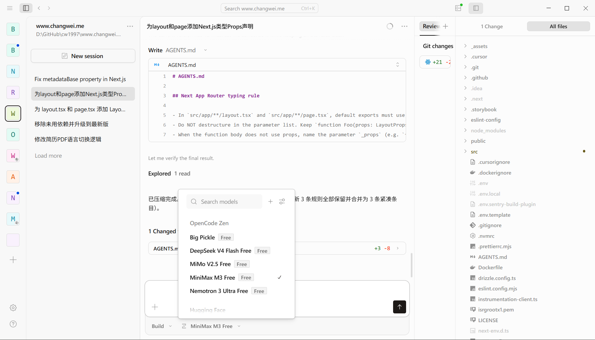

> 2026 年的 AI Coding早已成为日常开发流程的一部分。本文记录我在实际使用中的选型思路、省钱技巧，以及 OpenCode、提示词和 AGENTS.md 的一些实操经验——前半部分偏概念对比，后半部分是可以直接照着做的清单。
>
> 文内价格与配额信息参考 2026 年 6 月各厂商公开定价，具体价格请以官方页面为准。

# 2026年使用AI辅助Coding的一些小技巧

## Vibe Coding 与 AI 辅助 Coding 的区别

Andrej Karpathy 在 2025 年提出的 **Vibe Coding**，描述的是一种「跟着感觉走」的编程方式：你大致描述意图，AI 生成代码，你不太细看 diff，遇到报错就把错误贴回去让它修，循环直到能跑。这种方式做原型、玩具项目、学习探索时非常高效。

依照vibe coding的定义，其中的重要概念是，用户完全接受AI产生的代码，不需要对其有完全的计算机科学理解。
反之，AI研究者Simon Willison提到：“若你程序里的每一行内联内容都是大型语言模型写的，但你检查和测试过并完全理解，在我看来这就不算是vibe coding，这只是把大型语言模型当成打字助理。”

因此，通过输入Prompt然后请AI帮忙生成代码，然后程序员需要review生成的代码，进行手动测试并且approve的编程并不算是Vibe Coding，因此我的标题特地说明是**AI 辅助 Coding**而非**Vibe Coding**。

准确来说，**AI 辅助 Coding** 是一套更完整的工作流：把 AI 当作结对程序员，需要请AI这位程序员制定 Plan、根据产生的plan进行小步改动、然后等待生成的代码，最后AI会自动跑 lint/test、然后人工介入工作流，开始review diff，再决定是否 Accept。

其实**Vibe Coding 是一种风格，AI 辅助 Coding 是一种工作流**——两者并不互斥。写 Demo，或者产品的MVP（Minimum Viable Product，最小可行产品）时可以 Vibe，但是根据长期编程的经验，涉及到：
- 身份认证 / 权限验证
- 支付 / 积分
- 并发、事务、数据库迁移

等功能的开发，还是需要较强的人工介入，或者使用Tab Complete和AI Coding。

判断依据通常是：如果这个功能模块对于数据库的操作需要非常严格的transaction机制来确保数据一致性，这部分业务很关键，那就该退出 Vibe，进入 AI coding或者 手动编程模式了。

## 常用 AI 编辑器与 LLM 选择以及价格比较

工欲善其事必先利其器，根据不同的使用习惯可以选择不同的工具来最大化提升效率。我自己目前主要在用 Cursor（实习公司提供账号）和 OpenCode（免费模型）。

### 工具推荐

| 类型 | 代表产品 | 适合场景 |
|------|----------|--------|
| AI 原生 IDE | Cursor、Windsurf / Devin Desktop | 日常多文件编辑、Composer / Agent 工作流 |
| IDE 插件 | VS Code + GitHub Copilot、JetBrains AI | 已有 VS Code / JetBrains 工作流，不想换编辑器 |
| 终端 Agent | OpenCode、Claude Code、Codex CLI | 喜欢 TUI、脚本化、BYOK、远程 SSH |
| 规格驱动 | Kiro、Amazon Q Developer | 企业规范、spec-first 团队 |
| 开源 / BYOK | OpenCode、Cline、Continue | 自带 API Key，避免厂商锁定 |

### LLM 选型建议

2026 年的模型百花齐放，但是很多聪明的模型价格也很昂贵，需要精打细算,根据用途来切换使用不同模型：

| 任务类型 | 推荐模型方向 | 说明 |
|----------|--------------|------|
| 强推理 / 大重构 | Claude Opus / Sonnet、GPT-5.x Codex 类 | 架构设计、跨模块重构 |
| 日常迭代 / 性价比 | Claude Haiku、Cursor Composer、MiniMax M3、WindSurf SWE-1.5/1.6(使用专用ASIC推理，速度极快)、Gemini Flash、DeepSeek | 修 bug、写测试、小功能 |
| 本地 / 隐私 | Ollama + 开源LLM，Qwen Coder | 离线环境、敏感代码不出网 |
| 只读分析 | 便宜快速模型，比如GPT5-mini、Cursor的Composer、DeepSeek V4 Flash | Plan、Explore、Code Review |

**策略**：Plan 用便宜模型，Build 用强模型。OpenCode 支持按 Agent 分别绑定不同模型，配置示例见下文「善用 Plan 模式」一节。

### 价格比较（2026 年 6 月参考）

AI模型价格差别很大，像是 OpenCode 等就很便宜，但是 Cursor，Claude Code等就价格偏贵。

但是其实很多时候我们所做的工作并不需要用昂贵的模型也可以实现得很好，所以可以根据任务难度来按需选择。

> **免责声明**：2026 年 6 月前后，Cursor、GitHub Copilot 等厂商普遍从「固定月费 + 软限制」转向 **用量 / 积分（Credits）计费**。下表为撰写时参考，具体配额与超额策略请查阅各产品官方定价页。

| 产品 | 免费档 | 个人付费 | 团队 | 计费特点 |
|------|--------|----------|------|----------|
| GitHub Copilot | 有限免费 | ~$10/月 Pro | $19–39/seat | 2026/6 起 AI Credits 计量 |
| Cursor | Hobby 有限 | $20/月 Pro | $40–120/seat | Composer + 第三方 API 双池 |
| Windsurf | 较慷慨免费 | ~$20/月 Pro | ~$40/seat | Agent Cascade 为主 |
| Claude Code | BYOK 免费 | API / Pro 订阅 | 企业定制 | 按 token，重度用户 $50–150+/月 |
| OpenCode | **MIT 开源免费** | Go $10/月 或 Zen 按量 | — | 核心免费，可选托管模型(BYOK，仅需支付LLM的API费用) |
| OpenAI Codex | 免费档 | ~$20/月 Pro | 企业 | ChatGPT 生态绑定 |
| Cline / Continue | BYOK | 仅 API 成本 | — | 插件 + 自管 Key |

### 组合省钱方案

- **日常补全**：Copilot Free/Pro 或 Windsurf Free，Inline completion 消耗低
- **复杂 Agent 任务**：OpenCode + BYOK，或 Claude Code 按需付费
- **团队**：GitHub 生态选 Copilot Business（$19/seat）；AI 质量优先选 Cursor Teams

## 薅羊毛渠道

截止 2026年6月OpenCode仍然提供以下免费模型：
- Big Pickle（这是OpenCode的一个隐身模型，OpenCode官方没有公开其内部实现，但是被很多网友怀疑是智谱的GLM-4.6）
- DeepSeek V4 Flash（DeepSeek）
- Mimo V2.5（Xiaomi）
- MinMax M3（MiniMax）
- Nemotron 3 Ultra（NVIDIA）



OpenCode它是一个 MIT 许可的开源 AI 编程 Agent，由 terminal.shop 团队维护，GitHub 上已有超过 17 万 star（截至 2026 年 6 月）。与其他工具最大的不同是：**Provider 无关**——你可以自带 Anthropic、OpenAI、Google 等 API Key，也可以用 OpenCode 自己的 Go / Zen 托管服务。
OpenCode有TUI和GUI，虽然GUI还有很多BUG以及性能偏差的问题，不过目前来看仍然是社区关注度比较高的开源AI Coding工具，非常推荐，其他还有老牌的Continue.dev等也可以关注一下。

剩下还有其他一些免费薅羊毛或者非常便宜的渠道推荐：
1. GitHub Copilot，学生认证后每个月有 300 次请求。但是最近 rate limit限制非常厉害，如果在一个请求里面通过提示词发起长程任务有概率会触发 rate limit导致中断，因此几乎只能用来做一些小改动。
2. JetBrains 教育许可，好像目前每个月额度很少，几乎不太可用，只适用于智能补全和简单的 AI Review代码和自动生成 Git Commit Message
3. Windsurf 免费档，之前有Kimi 2.5，其自家的SWE-1.5、SWE-1.6 Slow（速度非常慢），之前还有一个Fast档位，似乎用了专用ASIC硬件推理，所以速度非常快，几乎是一秒钟一整屏幕的代码就出来了，非常震撼！
4. **Cursor 教育版免费一年**：需要使用 edu 邮箱注册 cursor 账号
5. **OpenCode Go**：首月 $5，之后 $10/月固定价，可用 Kimi、DeepSeek、Qwen 等开权重模型，免管多个 Provider Key
6. 本地弱模型结合线上强模型：本地用 Ollama + OpenCode 跑小模型做 explore/plan，线上强模型只用于最终 implement

## 提示词技巧
好的提示词不仅仅可以让AI准确得知用户的意图，并且还能有效节约AI的Token花费，因为准确并且信息丰富的提示词能够让AI减少更多检索内容的时间和thinking的开销。

不过好的提示词也不是「写得更长」，而是**给对上下文、设好边界、明确验收标准**，否则过长的提示词也有可能会导致AI注意力不集中，可能适得其反。

### 基本原则
- **给上下文，不给废话**：@ 相关文件、说明导致错误发生前进行过的操作，可以参考的schema和类型声明、贴完整 error log
- **提供准确定位**：比如Next.js是基于文件路径的URL路由，因此通过提供网址也可以让AI准确得知需要修改的位置在哪
- **增加README.md**：在readme维护项目基本信息，AI可以直接阅读README.md而非深度搜索整个代码库，有效减少搜索和input token数量
- **样本提示**：其实也叫做n-shot，比如one-shot单样本提示，two-shot双样本提示，3-shot多样本提示（适合存在一些规律的情况），比如可以在提示词中说“请参考已经实现的XX接口来设计本接口”

### 三个可复制模板

**Bug Fix：**

```text
复现步骤：
1. 打开 /login 页面
2. 输入正确账号密码
3. 点击登录

期望：跳转到 /dashboard
实际：停留在 /login，控制台报 401

相关文件：@src/auth/login.ts @src/api/client.ts

请先分析根因，给出修复方案，确认后再改代码。改完后跑 pnpm test。
```

**Feature：**

```text
用户故事：作为管理员，我需要在用户列表页批量禁用账号。

非目标：
- 不做软删除
- 不改现有单用户禁用逻辑

参考现有模式：@src/features/users/disable-single.ts

技术栈：Next.js 16 + React 19 + Drizzle ORM
验收：pnpm test 通过，新增 e2e 测试覆盖批量操作
```

**Code Review：**

```text
请只 review 以下 diff，不要修改任何文件。
关注：security、性能、边界条件、测试覆盖。

@src/middleware/auth.ts 的改动

输出格式：
1. 必须修复（blocking）
2. 建议改进（non-blocking）
3. 做得好的地方
```

### OpenCode 特有技巧

- **`!` 前缀**：在 TUI 里直接跑 shell，如 `!pnpm test`
- **Tab 切 Plan**：先让 Plan Agent 分析，确认方案后 Tab 回 Build 执行
- **`@general`**：复杂多步任务，可并行子 Agent
- **`/compact`**：压缩长 session 上下文，省 token
- **`/export`**：导出对话为 Markdown，沉淀团队知识

## 善用 Plan模式，先计划，后行动
很多人第一次用AI Coding通常都是直接使用Agent模式，输入提示词后直接让AI开始写代码。

这种用法适合对于产品细节要求没有很严格的场景，例如只是需要AI帮忙产生一个大概的UI或者DEMO项目。

但凡需要请AI非常精确的产生我们所需要的效果，都推荐使用Plan先产生计划，然后再implement实现计划。

### 为什么要先 Plan

否则 Agent 直接开干会自信地猜错方向，然后浪费了大量时间和token之后又要重新返工。

需求里的「批量禁用」和「软删除」若没写清，Build 阶段才会暴露，那时改起来更痛苦

### 什么时候 Plan，什么时候可以跳过

**建议先 Plan 的情况**：跨模块新功能、需求尚不清晰；涉及 auth、支付、数据库迁移或大重构；架构有多种可行方案、需要先选型再动手。

**可以跳过 Plan 的情况**：单行 typo、改个变量名这类小改动，直接用 Agent 或 inline 补全即可。若是你做过很多次的套路改动（例如按现有 CRUD 再加一个接口），Plan 可选——@ 参考文件往往就够。明确只动一个文件、步骤少于 3 步的小 patch，通常也可以不 Plan。

### 模型分工：Plan 用便宜模型，Build 用强模型

上文 LLM 选型里提过这一策略；OpenCode 可以在 `opencode.json` 里按 Agent 分别绑模型。例如：

```json
{
  "agent": {
    "plan": { "model": "opencode/deepseek-v4-flash" },
    "build": { "model": "anthropic/claude-sonnet-4-20250514" }
  }
}
```

模型 ID 按你的 BYOK Provider 或 OpenCode Go 套餐调整即可。

Plan 用 DeepSeek V4 Flash、MiniMax M3 这类 fast 模型，Build 用 Sonnet / Opus 类强推理模型。

### 本地 + 云端组合
本地用 Ollama 跑 plan，implement 再用线上强模型，可以进一步压低日常 token 成本。

### 控制 Plan session 长度
在同一个chat里面对话过长时，旧上下文和幻觉容易累积。建议每次执行不同的任务时都新开个chat，就和ChatGPT一样。

OpenCode 可用 `/compact` 压缩上下文，或直接开新 session。

大任务按 todo 拆成多轮 Plan → Build，比一条 session 硬扛到底更稳。

## Rules 与 AGENTS.md
在古法编程（手动开发，手写代码）的时代，每个团队都会有自己的一套代码风格（coding-style）。
因为这种代码风格都通常都是给人看的，所以会放在其他更方便人类编写和查看的地方维护，比如Confluence，Google Docs和飞书文档等。

但是在AI时代，每个人输入的提示词和使用的AI工具以及模型都不一样，即使是同一个人用同一个AI工具，如果调用的模型不一样，可能其生成代码风格也都不一样。

因此为了确保每个人在每次发起AI Coding时都能够产生风格一致的代码，所以需要给AI制定一套Rules。而目前行业标准是把 rules写在项目的根目录下的 `AGENTS.md` 文件里面。

`AGENTS.md` 是 OpenCode（以及 Cursor 等工具）用来给 AI 提供**持久项目上下文**的文件，类似 Cursor 的 `.cursor/rules/`，但通常放在项目根目录、提交到 Git、全团队共享。（现在Cursor以VS Coding等绝大部分工具都支持直接在根目录下放置一个名为AGENTS.md来维护rules，这已经成为了各种AI Coding工具的事实标准。

OpenCode 的 `/init` 命令会自动扫描仓库并生成初稿，但生成后需要人工精简。

### 应该写什么
- 目录结构与 monorepo 约定：比如apps放可以单独执行的项目，packages放用来被引用的包，比如UI库和工具类
- 命名规范：比如我个人喜好所有state都以_开头，确保和其他变量区分
- 类型声明：比如 ID 统一使用uuid格式的string类型，时间统一使用number类型表达的timestamp并且默认为UTC+0时区
- 代码风格：通常指的是代码里面各个模块应该如何摆放，例如我会习惯将所有只被调用过一次的组件都放在调用方的同一个文件内，而不要单独为每个小组件都生成一个独立的*.tsx文件
- 禁止事项：例如「不要将只有一条语句的逻辑抽取到一个单独的函数」、「不要修改 reactcomponent传入props」）
- 测试专用规则：例如我会要求每个组件都存在一个__test_xxx的prop，方便storybook或者其他UI测试框架强制覆盖一些数据到组件内，用于给组件bypass掉一些逻辑来强制输入mock data
- 项目特有坑：env 变量、mock 策略、部署流程

### 不应该写什么

- 整本框架文档（用 `opencode.json` 的 `instructions` 字段引用外部 md）
- secrets / API key
- 超过 ~200 行的冗长规则（拆到 `docs/` 或 `.opencode/agents/`）

### 我自己的项目中真实使用的 AGENTS.md 示例

```markdown
# Project

TS monorepo: pnpm workspace + Turborepo, Node ^25, ESM only. No npm/yarn.

**Root:** `pnpm install` · `pnpm dev` · `pnpm build` · `pnpm lint` · `pnpm test` · `pnpm check-types`

**Layout:** `apps/` (web Next 16, api Fastify 5) · `packages/` (common, datasource, eslint-config, rich-text-editor) · `worker/email` · `tools/`. Internal deps: `workspace:*`. **packages/** changed → `pnpm check-types && pnpm build`.

**Stack:** React 19, Tailwind 4, Shadcn, SWR, ahooks · Fastify 5, Drizzle, Postgres, argon2, WebSocket · TS 5, `@mubiao-org/datasource` · Jest (api/datasource), Vitest + Storybook (web), ESLint + Prettier, strict TS.

**Aliases:** `apps/web` → `@/*` → `apps/web/src/*` · `packages/*` & `api` → `@/*` → `src/*`.

## Code

TS/TSX, ESM. **Files/folders:** snake_case · **Components/types:** PascalCase · **Functions/vars:** snake_case. State: `const [_x, set_x] = useState(...)`.

## Frontend

**Components:** split Logic vs UI split — e.g. `LoginForm` (API) + `LoginFormRender` (props-only). Render-only: Storybook. Wrap Button with Link for navigation. Component names: PascalCase. Page-specific components: same directory as page (not separate components folder). **Always use `function ComponentName(props: Readonly<ComponentNameProps>) {}` declaration — never `const ComponentName: React.FC<IProps> = (props) => {}` arrow function style. Props types must be named `ComponentNameProps` (e.g., `LoginPageProps`, `LoginFormRenderProps`), declared as `type ComponentNameProps = { ... }` (never `interface`), and wrapped with `Readonly<>` on the function parameter. Never use `IProps` or `IXxxProps` Hungarian notation.** **Every component must have a corresponding `ComponentNameProps` type — even if props are empty (`export type FooProps = {}`). Parameter destructuring must NOT appear in the function signature; instead use `props: Readonly<ComponentNameProps>` and destructure on the first line of the body: `const {a, b} = props`.**

**Next app router props:** Every `apps/web/src/app/**/page.tsx` and `apps/web/src/app/**/layout.tsx` must declare Next's route-aware props type in the default export signature, using `props: Readonly<PageProps<`/visible/url/path`>>` for pages and `props: Readonly<LayoutProps<`/visible/url/path`>>` for layouts. Use the URL route path as the generic argument, omit filesystem-only route groups like `(general)` or `(passport)`, and keep dynamic segments in bracket form exactly as they appear in the URL. Do not shadow these Next types with local `PageProps` or `LayoutProps` aliases inside app-router entry files.

**Pages:** `page.tsx` → `*ServerPage` · container → `*Page` (SWR, params/searchParams) + `*PageRender` (props-only, Storybook). Props: `*PageProps`, `*PageRenderProps`.

**UI:** RWD, SEO, a11y, i18n, semantic HTML, web standards.
```

### 注意定时压缩 AGENTS.md
AGENTS.md 是会在每次请求AI时都会作为输入 token，也就是context的一部分，因此缩短 AGENTS.md的内容可以有效节约token，非常建议每次修改过AGENTS.md之后都尽可能压缩里面的内容。

有一个小技巧，就是直接请AI帮你压缩，可以使用的提示词：
```markdown
压缩AGENTS.md但不丢失语义和rules
```

### 层级与引用

| 位置 | 作用 | 是否提交 Git |
|------|------|--------------|
| 项目根 `AGENTS.md` | 团队共享的项目规则 | 是 |
| `~/.config/opencode/AGENTS.md` | 个人偏好（如「回复用中文」） | 否 |
| `opencode.json` → `instructions` | 引用 `CONTRIBUTING.md`、`.cursor/rules/*.md` | 是 |

OpenCode 也兼容 Claude Code 的 `CLAUDE.md` 作为 fallback，但建议统一用 `AGENTS.md`。

## 结语

AI 辅助 Coding 可以有效节约人力，把重复劳动（boilerplate、测试骨架、文档、常规 refactor）交给 Agent，人专注于意图、架构与验收。

目前我的开发过程中有80%都是使用AI辅助Coding，如果算上Tab Complete的话那就算是100%都在用AI开发了。

如果你还没开始接触过AI Coding但是又想要初步尝试的话，我建议的路径是：

1. 用 Cursor、Copilot 或 Windsurf 免费档体验 inline 补全
2. 装 OpenCode，BYOK 或 Go 套餐，先体验 AI Coding，尝试不同的提示词对于编码效果影响
3. 生成第一份 AGENTS.md,并且把 AGENTS.md 提交到 Git，在 PR 里一起维护

工具会变，模型会换代，但 **Plan → 小步执行 → 验证 → Review** 这条纪律不会过时。Vibe Coding 可以玩，生产代码还是请认真对待，至少需要人工review一遍AI代码，并且手工E2E测试一遍整个流程，确保没有问题后再上线。

涉及到后端操作数据库的部分，也要仔细确认AI是否有改动到schema，如果改动则需要确认对应的migration是否执行，transaction是否有正确覆盖到关键操作等。
