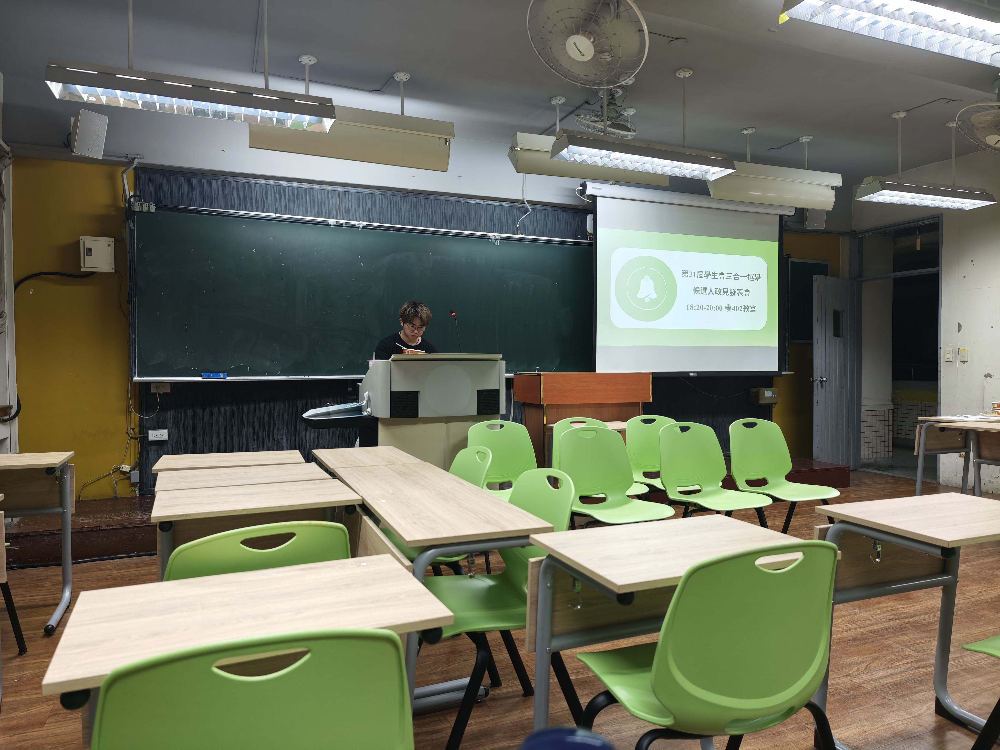
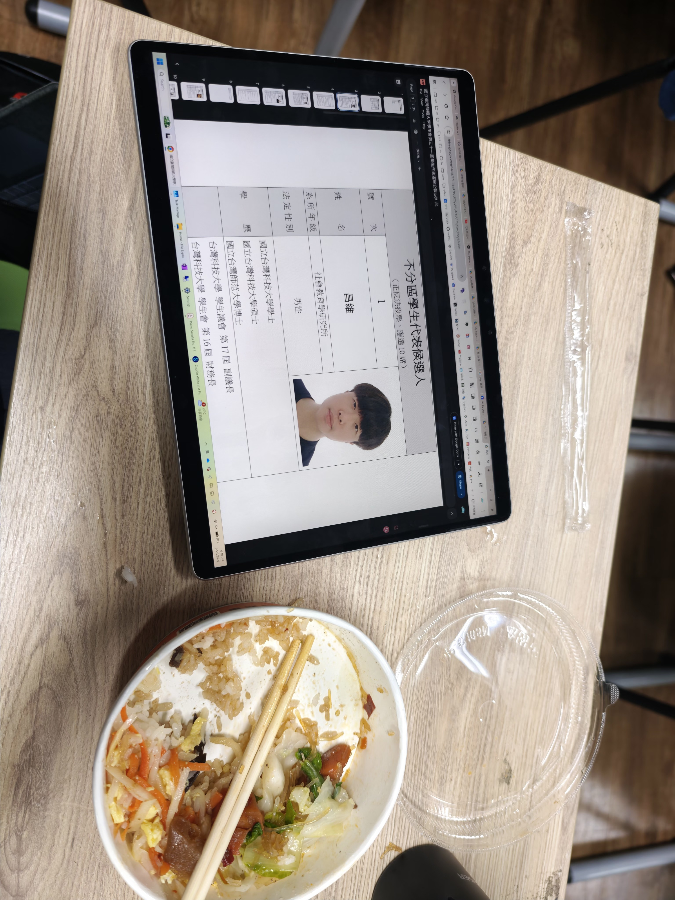

> 這個分類用來記錄大學生活裡比較值得留下來的片段——不一定是課業或研究，也可能是校園裡才會遇到的制度與文化。
> 這篇寫的是我第一次親自到場，參加國立臺灣師範大學學生會選舉委員會所辦的「候選人政見發表會」。

# 第一次參加臺師大學生代表政見發表會

三月下旬，我在校園裡看到有人張貼第 31 屆學生會選舉相關的海報。

以前就已參與過臺灣科技大學的學生自治活動。臺師大的學生會採理監事制度，因此各學院的學生代表與不分區學生代表，大致上相當於臺科大的學生議員加上校級會議學生代表。我之前已有擔任學生代表的經驗，這次便也參加了臺師大的選舉。

相對而言，臺師大的學生代表選舉更加規範，除了面向全校的實體政見發表會，同場也透過「臺師大學生會」Instagram 粉絲專頁直播，讓無法到場的同學也能參與。

臺師大的理監事制度允許各學院依一定人數比例選出對應的學院學生代表；不分區學生代表則對原住民、僑生、港澳生設有保障名額。不過表單中特別強調，外籍生不包含「陸生」，因此陸生並無保障名額。

但臺師大的選舉主要透過線上平台進行，該平台可使用網頁版，或須事先安裝學校的手機 App 才能投票；實際介面操作並不方便，流程也談不上直覺。我個人覺得，這可能是實際投票率不如預期的原因之一。

相較之下，臺科大過去會在郵局前廣場或 T4 一樓大廳擺設實體投票桌，以及類似政府選舉的投票處，現場投票還會贈送飲料。與臺師大透過 Instagram 回覆再抽獎的做法相比，我認為臺科大的方式更能提高投票行為的觸及率與關注度。

----

## 政見發表會流程

選委會寄給候選人的通知裡，整場活動排了 90 分鐘，流程細到分鐘：

| 時間 | 項目 |
|------|------|
| 17:50–18:00 | 候選人及參與者簽到 |
| 18:00–18:10 | 主持人說明政見發表會進行之規則 |
| 18:10–19:00 | 候選人依**選舉公報順序**輪流發表政見 |
| 19:00–19:25 | 候選人問答 |
| 19:25–19:30 | 合照 |

當天政見發表會地點在臺師大和平校區的**樸 402 教室**，由選委會**主任委員**擔任主持人，其他選舉委員會的同學負責錄影、計時等作業流程。

政見發表階段，候選人依選舉公報順序輪流上台，每人**限時 5 分鐘**——不論參選幾種選舉類別，時間都不會加碼。選委會會在候選人開始後第 4 分鐘響鈴一聲、4 分 45 秒響鈴兩聲提醒，5 分鐘一到便響長鈴，要求台上停止發表。候選人可以自備簡報（需事先把檔案放到教室電腦或寄給選委會），但不能影響秩序；若無法到場，還得依通知在期限前繳交 5 分鐘內的影音，由選委會代為播放，只是就無法參加現場問答。

個人政見發表結束後，主持人會在教室前排擺放多張椅子，供所有人坐在講台最前面，接著開始面向選舉人進行 Q&A 問答環節。

此環節採自由發問，和總統大選類似：選舉人可自由舉手當面提問，或在 Slido 上線上提問，並可指定由哪位候選人回答，或不指定候選人。若不指定候選人，候選人可以搶答，也可以保持沉默、不作回答；若指定候選人，則通常由對應的候選人回答。

## Slido：匿名提問，按讚決定先後

通知裡寫得很具體：選委會會在候選人發表政見**之前**就提供 **Slido** 問答頁面，讓現場與線上參與者對**全體或特定候選人**提問；問答環節再由主持人邀請候選人回答。

提問順序以 Slido 上**按讚數多者優先**。我當下覺得這個設計很聰明：一方面維持匿名，降低當面質疑的壓力；另一方面又用按讚把「同學最想知道的事」排出優先順序，避免現場只聽得到最大聲的那幾個問題。許多原本只會在私下抱怨的疑慮，有機會被整理成螢幕上的文字，再進入有時間限制的公開答覆。

實體發表會加上數位問答，等於把傳統的公開論述，和這一代熟悉的參與方式接在一起。對我這種第一次參與的人來說，就算不敢舉手，至少還能透過 Slido 看見同學真正在意什麼，並觀察候選人如何在限時內回應。

## Q&A 的時間規則「很像總統大選」

問答環節的計時，是我覺得和電視上總統候選人政見發表會最相似的地方。

針對**同一則提問**，每一位受邀回答的候選人都**限時 3 分鐘**。選委會會在開始回答後第 2 分鐘按鈴一聲、2 分 50 秒響鈴兩聲提醒，第 3 分鐘按長鈴並要求停止回答。政見發表則是 5 分鐘配 4 分鐘／4 分 45 秒／長鈴的節奏——不是隨便聊天，而是一套事先講好、現場確實執行的規則。

問答在候選人政見全部發表完後才開始，**19:25** 為最後一則提問的截止；該題所有欲回答的候選人都答完後，問答即結束，主持人不再邀請回答尚未處理的問題。這種「時間到就停、議程不無限拖」的做法，和大型政見發表會的節奏真的很像。

## 這算是一種模擬國會嗎？

從形式上看，確實有幾分像國會：有議程、有公報順序、有發言權分配與問答答辯的節奏，也有選舉人透過 Slido 與投票監督候選人。若從目的上看，它更像是學生自治的入門練習——在還沒進入真正的政治場域之前，先在校園裡經歷一次「把自己的立場公開化、把異議制度化」的過程。

對我而言，這次經驗最大的收穫，是重新理解「學生代表」與學生會選舉候選人背後的規範流程。不過從實際效果來看，臺師大的學生自治參與度也沒有我想像中的那麼高，具體原因我仍不得而知；這確實是一個很值得研究的現象。
